# 자바 개요

## 프로그래밍 언어와 자바

컴퓨터가 이해할 수 있는 기계어는 우리가 일상생활에서 사용하는 언어와는 너무나도 다른 0과 1로 이루어진 이진 코드를 사용한다. 반대로 사람이 사용하는 언어는 컴퓨터 입장에서 보면 이해할 수 없는 문자의 집합이다. 그렇기 때문에 사람과 컴퓨터가 대화하기 위해서는 사람의 언어와 기계어의 다리 역할을 하는 프로그래밍 언어가 필요하다.

프로그래밍 언어는 고급 언어와 저급 언어로 구분된다. 고급 언어란 컴퓨터와 대화할 수 있도록 만든 언어 중에서 사람이 쉽게 이해할 수 있는 언어를 말한다. 고급 언어로 작성된 소스 파일은 컴퓨터가 바로 이해할 수 없기 때문에 컴파일이라는 과정을 통해서 컴퓨터가 이해할 수 있는 0과 1로 이루어진 기계어로 변환한 후 컴퓨터가 사용하게 된다. 반대로 저급 언어란 기계어에 가까운 언어를 말하는데, 대표적으로 어셈블리어가 저급 언어에 속한다.

개발자가 고급 언어로 작성한 파일을 소스 파일이라고 부른다. 고급 언어에는 많은 종류가 있다. 대표적으로 자바, C, C++, C#, 파이썬 등이 있다.

자바는 1995년도에 처음 썬 마이크로시스템즈에서 발표한 후, 가장 성공한 프로그래밍 언어로서 전세계적으로 다양한 분야에서 사용되고 있다. 안드로이드 폰에서 실행하는 애플리케이션뿐만 아니라, 웹 사이트를 개발하는 핵심 언어로 사용되고 있다. 그리고 모든 운영체제에서 실행 가능한 데스크톱 애플리케이션도 개발할 수 있다.

자바는 오라클에서 라이선스를 가지고 있다. 오라클은 자바 개발 도구를 배포하여 자바로 프로그램을 쉽게 개발할 수 있도록 기술적 지원을 하고 있다. 자바는 다른 프로그래밍 언어에 비해 다음과 같은 특징이 있다.

* 모든 운영체제에서 실행 가능

  자바로 작성된 프로그램은 운영체제와 상관없이 모두 실행되기 때문에 윈도우에서 개발된 프로그램을 수정 없이 바로 맥OS 또는 리눅스에서도 실행할 수 있다는 장점이 있다.

* 객체 지향 프로그래밍

  먼저 객체(부품)를 만들고, 이 객체들을 서로 연결해서 더 큰 프로그램을 완성시키는 기법을 객체 지향 프로그래밍(Object Oriented Programming, OOP)이라고 한다. 자바는 OOP를 위한 최적의 언어이다.

* 메모리 자동 정리

  자바는 메모리(RAM)를 자동 관리하므로, 개발자는 메모리 관리의 수고스러움을 덜고 핵심 기능 작성에 집중할 수 있다.

* 무료 라이브러리 풍부

  무료로 다운로드해서 사용할 수 있는 오픈 소스 라이브러리가 풍부하기 때문에 프로그램 개발 기간을 단축시켜준다.

## 운영체제별 JDK 설치

자바 프로그램을 개발하고 실행하기 위해서는 먼저 Java SE의 구현체인 JDK를 설치해야 한다. JDK에는 OpenJDK와 Oracle JDK가 있다.

| 구분                | Open JDK          | Oracle JDK                           |
| ------------------- | ----------------- | ------------------------------------ |
| 라이선스            | GNU GPL version 2 | Oracle Technology Network License    |
| 사용료              | 무료              | 개발 및 학습용 : 무료, 상업용 : 유료 |
| 개발 소스 공개 의무 | 없음              | 없음                                 |

Oracle JDK는 Open JDK보다 응답성과 JVM 성능이 상대적으로 뛰어나다. 하지만 Open JDK의 성능도 지속석으로 향상되고 있으며, 더욱 안정화되었기 때문에 JDK 비용을 고려한다면 Open JDK를 사용하는 것이 유리하다. 

JDK LTS 버전은 장기간 기술 지원을 받을 수 있기 때문에 다른 버전보다는 안정적으로 사용할 수 있다. JDK 8, JDK 11, JDK 17이 LTS 버전이며, 이 버전으로 개발 및 실행하는 것이 좋다. 그래서 Open JDK 17 버전을 사용한다.

## 바이트코드 파일과 자바 가상 머신

JDK를 설치했다면 이제 자바 언어로 작성한 소스 파일을 만들고 컴파일할 수 있다. 자바 소스 파일의 확장명은 .java이다. 텍스트 파일이므로 어떤 텍스트 에디터에서도 작성이 가능하다.

### 바이트코드 파일

소스 파일(.java)을 작성한 후에는 컴파일을 해야 한다. javac(java compiler) 명령어는 소스 파일을 컴파일하는데, 컴파일 결과는 확장명이 .class인 바이트코드 파일로 생성된다. 

윈도우, 맥OS, 리눅스 등 어떤 운영체제라 하더라도 동일한 소스 파일을 javac로 컴파일하면 모두 동일한 바이트코드 파일이 생성된다.

### 자바 가상 머신

바이트코드 파일(~.class)을 특정 운영체제가 이해하는 기계어로 번역하고 실행시키는 명령어는 java이다. java 명령어는 JDK와 함께 설치된 자바 가상 머신을 구동시켜 바이트코드 파일을 완전한 기계어로 번역하고 실행시킨다.

바이트코드 파일은 운영체제와 상관없이 모두 동일한 내용으로 생성되지만, 자바 가상 머신은 운영체제에서 이해하는 기계어로 번역해야 하므로 운영체제별로 다르게 설치된다. 그래서 운영체제별로 설치하는 JDK가 다른 것이다.

## 소스 작성부터 실행까지

1. 사용자 홈에서 temp 디렉터리를 다음 구조로 생성하고, Hello.java 소스 파일을 생성한다.

   ```
   ~/temp
       ├── src
       │   └── ch01
       │       └── sec06
       │           └── Hello.java
       └── bin
   ```

   ※ 패키지란?

   자바는 소스 파일 및 컴파일된 바이트코드 파일을 쉽게 관리하기 위해 패키지를 사용한다. 패키지는 마치 파일 시스템의 디렉터리와 비슷하다. 

2. Hello.java를 텍스트 에디터에서 열고, 다음과 같이 코드를 작성한다.

   ```java
   package ch01 .sec06
       
   public class Hello {
       public static void main(String[] args) { // 바이트코드 파일을 실행하면 이 main() 메소드 블록이 실행된다.
           System.out.println("Hello, Java");
       }
   }
   ```

3. 소스 파일을 javac 명령어로 컴파일한다. 

   ```
   javac -d [바이트코드파일저장위치] [소스경로/*.java]
   ```

   ```
   temp/bin 디렉터리에 바이트코드 파일(ch01/sec06/Hello.class)이 생성
   ```

4. java 명령어로 바이트코드 파일을 기계어로 번역하고 실행한다. 여전히 명령 프롬프트와 터미널의 현재 위치는 사용자 홈의 temp 디렉터리이다. 주의할 점은 .class를 제외한 Hello만 입력해야 한다.

   ```
   java -cp [바이트코드파일위치] [패키지...클래스명]
   ```

   ```
   콘솔에 Hello, Java가 출력
   ```

   javac로 컴파일을 하면 운영체제에 독립적인 바이트코드 파일(*.class)이 생성되기 때문이다.

※ 자동 컴파일된 바이트코드 파일은 어디에?

Hello.java 소스 파일을 작성하고 자동 컴파일된 바이트코드 파일(Hello.class)은 thisisjava 프로젝트 디렉터리 안 bin 디렉터리에 패키지 디렉터리와 함께 저장된다. 

## 연습문제

1. 자바 언어의 특징을 잘못 설명한 것은 무엇입니까?

   1. 안드로이드 애플리케이션뿐만 아니라 웹 사이트를 개발할 때 사용하는 언어이다.
   2. 한 번 작성으로 다양한 운영체제에서 실행할 수 있다.
   3. 객체 지향 프로그래밍 언어이다.
   4. 개발자가 코드로 메모리를 관리해야 한다.

2. Open JDK와 Oracle JDK를 잘못 설명한 것은 무엇입니까?

   1. 둘 다 학습용 및 개발용으로는 무료로 사용 가능하다.
   2. Oracle JDK는 개발 소스 공개 의무가 없지만, Open JDK는 있다.
   3. 둘 다 Java SE의 구현체이다.
   4. JDK 11 LTS 버전의 후속 LTS 버전은 JDK 17이다.

3. 환경 변수에 대해 잘못 설명한 것은 무엇인가?

   1. 프로그램에서 사용할 수 있도록 운영체제가 관리한다.
   2. JAVA_HOME은 JDK가 설치된 디렉토리 경로를 가지고 있다.
   3. PATH는 명령 프롬프트 또는 터미널에서 명령어 파일을 찾을 때 이용된다.
   4. 환경 변수를 수정하면 기존 명령 프롬프트 또는 터미널에서 바로 적용된다.

4. 자바 가상 머신(JVM)에 대해 잘못 설명한 것은 무엇입니까?

   1. JVM은 java.exe 명령어에 의해 구동된다.
   2. JVM은 바이트코드를 기계어로 변환하고 실행시킨다.
   3. JVM은 운영체제에 독립적이다 (운영체제별로 동일한 JVM이 사용된다).
   4. 바이트코드는 어떤 JVM에서도 실행 가능한 독립적 코드이다.

5. 자바 프로그램 개발 과정을 순서대로 적어보시오.

   1. javac.exe로 바이트코드 파일(~.class)을 생성한다.
   2. java.exe로 JVM을 구동시킨다.
   3. 자바 소스 파일(~.java)을 작성한다.
   4. JVM은 main() 메소드를 찾아 메소드 블록을 실행시킨다.

6. 자바 소스 파일을 작성할 때 잘못된 것은 무엇인가?

   1. 자바 소스 파일명과 클래스명은 대소문자가 동일해야 한다.
   2. 클래스 블록과 메소드 블록은 반드시 중괄호 {}로 감싸야 한다.
   3. 실행문 뒤에는 반드시 세미콜론(;)을 붙여야 한다.
   4. 주석은 문자열 안에도 작성할 수 있다.

7. 이클립스의 특징을 올바르게 설명한 것을 모두 선택하시오.

   1. 오픈 소스 통합 개발 환경(IDE)이다.
   2. 소스 파일을 저장하면 자동 컴파일되어 바이트코드 파일이 생성된다.
   3. 워크스페이스(Workspace)는 프로젝트들이 생성되는 기본 디렉터리를 말한다.
   4. Java 17을 지원하는 최소 버전은 Eclipse IDE 2021 - 12 이다.

8. 다음과 같이 출력되도록 Example.java를 패키지 ch01.verify에서 작성하시오.

   ```
   개발자가 되기 위한 필수 개발 언어 Java
   ```

# 변수와 타입

## 변수 선언

컴퓨터 메모리(RAM)는 수많은 번지들로 구성된 데이터 저장 공간이다. 프로그램은 데이터를 메모리에 저장하고 읽는 작업을 빈번히 수행한다. 이때 데이터를 어디에, 어떤 방식으로 저장할지 정해져 있지 않다면 메모리 관리가 무척 어려워진다. 프로그래밍 언어는 이 문제를 해결하기 위해 변수를사용한다.

변수는 하나의 값을 저장할 수 있는 메모리 번지에 붙여진 이름이다. 변수를 통해 프로그램은 메모리 번지에 값을 저장하고 읽을 수 있다.

**변수란? 하나의 값을 저장할 수 있는 메모리 번지에 붙여진 이름**

자바의 변수는 다양한 타입의 값을 저장할 수 없다. 즉, 정수형 변수에는 정수값만 저장할 수 있고, 실수형 변수에는 실수값만 저장할 수 있다.

변수를 사용하려면 변수 선언이 필요한데, 변수 선언은 어떤 타입의 데이터를 저장할 것인지 그리고 변수 이름이 무엇인지를 결정하는 것이다.

변수 이름은 첫 번째 글자가 문자여야 하고, 중간부터는 문자, 숫자, $, ...를 포함할 수 있다. 또한, 첫 문자를 소문자로 시작하되 캐멀 스타일로 작성하는 것이 관례이다.

변수가 선언되었다면 값을 저장할 수 있는데, 이때 대입 연산자인 =를 사용한다. 수학에서 등호(=)는 '같다'라는 의미지만, 자바에서는 우측 값을 좌측 변수에 대입하는 연산자로 사용된다.

변수 선언은 저장되는 값의 타입과 이름만 결정한 것이지, 아직 메모리에 할당된 것은 아니다. 변수에 최초로 값이 대입될 때 메모리에 할당되고, 해당 메모리에 값이 저장된다.

변수에 최초로 값을 대입하는 행위를 변수 초기화라고 하고, 이때의 값을 초기값이라고 한다. 초기값은 다음과 같이 변수를 선언함과 동시에 대입할 수도 있다.

초기화되지 않은 변수는 아직 메모리에 할당되지 않았기 때문에 변수를 통해 메모리 값을 읽을 수 없다. 따라서 다음은 잘못된 코딩이다.

```java
int value; // 변수 선언은 하였으나 초기화되지 않음
int result = value + 10; // 변수 value 값을 읽고 10을 더해서 변수 result에 저장
```

위 코드를 수정하자면 다음과 같다.

```java
int value = 30; // 변수 value가 30으로 초기화됨
int result = value + 10; // 변수 value 값(30)을 읽고 10을 더해서 변수 result에 저장
```

다음 예제는 초기화되지 않은 변수를 연산식에 사용할 경우 컴파일 에러가 발생하는 것을 보여준다.

*VariableInitializationExample.java*

```java
public class VariableInitializationExample {

	public static void main(String[] args) {
		
		// 변수 value 선언
		int value;
		
		// 연산 결과를 변수 result의 초기값으로 대입
		int result = value + 10;
		
		// 변수 result 값을 읽고 콘솔에 출력
		System.out.println(result);
	}

}
```

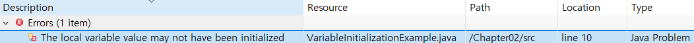

변수는 출력문이나 연산식에 사용되어 변수값을 활용한다. 다음 예제는 변수를 문자열과 결합 후 출력하거나 연산식에서 활용하는 모습을 보여준다.

*VariableUseExample.java*

```java
public class VariableUseExample {

	public static void main(String[] args) {
		
		int hour = 3;
		int minute = 5;
		System.out.println(hour + " 시간 " + minute + "분");
		
		int totalMinute = (hour*60) + minute;
		System.out.println("총 " + totalMinute + "분");
	}

}
```


변수는 또 다른 변수에 대입되어 메모리 간에 값을 복사할 수 있다. 다음 코드는 변수 x값을 변수 y값으로 복사한다.

```java
int x = 10;
int y = x;
```

다음 예제는 두 변수의 값을 교환하는 방법을 보여준다. 두 변수의 값을 교환하기 위해서 새로운 변수 temp를 선언한 것에 주목한다.

*VariableExchangeExample.java*

```java
public class VariableExchangeExample {

	public static void main(String[] args) {
		
		int x = 3;
		int y = 5;
		System.out.println("x:" + x + ", y" + y);

		int temp = x;
		x = y;
		y = temp;
		System.out.println("x:" + x + ", y" + y);
	}

}
```

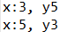

## 정수 타입

변수는 선언될 때의 타입에 따라 저장할 수 있는 값의 종류와 허용 범위가 달라진다. 자바는 정수, 실수, 논리값을 저장할 수 있는 기본 타입 8개를 다음과 같이 제공한다.

| 값의 분류        | 기본 타입                    |
| ---------------- | ---------------------------- |
| 정수             | byte, char, short, int, long |
| 실수             | float, double                |
| 논리(true/false) | boolean                      |

정수 타입은 총 5개로, 다음과 같이 메모리 할당 크키와 저장되는 값의 범위를 가지고 있다.

| 타입  | 메모리 크기 | 저장되는 값의 허용 범위 | 저장되는 값의 허용 범위                                |
| ----- | ----------- | ----------------------- | ------------------------------------------------------ |
| byte  | 1byte*      | -2^7 - (2^7-1)          | -128 ~ 127                                             |
| short | 2byte       | -2^15 - (2^15-1)        | -32768 - 32767                                         |
| char  | 2byte       | 0 - (2^16-1)            | 0 - 65535                                              |
| int   | 4byte       | -2^31 - (2^31-1)        | -2,147,483,648 - 2,147,483,643                         |
| long  | 8byte       | -2^63 - (2^63-1)        | -9,233,372,036,854,775,808 - 9,223,372,036,854,775,807 |

각 타입에 저장되는 값의 허용 범위를 모두 외울 필요는 없다. 하지만 메모리 할당 크기는 알아야 한다. 정수 타입을 메모리 사용 크기순으로 나열하면 다음과 같다.

| 종류                       | byte | short | int  | long |
| -------------------------- | ---- | ----- | ---- | ---- |
| 메모리 사용 크기(단위 bit) | 8    | 16    | 32   | 64   |

메모리 크기를 n이라고 할 때 정수 타입은 다음과 같은 동일한 구조의 2진수로 저장된다.

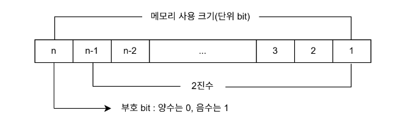

byte, short, int, long은 모두 부호 있는(signed) 정수 타입이므로 최상위 bit는 부호 bit로 사용되고, 나머지 bit는 값의 범위를 결정한다.

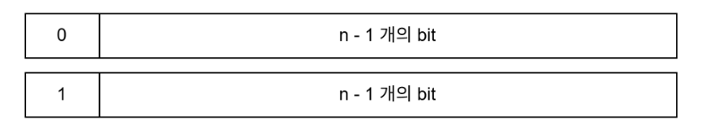

값의 범위는 위, 아래 차례대로 0 ~ (2^(n-1) - 1) 과 -2^(n-1) ~ -1이다.

예를 들어 byte 타입은 최상위 bit를 부호 비트로 사용하고 나머지 7bit로 값의 범위를 결정한다.

최상위 bit가 1인 음수의 경우 7개의 bit를 모두 1의 보수(1은 0, 0은 1)로 바꾸고 1을 더한 값에 -를 붙이면 10진수가 된다. 

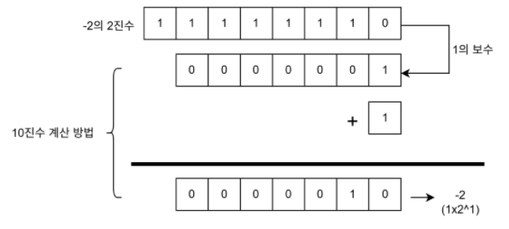

코드에서 프로그래머가 직접 입력한 고정 값을 리터럴이라고 부르는데, 변수에 대입할 정수 리터럴은 진수에 따라 작성하는 방법이 다르다.

* 2진수 : 0b 또는 0B로 시작하고 0과 1로 작성

  ```java
  int x = 0b1011;
  int y = 0B10100;
  ```

* 8진수 : 0으로 시작하고 0-7 숫자로 작성

  ```java
  int x = 013;
  int y = 0206;
  ```

* 10진수 : 소수점이 없는 0-9 숫자로 작성

  ```java
  int x = 12;
  int y = 365;
  ```

* 16진수 : 0x 또는 0X로 시작하고 0-9 숫자나 A, B, C, D, E, F 또는 a, b, c, d, e, f로 작성

  ```java
  int x = 0xB3;
  int y = 0x2A0F;
  ```

다음 예제는 다양한 정수 리터럴을 int 타입 변수에 대입하고 10진수로 출력한다.

*IntegerLiteralExample.java*

```java
public class IntegerLiteralExample {

	public static void main(String[] args) {
		
		int var1 = 0b1011;
		int var2 = 0206;
		int var3 = 365;
		int var4 = 0xB3;
		
		System.out.println("var1: " + var1);
		System.out.println("var2: " + var2);
		System.out.println("var3: " + var3);
		System.out.println("var4: " + var4);
	}

}
```

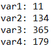

다음 예제는 byte 타입 변수에 허용 범위를 초과한 값을 대입했을 경우 컴파일 오류가 발생하는 것을 보여준다.

*ByteExample.java*

```java

public class ByteExample {

	public static void main(String[] args) {

		byte var1 = -128;
		byte var2 = -30;
		byte var3 = 0;
		byte var4 = 30;
		byte var5 = 127;
		byte var6 = 128;
		
		System.out.println(var1);
		System.out.println(var2);
		System.out.println(var3);
		System.out.println(var4);
		System.out.println(var5);

	}

}
```

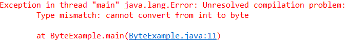

long 타입은 수치가 큰 데이터를 다루는 프로그램에서 사용된다. 예를 들어 은행이나 과학 분야에서 사용되는 프로그램들이다. 기본적으로 컴파일러는 정수 리터럴을 int 타입 값으로 간주하기 때문에, int 타입의 허용 범위를 초과하는 리터럴은 뒤에 소문자 'l'이나 대문자 'L'을 붙여 long 타입 값을 컴파일러에게 알려줘야 한다.

*LongExample.java*

```java
public class LongExample {
	public static void main(String[] args) {
		long var1 = 10;
		long var2 = 20L;
		long var3 = 100000000000;
		long var4 = 100000000000L;
		
		System.out.println(var1);
		System.out.println(var2);
		System.out.println(var4);
	}
}
```

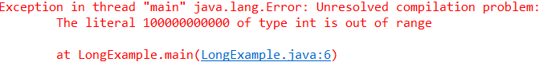

## 문자 타입

하나의 문자를 작은따옴표로 감싼 것을 문자 리터럴이라고 한다. 문자 리터럴은 유니코드로 변환되어 저장되는데, 유니코드는 세계 각국의 문자를 0-65535 숫자로 매핑한 국제 표준 규약이다. 자바는 이러한 유니코드를 저장할 수 있도록 char 타입을 제공한다.

```java
char var1 = 'A';
char var3 = '가';
```

유니코드가 정수이므로 char 타입도 정수 타입에 속한다. 그렇기 때문에 char 변수에 작은따옴표로 감싼 문자가 아니라 유니코드 숫자를 직접 대입할 수도 있다.

```java
char c = 65;
char c = 0x0041;
```

*CharExample.java*

```java
public class CharExample {

	public static void main(String[] args) {
		
		char c1 = 'A';
		char c2 = 65;
		
		char c3 = '가';
		char c4 = 44032;
		
		System.out.println(c1);
		System.out.println(c2);
		System.out.println(c3);
		System.out.println(c4);

	}

}
```

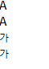

char 타입의 변수에 어떤 문자도 대입하지 않고 단순히 초기화를 할 목적으로 다음과 같이 작은따옴표 두 개를 연달아 붙인 빈 문자를 대입하면 컴파일 에러가 발생한다. 이 경우에는 공백(유니코드:32) 하나를 포함해서 초기화해야 한다.

```java
char c = '';     // 컴파일 에러
char c = ' ';    // 공백 하나를 포함해서 초기화
```

## 실수 타입

실수 타입에는 float과 double이 있으며 다음과 같이 메모리 할당 크기와 저장되는 값의 범위를 가지고 있다.

| 타입   | 메모리 크기 | 저장되는 값의 허용 범위(양수 기준) | 유효 소수 이하 자리 |
| ------ | ----------- | ---------------------------------- | ------------------- |
| float  | 4byte       | 1.4 x 10^-45 - 3.4 x 10^38         | 7자리               |
| double | 8byte       | 4.9 x 10^-324 - 1.8 x 10^308       | 15자리              |

그림을 보면 double 타입이 큰 실수를 저장할 수도 있고 정밀도 또한 높은 것을 볼 수 있다.

**float 타입**

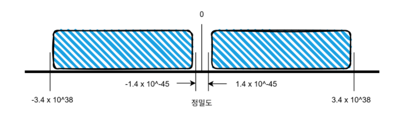

**double 타입**

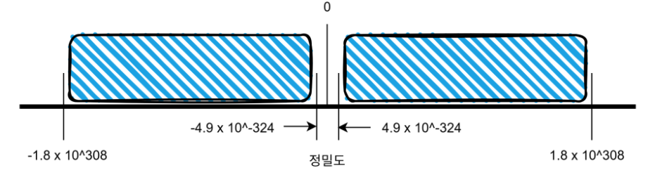

자바는 IEEE 754 표준에 근거해서 float 타입과 double 타입의 값을 부동 소수점 방식으로 메모리에 저장한다.

float 타입과 double 타입은 가수와 지수를 저장하기 위해 전체 bit를 다음과 같이 나누어 사용한다.

* float : 부호(1bit) + 지수(8bit) + 가수(23bit) = 32bit = 4byte
* double : 부호(1bit) + 지수(11bit) + 가수(52bit) = 64bit = 8byte

최상위 1bit는 양수 및 음수를 결정짓는 부호 bit로 0이면 양수, 1이면 음수가 된다. 지수는 float 타입은 8bit, double 타입은 11bit로 표현하고 나머지 bit는 모두 기수를 표현하는 데 사용된다. double은 float보다 지수와 가수 부분의 bit 수가 크기 때문에 더 크고 정밀한 실수를 저장할 수 있다. 코드에서 실수 리터럴은 다음과 같이 작성할 수 있다.

* 10진수 리터럴

  ```java
  double x = 0.25;
  double y = -3.14;
  ```

* e 또는 E가 포함된 10의 거듭제곱 리터럴

  ```java
  double x = 5e2;			// 5.0 x 10^2 = 500.0
  double y = 0.12E-2;		// 0.12 x 10^-2 = 0.0012
  ```

컴파일러는 실수 리터럴을 기본적으로 double 타입으로 해석하기 때문에 double 타입 변수에 대입해야 한다. float 타입에 대입하고 싶다면 리터럴 뒤에 소문자 'f'나 대문자 'F'를 붙여 컴파일러가 float 타입임을 알 수 있도록 해야 한다.

```java
double var = 3.14;
double var = 314e-2;
```

```java
float var = 3.14f;
float var = 3E6F;
```

다음 예제는 float과 double 타입의 소수 이하 유효 자릿수를 확인한다. double 타입은 float 타입 보다 약 2배의 유효 자릿수를 가지기 때문에 보다 정확한 데이터 저장이 가능하다. double이라는 이름도 float보다 약 2배의 정밀도를 갖는다는 의미에서 붙여진 것이다. 확인 후에는 10의 거듭 제곱 리터럴을 대입해서 출력해보자.

*FloatDoubleExample.java*

```java
public class FloatDoubleExample {

	public static void main(String[] args) {
		
		// 정밀도 확인
		float var1 = 0.1234567890123456789f;
		double var2 = 0.1234567890123456789;
		System.out.println(var1);
		System.out.println(var2);
		
		// 10의 거듭제곱 리터럴
		double var3 = 3e6;
		float var4 = 3e6F;
		double var5 = 2e-3;
		
		System.out.println(var3);
		System.out.println(var4);
		System.out.println(var5);
	}

}
```

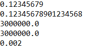

## 논리 타입

참과 거짓을 의미하는 논리 리터럴은 true와 false이다. 논리 리터럴은 boolean 타입 변수에 다음과 같이 대입할 수 있다.

```java
boolean stop = true;
boolean stop = false;
```

boolean 타입 변수는 주로 두 가지 상태값을 저장할 필요가 있을 경우에 사용되며, 상태값에 따라 조건문과 제어문의 실행 흐름을 변경하는 데 사용된다. 연산식 중에서 비교 및 논리 연산의 산출값은 true 또는 false이므로 boolean 타입 변수에 다음과 같이 대입할 수 있다.

```java
int x = 10;
boolean result1 = (x == 20);
boolean result2 = (x != 20);
boolean result3 = (x > 20);
boolean result4 = (0 < x && x < 20);
boolean result5 = (x < 0 || x > 200);
```

다음 예제는 stop 변수값에 따라 if 블록과 else 블록 중 하나를 실행하고, 연산식의 결과를 boolean 변수에 저장해서 출력한다.

*BooleanExample.java*

```java
public class BooleanExample {

	public static void main(String[] args) {
		
		boolean stop = true;
		
		if(stop) {
			System.out.println("stop");
		} else {
			System.out.println("start");
		}
		
		int x = 10;
		boolean result1 = (x == 20);
		boolean result2 = (x != 20);
		
		System.out.println(result1);
		System.out.println(result2);

	}

}
```

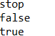

## 문자열 타입

작은따옴표로 감싼 한 개의 문자는 char 타입이지만, 큰따옴표로 감싼 여러 갱의 문자들은 유니코드로 반환되지 않는다. 따라서 다음은 잘못 작성된 코드다.

```java
char var1 = "A";		// 컴파일 에러
char var2 = "홍길동";	  // 컴파일 에러
```

큰따옴표로 감싼 문자들을 문자열이라고 부르는데, 문자열을 변수에 저장하고 싶다면 다음과 같이 String 타입을 사용해야 한다.

```java
String var1 = "A";
String var2 = "홍길동";
```

문자열 내부에 역슬레시(`\`)가 붙은 문자를 사용할 수가 있는데, 이것을 이스케이프 문자라고 한다. 이스케이프 문자를 사용하면 특정 문자를 포함할 수 있고, 출력에 영향을 미치기도 한다.

| 이스케이프 문자 | 내용                                 |
| --------------- | ------------------------------------ |
| `\"`            | " 문자 포힘                          |
| `\'`            | ' 문자 포함                          |
| `\\`            | `\` 문자 포함                        |
| `\u16진수`      | 16진수 유니코드에 해당하는 문자 포함 |
| `\t`            | 출력 시 탭만큼 띄움                  |
| `\n`            | 출력 시 줄바꿈(라인피드)             |
| `\r`            | 출력 시 캐리지 리턴                  |

다음 예제는 이스케이프 문자를 사용하는 방법을 보여준다. 문자열에 큰따옴표를 넣기 위해 `\"`를 사용했고, 탭만큼 띄워 출력하기 위해 `\t`를, 다음 행으로 이동하기 위해 `\n`을 사용하였다.

*StringExample.java*

```java
public class StringExample {

	public static void main(String[] args) {
		
		String name = "홍길동";
		String job = "프로그래머";
		System.out.println(name);
		System.out.println(job);
		
		String str = "나는 \"자바\"를 배웁니다.";
		System.out.println(str);
		
		str = "번호\t이름\t직업";
		System.out.println(str);
		
		System.out.println("나는\n");
		System.out.println("자바를\n");
		System.out.println("배웁니다.");

	}

}
```

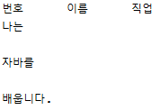

Java 13부터는 다음과 같은 텍스트 블록 문법을 제공한다.

```java
String str = """
    ...
    """;
```

큰따옴표 3개로 감싸면 이스케이프하거나 라인피드를 할 필요가 없이 작성된 그대로 문자열로 저장된다. 다음 예제에서 str1과 str2는 동일한 문자열이 저장된다.

*TextBlockExample.java*

```java
public class TextBlockExample {

	public static void main(String[] args) {

		String str1 = "" +
				"{\n" +
				"\t\"id\":\"winter\",\n" +
				"\t\"name\":\"눈송이\"\n"  +
				"}";
		
		String str2 = """
				{
					"id":"winter",
					"name":"눈송이"
				}
				""";
		
		System.out.println(str1);
		System.out.println("-----------------------------------------");
		System.out.println(str2);
		System.out.println("-----------------------------------------");
		String str = """
				나는 자바를 \
				학습합니다.
				나는 자바 고수가 될 겁니다.
				""";
		System.out.println(str);
	}
}
```

```
{
	"id":"winter",
	"name":"눈송이"
}
-----------------------------------------
{
	"id":"winter",
	"name":"눈송이"
}

-----------------------------------------
나는 자바를 학습합니다.
나는 자바 고수가 될 겁니다.
```

텍스트 블록에서 줄바꿈은 \n에 해당한다. 만약 줄바꿈을 하지 않고 다음 줄에 이어서 작성하고 싶다면 23라인처럼 맨끝에 `\`를 붙여주면 된다. 이 기능은 Java 14부터 제공된다.

## 2.7 자동 타입 변환

자동 타입 변환(promotion)은 말 그대로 자동으로 타입 변환이 일어난다는 것을 말한다. 자동 타입 변환은 값의 허용 범위가 작은 타입의 허용 범위가 큰 타입으로 대입될 때 발생한다.

기본 타입을 허용 범위 순으로 나열하면 다음과 같다.

```java
byte < short, char < int < long < float < double
```

int 타입이 byte 타입보다 허용 범위가 더 크기 때문에 다음 코드는 자동 타입 변환이 된다.

```java
byte byteValue = 10;
int intValue = byteValue;	// 자동 타입 변환됨
```

byte 타입은 1byte, int 타입은 4byte 메모리 크기를 가지므로 메모리에서 값이 복사되는 모양을 그림으로 표현하면 다음과 같다.

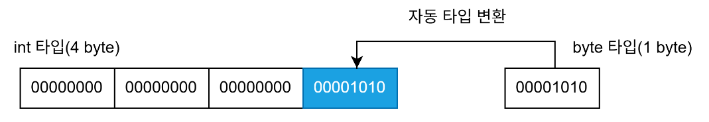

정수 타입이 실수 타입으로 대입될 경우에는 무조건 자동 타입 변환이 된다. 실수 타입은 정수 타입보다 허용 범위가 더 크다.

```java
long longValue = 5000000000L;
float floatValue = longValue;		// 5.0E9f로 저장됨
double doubleValue = longValue;		// 5.0E9로 저장됨
```

char 타입의 경우 int 타입으로 자동 변환되면 유니코드 값이 int 타입에 대입된다.

```java
char charValue = 'A';
int intValue = charValue;	// 65가 저장됨
```

자동 타입 변환에서 예외가 있다. char 타입보다 허용 범위가 작은 byte 타입은 char 타입으로 자동 변환될 수 없다. 왜냐하면 char 타입의 허용 범위는 음수를 포함하지 않는데, byte 타입은 음수를 포함하기 때문이다.

```java
byte byteValue = 65;
char charValue = byteValue;
```

다음은 자동 타입 변환이 생기는 다양한 코드들이다.

*PromotionExample.java*

``` java
public class PromotionExample {

	public static void main(String[] args) {
		
		// 자동 타입 변환
		byte byteValue = 10;
		int intValue = byteValue;
		System.out.println("intValue : " + intValue);
		
		char charValue = '가';
		intValue = charValue;
		System.out.println("가의 유니코드 : " + intValue);
		
		intValue = 50;
		long longValue = intValue;
		System.out.println("longValue : " + longValue);
		
		longValue = 100;
		float floatValue = longValue;
		System.out.println("floatValue : " + floatValue);
		
		floatValue = 100.5F;
		double doubleValue = floatValue;
		System.out.println("doubleValue : " + doubleValue);

	}

}
```

```
intValue : 10
가의 유니코드 : 44032
longValue : 50
floatValue : 100.0
doubleValue : 100.5
```

## 강제 타입 변환

큰 허용 범위 타입은 작은 허용 범위 타입으로 자동 타입 변환될 수 없다. 마치 큰 그릇을 작은 그릇 안에 넣을 수 없는 것과 동일한 이치이다. 하지만 큰 그릇을 작은 그릇 단위로 쪼개어서 한 조각만 작은 그릇에 넣는 것은 가능하다.

큰 허용 범위 타입을 작은 허용 범위 타입으로 쪼개어서 저장하는 것을 강제 타입 변환(casting)이라고 한다. 강제 타입 변환은 캐스팅 연산자로 괄호()를 사용하는데, 괄호 안에 들어가는 타입은 쪼개는 단위이다.

### int >>> byte

int 타입은 byte 타입보다 더 큰 허용 범위를 가진다. 따라서 int 타입은 byte 타입으로 자동 변환되지 않고, (byte) 캐스팅을 해서 byte 타입으로 강제 변환시켜야 한다.

```java
int intValue = 10;
byte byteValue = (byte) intValue;	// 강제 타입 변환
```

int 타입을 byte 타입으로 강제 타입 변환하는 모양을 그림으로 표헌하면 다음과 같다.

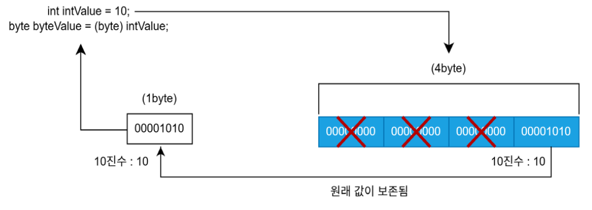

10진수 10은 2진수 1010으로 1byte만 있으면 저장할 수 있다. int 타입은 4byte 크기를 가지므로 10은 끝 1byte 안에 저장된다. byte 타입으로 강제 타입 변환하면 앞 3byte는 삭제되고 끝 1byte 값만 byte 타입 변수에 저장된다. 따라서 강제 타입 변환을 하더라도 원래 값 10은 보존된다.

그러나 다음 그림을 보면 2byte 이상이 필요한 int 값은 원래 값이 보존되지 않는다.

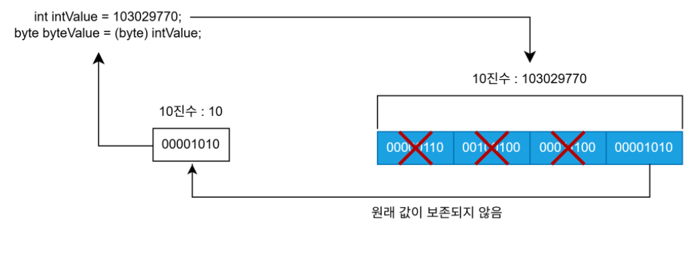

강제 타입의 목적은 원래 값이 유지되면서 타입만 바꾸는 것이다. 그렇기 때문에 작은 허용 범위 타입에 저장될 수 있는 값을 가지고 강제 타입 변환을 해야 한다. byte 타입으로 변환한다면 -128 ~ 127인 int 값만 원래 값을 보존할 수 있다.

### long >>> int

long 타입은 int 타입보다 큰 허용 범위를 가진다. 따라서 long 타입은 int 타입으로 자동 변환되지 않고, (int) 캐스팅을 해서 강제 변환시켜야 한다. 예를 들어 300을 갖는 long 타입 변수는 8byte 중에 끝 4byte로 300을 표현할 수 있다. int 타입으로 강제 변환하면 앞 4byte는 버려지고 끝 4byte만 int 타입 변수에 저장되므로 300이 그대로 유지된다.

```java
long longValue = 300;
int intValue = (int) longValue;		// 강제 타입 변환 후에 300이 그대로 유지
```

### int >>> char

int 타입은 char 타입보다 큰 허용 범위를 가진다. 따라서 int 타입은 char 타입으로 자동 변환되지 않고, (char) 캐스팅을 해서 강제 변환시켜야 한다. 주의할 점은 char 타입의 허용 범위인 0-65535 사이의 값만 원래 값을 유지한다.

```java
int intValue = 65;
char charValue = (char) intValue;
System.out.println(charValue);		// 'A'가 출력
```

### 실수 >>> 정수

실수 타입(float, double)은 정수 타입(byte, short, int, long) 보다 항상 큰 허용 범위를 가진다. 따라서 대상 정수 타입으로 캐스팅해서 강제 변환시켜야 한다. 이 경우 소수점 이하 부분은 버려지고, 정수 부분만 저장된다.

```java
double doubleValue = 3.14;
int intValue = (int) doubleValue;		// intValue는 정수 부분인 3만 저장
```

```java
public class CastingExample {

	public static void main(String[] args) {
		
		int var1 = 10;
		byte var2 = (byte) var1;
		System.out.println(var2); 		// 강제 타입 변환 후에 10이 그대로 유지
		
		long var3 = 300;
		int var4 = (int) var3;
		System.out.println(var4); 		// 강제 타입 변환 후에 300이 그대로 유지
		
		int var5 = 65;
		char var6 = (char) var5;
		System.out.println(var6);		// 'A'가 출력
		
		double var7 = 3.14;
		int var8 = (int) var7;
		System.out.println(var8);		// 3이 출력

	}

}
```

```
10
300
A
3
```

## 연산식에서 자동 타입 변환

자바는 실행 성능을 향상시키기 위해 컴파일 단계에서 연산을 수행한다. 정수 리터럴 10과 20을 덧셈 연산해서 결과를 byte 타입 변수 result에 저장하는 코드가 있다고 가정해보자.

```java
byte result = 10 + 20;		// 컴파일 : byte result = 30
```

자바 컴파일러는 컴파일 단계에서 10 + 20을 미리 연산해서 30을 만들고 result 변수에 30을 저장하도록 바이트코드를 생성한다. 따라서 실행 시 덧셈 연산이 없으므로 실행 성능이 좋아진다.

하지만 정수 리터럴이 아니라 변수가 피연산자로 사용되면 실행 시 연산을 수행한다. 정수 타입 변수가 산술 연산식에서 피연산자로 사용되면 int 타입보다 작은 byte, short 타입의 변수는 int 타입으로 자동 타입 변환되어 연산을 수행한다.

```java
byte x = 10;
byte x = 20;
byte result = x + y;	// 컴파일 에러
int result = x + y;
```

위 코드와 같이 byte 변수 x, y가 피연산자로 사용되면 변수값은 int 타입으로 변환되어 연산되고(컴파일 과정에서), 결과도 int 타입으로 생성된다(런타임 과정에서). 따라서 결과값을 byte 변수에 저장할 수 없고, int 변수에 저장해야 한다.

```java
int x = 10;
int y = 20;
int result = x + y;
```

특별한 이유가 없다면 정수 연산에서 변수가 사용될 경우에는 위와 같이 int 타입으로 변수를 선언하는 것이 타입 변환이 발생하지 않기 때문에 실행 성능에 도움이 된다.

정수 연산식에서 모든 변수가 int 타입으로 변환되는 것은 아니다. int 타입보다 허용 범위가 더 큰 long 타입이 피연산자로 사용되면 다른 피연산자는 long 타입으로 변환되어 연산을 수행한다. 따라서 연산 결과는 long 타입 변수에 저장해야 한다.

이번에는 실수 연산을 알아보자. 피연산자가 동일한 실수 타입이라면 해당 타입으로 연산된다. 아래 예시는 피연산자에 모두 f가 붙어있기 때문에 float 타입으로 연산을 수행한다. 따라서 결과도 당연히 float 타입이 된다.

```java
float result = 1.2f + 3.4f;		// 컴파일 : float result = 4.6f
```

하지만 피연산자 중 하나가 double 타입이면 다른 피연산자도 double 타입으로 변환되어 연산되고, 연산 결과 또한 double 타입이 된다.

int 타입과 double 타입을 연산하는 경우에도 int 타입 피연산자가 double 타입으로 자동 변환되고 연산을 수행한다.

```java
int intValue = 10;
double doubleValue = 5.5;
double result = intValue + doubleValue;		// 10.0 + 5.5
```

만약 int 타입으로 연산을 해야 한다면 double 타입을 int 타입으로 강제 변환하고 덧셈 연산을 수행하면 된다.

```java
int intValue = 10;
double doubleValue = 5.5;
int result = intValue + (int) doubleValue;	// 10 + 5
```

수학에서 1을 2로 나누면 0.5가 나온다. 이것을 코드로 옮기면 다음과 같다.

```java
int x = 1;
int y = 2;
double result = x / y;
System.out.println(result);		// 0.5가 출력될까요?
```

위 코드를 실행하면 0.5가 아니라 0.0이 출력된다. 자바에서 정수 연산의 결과는 항상 정수가 되기 때문이다. 따라서 x / y의 연산 결과는 0.5가 아니라 0이 되고, 0을 double 타입 변수 result에 저장하므로, 0.0이 된다. 위 코드의 결과가 0.5가 되기 위해서는 x / y 부분을 정수 연산이 아니라 실수 연산으로 변경해야 한다. x와 y 둘 중 하나 또는 둘 모두를 double 타입으로 변환하는 것이다.

* 방법 1

  ```java
  int x = 1;
  int y = 2;
  double result = (double) x / y;
  System.out.println(result);
  ```

* 방법 2

  ```java
  int x = 1;
  int y = 2;
  double result = x / (double) y;
  System.out.println(result);
  ```

* 방법3

  ```java
  int x = 1;
  int y = 2;
  double result = (double) x / (double) y;
  System.out.println(result);
  ```

만약 (double) (x / y)로 수정하면 0.5가 아니라 0.0을 얻는다. 그 이유는 (x / y)가 먼저 연산이 되어 0이 되고, 이것을 double 타입으로 변환하면 0.0이 되기 때문이다.

*OperationPromotionExample.java*

```java
public class OperationPromotionExample {

	public static void main(String[] args) {
		
		byte result1 = 10 + 20;		// 컴파일 단계에서 연산
		System.out.println("result1 : " + result1);

		byte v1 = 10;
		byte v2 = 20;
		int result2 = v1 + v2;		// int 타입으로 변환 후 연산
		System.out.println("result2 : " + result2);
		
		byte v3 = 10;
		int v4 = 100;
		long v5 = 1000L;
		long result3 = v3 + v4 + v5;	// long 타입으로 변환 후 연산
		System.out.println("result3 : " + result3);
		
		char v6 = 'A';
		char v7 = 1;
		int result4 = v6 + v7;			// int 타입으로 변환 후 연산
		System.out.println("result4 : " + result4);
		System.out.println("result4 : " + (char) result4);
		
		int v8 = 10;
		int result5 = v8 / 4;			// 정수 연산의 결과는 정수
		System.out.println("result5 : " + result5);
		
		int v9 = 10;
		double result6 = v9 / 4.0;		// double 타입으로 변환 후 연산
		System.out.println("result6 : " + result6);
		
		int v10 = 1;
		int v11 = 2;
		double result7 = (double) v10 / v11;	// double 타입으로 변환 후 연산
		System.out.println("result7 : " + result7);
		
	}

}
```

```
result1 : 30
result2 : 30
result3 : 1110
result4 : 66
result4 : B
result5 : 2
result6 : 2.5
result7 : 0.5
```

자바에서 + 연산자는 두 가지 기능을 가지고 있다. 피연산자가 모두 숫자일 경우에는 덧셈 연산을 수행하고, 피연산자 중 하나가 문자열일 경우에는 나머지 피연산자도 문자열로 자동 변환되어 문자열 결합 연산을 수행한다.

```java
int value = 3 + 7; // int value = 10;
String str = "3" + 7;	// String str = "3" + "7"; : String str = "37";
String str = "3" + "7";	// String str = "3" + "7"; : String str = "37";
```

연산식에서 + 연산자가 연이어 나오면 앞에서부터 순차적으로 + 연산을 수행한다. 먼저 수행된 연산이 덧셈 연산이라면 덧셈 결과를 가지고 그다음 + 연산을 수행한다. 만약 먼저 수행된 연산이 결합 연산이라면 이후 + 연산은 모두 결합 연산이 된다.

```java
int value = 1 + 2 + 3; 		// int value = 3 + 3; : int value = 6;
String str = 1 + 2 + 3;		// String str = 3 + "3"; : String str = "33";
String str = 1 + "2" + 3;	// String str = "12" + 3; : String str = "123";
String str = "1" + 2 + 3;	// String str = "12" + 3; : String str = "123";
```

앞에서 순차적으로 + 연산을 수행하지 않고 특정 부분을 우선 연산하고 싶다면 해당 부분을 괄호()로 감싸면 된다. 괄호는 항상 최우선으로 연산을 수행한다.

```java
String str = "1" + (2 + 3); // String str = "1" + 5; : String str = "15";
```

*StringConcatExample.java*

```java
public class StringConcatExample {

	public static void main(String[] args) {
		
		// 숫자 연산
		int result1 = 10 + 2 + 8;
		System.out.println(result1);
		
		// 결합 연산
		String result2 = 10 + 2 + "8";
		System.out.println(result2);
		
		String result3 = 10 + "2" + 8;
		System.out.println(result3);
		
		String result4 = "10" + 2 + 8;
		System.out.println(result4);
		
		String result5 = "10" + (2 + 8);
		System.out.println(result5);

	}

}
```

```
20
128
1028
1028
1010
```

## 문자열을 기본 타입으로 변환

프로그램에서 문자열을 숫자 타입으로 변환하는 경우가 매우 많다. 예를 들어 '12'와 '3.5'를 정수 및 실수 타입으로 변환해서 숫자 연산을 하는 경우이다. 자바에서 문자열을 기본 타입으로 변환하는 방법은 다음과 같다.

| 변환 타입         | 사용 예                                                      |
| ----------------- | ------------------------------------------------------------ |
| String >> byte    | String str = "10";<br />byte value = Byte.parseByte(str);    |
| String >> short   | String str = "200"<br />short value = Short.parseShort(str); |
| String >> int     | String str = "300000";<br />int value = Integer.parseInt(str); |
| String >> long    | String str = "40000000000";<br />long value = Long.parseLong(str); |
| String >> float   | String str = "12.345";<br />float value = Float.parseFloat(str); |
| String >> double  | String str = "12.345";<br />double value = Double.parseDouble(str); |
| String >> boolean | String str = "true";<br />boolean value = Boolean.parseBoolean(str); |

반대로 기본 타입의 값을 문자열로 변경하는 경우도 있는데, 이 경우는 간단히 String.valueOf() 메소드를 이용하면 된다.

```java
String str = String.valueOf(기본타입값);
```

*PrimitiveAndStringConversionExample.java*

```java
package Chap2_VariableAndType;

public class PrimitiveAndStringConversionExample {

	public static void main(String[] args) {
		
		int value1 = Integer.parseInt("10");
		double value2 = Double.parseDouble("3.14");
		boolean value3 = Boolean.parseBoolean("true");
		
		System.out.println(value1);
		System.out.println(value2);
		System.out.println(value3);
		
		String str1 = String.valueOf(10);
		String str2 = String.valueOf(3.14);
		String str3 = String.valueOf(true);
		
		System.out.println(str1);
		System.out.println(str2);
		System.out.println(str3);
	}

}
```

```
10
3.14
true
10
3.14
true
```

## 변수 사용 범위

main() 메소드 블록에는 다른 중괄호 {} 블록들이 작성될 수 있다. 조건문에 해당하는 if, 반복문에 해당하는 for, while 등이 {} 블록을 가질 수 있는데, 이러한 중괄호 {} 블록 내에서 선언된 변수는 해당 중괄호 {} 블록 내에서만 사용이 가능하고 밖에서는 사용할 수 없다.

메소드 블록 전체에서 사용하고 싶다면 메소드 블록 첫머리에 선언하는 것이 좋고, 특정 블록 내부에서만 사용된다면 해당 블록 내에서 선언하는 것이 좋다.

*VariableScopeExample.java*

```java
package Chap2_VariableAndType;

public class VariableScopeExample {

	public static void main(String[] args) {
		
		int v1 = 15;
		if(v1 > 10) {
			int v2 = v1 - 10;
		}
		
		int v3 = v1 + v2 + 5;	// v2 변수를 사용할 수 없기 때문에 컴파일 에러 발생

	}

}
```

```
Exception in thread "main" java.lang.Error: Unresolved compilation problem: 
	v2 cannot be resolved to a variable

	at Chap2_VariableAndType.VariableScopeExample.main(VariableScopeExample.java:12)
```

## 콘솔로 변수값 출력

지금까지 표준 출력 장치인 모니터(명령 프롬프트, 터미널, 콘솔)에 값을 출력하기 위해 System.out.println()을 이용했다. 괄호() 안에 리터럴을 넣으면 리터럴이 그대로 출력되고, 변수를 넣으면 변수에 저장된 값이 출력되었다.

System.out.println(리터럴 또는 변수);

* System.

  시스템으로

* out.

  출력하는데

* println(리터럴 또는 변수);

  괄호 안의 내용을 출력하고 행을 바꿔라

출력 방법에 따라 println() 이외에도 다음과 같이 print(), printf()를 사용할 수 있다.

| 메소드                               | 의미                                         |
| ------------------------------------ | -------------------------------------------- |
| println(내용);                       | 괄호 안의 내용을 출력하고 행을 바꿔라        |
| print(내용);                         | 괄호 안의 내용을 출력하고 행은 바꾸지 말아라 |
| printf("형식문자열", 값1, 값2, ...); | 형식 문자열에 맞추어 뒤의 값을 출력하라      |

printf()의 형식 문자열은 다음과 같은 포맷으로 작성한다.

```java
printf("형식문자열", 값1, 값2, ...)
```

여기서 형식문자열의 포맷을 살펴보면,

```java
% [argument_index$] [flags] [width] [.precision] conversion
```

이다.

각각의 구성을 살펴보면,

* argument_index

  참조할 인수

* flags

  정렬, 공백, 부호 등을 제어하는 옵션이다.

* width

  출력할 최소 폭을 설정한다.

* .precision

  소수점 이하의 자리수를 지정하거나 문자열의 길이를 제한한다.

* conversion

  데이터 유형을 지정한다. 예) d(정수), f(실수), s(문자열) 등

형식 문자열에서 %와 conversion (변환 문자)은 필수로 작성하고 그 외의 항목은 모두 생략할 수 있다. %는 형식 문자열의 시작을 뜻하고, conversion에는 제공되는 값의 타입에 따라 d(정수), f(실수), s(문자열)가 나온다.

```java
System.out.printf("이름 : %s", "김자바");
System.out.printf("나이 : %d", 25);
```

형식 문자열에 포함될 값이 두 개 이상일 경우에는 값의 순번(argument_index$)을 포함시켜야 한다. 예를 들어 1$는 첫 번째 값을, 2$는 두 번째 값을 뜻한다.

```java
System.out.printf("이름 : %1$s, 나이 : %2$d", "김자바", 25);
```

flags는 빈 공간을 채우는 방법인데, 생략되면 왼쪽이 공백으로 채워지고 -가 오면 오른쪽이 공백으로 채워진다. 0은 공백 대신 0으로 채운다. width는 소수점을 포함한 전체 자릿수이며, .precision은 소수 이하 자릿수이다. 자주 사용되는 형식 문자열은 다음과 같다.

| 형식화된 문자열 | 설명                             | 출력 형태                                                    | 출력 형태                                  |
| --------------- | -------------------------------- | ------------------------------------------------------------ | ------------------------------------------ |
| 정수            | %d<br />%6d<br />%-6d<br />%06d  | 정수<br />6자리 정수. 왼쪽 빈자리 공백<br />6자리 정수. 오른쪽 빈자리 공백<br />6자리 정수. 왼쪽 빈자리 0 채움 | 123<br />---123<br />123---<br />000123    |
| 실수            | %10.2f<br />%-10.2f<br />%010.2f | 정수 7자리 + 소수점 + 소수 2자리. 왼쪽 빈자리 공백<br />정수 7자리 + 소수점 + 소수 2자리. 오른쪽 빈자리 공백<br />정수 7자리 + 소수점 + 소수 2자리. 왼쪽 빈자리 0 채움 | ----123.45<br />123.45----<br />0000123.45 |
| 문자열          | %s<br />%6s<br />%-6s            | 문자열<br />6자리 문자열. 왼쪽 빈자리 공백<br />6자리 문자열. 오른쪽 빈자리 공백 | abc<br />---abc<br />abc---                |
| 특수 문자       | \t<br />\n<br />%%               | 탭(tab)<br />줄바꿈<br />%                                   | <br /><br />%                              |

*PrintfExample.java*

```java
package Chap2_VariableAndType;

public class PrintfExample {

	public static void main(String[] args) {
		
		int value = 123;
		System.out.printf("%d\n", value);
		System.out.printf("%6d\n", value);
		System.out.printf("%-6d\n", value);
		System.out.printf("%06d\n", value);
		
		double area = 3.124159 * 10 * 10;
		System.out.printf("반지름이 %d인 원의 넓이 : %10.2f\n", 10, area);
		
		String name = "홍길동";
		String job = "도적";
		System.out.printf("%6d | %-10s | %10s\n", 1, name, job);
		
	}
	
}
```

```
123
   123
123   
000123
반지름이 10인 원의 넓이 :     312.42
     1 | 홍길동        |         도적
```

## 키보드 입력 데이터를 변수에 저장

키보드로부터 입력된 데이터를 읽고 변수에 저장하는 가장 쉬운 방법은 Scanner를 사용하는 것이다. 다음과 같이 Scanner 타입 변수를 선언하고, 대입 연산자 =를 사용해서 new 연산자로 생성한 Scanner 객체를 변수에 대입한다. 

Scanner scanner = new Scanner(System.in);

> 위 코드는 Scanner 객체를 생성해서 생성된 Scanner 객체를 변수에 대입하는 것이다.

그리고 다음과 같이 scanner.nextLine()을 실행하면 키보드로 입력된 내용을 문자열로 읽고 좌측 String 변수에 저장할 수 있다.

String inputData = scanner.nextLine();

> scanner.nextLine()에서 Enter 키를 누르면 입력된 문자열을 읽음 이후 읽은 문자열을 String 변수에 저장

scanner.nextLine()은 Enter 키가 입력되기 전까지 블로킹(대기) 상태가 되며, Enter 키가 입력되면 지금까지 입력된 모든 내용을 문자열로 읽는다.

*ScannerExample.java*

```java
package Chap2_VariableAndType;

import java.util.Scanner;

public class ScannerExample {

	public static void main(String[] args) {
		
		Scanner scanner = new Scanner(System.in);
		
		System.out.println("x 값 입력 : ");
		String strX = scanner.nextLine();
		int x = Integer.parseInt(strX);
		
		System.out.println("y 값 입력 : ");
		String strY = scanner.nextLine();
		int y = Integer.parseInt(strY);
		
		int result = x + y;
		System.out.println("x + y : " + result);
		System.out.println();
		
		while(true) {
			System.out.println("입력 문자열 : ");
			String data = scanner.nextLine();
			if(data.equals("q")) {
				break;
			}
			System.out.println("출력 문자열 : " + data);
			System.out.println();
		}
		
		System.out.println("종료");

	}

}
```

```
x 값 입력 : 
10
y 값 입력 : 
20
x + y : 30

입력 문자열 : 
string
출력 문자열 : string

입력 문자열 : 
string
출력 문자열 : string

입력 문자열 : 
string
출력 문자열 : string

입력 문자열 : 
q
종료
```

자바는 기본 타입(byte, short, int, long, float, double, boolean) 값이 동일한지 비교할 때는 ==를 사용하고, String 타입 값이 동일한지 비교할 때에는 equals()를 사용한다.

* 기본 타입 값 비교

  ```java
  boolean result = (number == 3);
  ```

* 문자열 타입 값 비교

  ```java
  boolean result = string.equals("문자열");
  ```

## 연습문제

1. 변수에 대해 잘못 설명한 것은 무엇입니까? 4

   1. 변수는 하나의 값만 저장할 수 있다.
   2. 변수는 선언 시에 사용한 타입의 값만 저장할 수 있다.
   3. 변수는 변수가 선언된 중괄호 {} 안에서만 사용 가능하다.
   4. 변수는 초기값이 저장되지 않은 상태에서 읽을 수 있다.

2. 변수 이름으로 사용할 수 없는 것을 모두 선택하시오. 3, 6, 7

   1. modelName
   2. class
   3. 6hour
   4. $value
   5. _age
   6. #name
   7. int

3. 다음 표의 빈 칸에 자바의 기본 타입 8개를 적어보세요.

   | 타입\크기 | 1byte   | 2byte       | 4byte | 8byte  |
   | --------- | ------- | ----------- | ----- | ------ |
   | 정수 타입 | byte    | char, short | int   | long   |
   | 실수 타입 |         |             | float | double |
   | 논리 타입 | boolean |             |       |        |

4. 다음 코드에서 타입, 변수 이름, 리터럴에 해당하는 것을 적어보세요.

   ```java
   int age;
   age = 10;
   double price = 3.14;
   ```

   * 타입 : int, double
   * 변수 이름 : age, price
   * 리터럴 : 10, 3.14

5. 다음 자동 타입 변환에서 컴파일 에러가 발생하는 것을 선택하세요. 3

   ```java
   byte byteValue = 10;
   char charValue = 'A';
   ```

   1. int intValue = byteValue;
   2. int intValue = charValue;
   3. short shortValue = charValue;
   4. double doubleValue = byteValue;

6. 다음 강제 타입 변환에서 컴파일 에러가 발생하는 것을 선택하세요. 4

   ```java
   int intValue = 10;
   char charValue = 'A';
   double doubleValue = 5.7;
   String strValue = "A";
   ```

   1. double var = (double) intValue;
   2. byte var = (byte) intValue;
   3. int var = (int) doubleValue;
   4. char var = (char) strValue;

7. 변수를 잘못 초기화한 것은 무엇입니까? 3

   1. int var1 = 10;

   2. long var2 = 1000000000000L;

   3. char var3 = ''; // 작은따옴표 두 개가 붙어 있음

   4. float var4 = 10;

   5. String var5 = "abc\ndef";

   6. String var6 = """

      abc

      def

      """;

8. 콘솔에 값을 입출력하는 방법에 대해 잘못 설명한 것을 선택하세요. 3

   1. System.out.print(변수)는 변수값을 출력시키고 행을 바꾸지 않는다.
   2. System.out.println(변수)는 변수값을 출력시키고 행을 바꾼다.
   3. System.out.printf("형식", 변수)는 주어진 형식대로 변수값을 바꾼다.
   4. Scanner의 nextLine() 메소드는 콘솔에 입력된 내용을 문자열로 읽는다.

9. 연산식의 타입 변환 중에서 컴파일 에러가 발생하는 것을 선택하세요. 1

   ```java
   byte byteValue = 10;
   float floatValue = 2.5F;
   double doubleValue = 2.5;
   ```

   1. byte result = byteValue + byteValue;
   2. int result = 5 + byteValue;
   3. float result = 5 + floatValue;
   4. double result = doubleValue;

10. 문자열을 기본 타입으로 변환하는 코드로 틀린 것을 고르시오. 2

    ```java
    String str = "5";
    ```

    1. byte var1 = Byte.parseByte(str);
    2. int var2 = Int.parseInt(str);
    3. float var3 = Float.parseFloat(str);
    4. double var4 = Double.parseDouble(str);

11. 다음 코드에서 컴파일 에러가 발생하는 라인을 모두 적어보세요.

    ```java
    int v1 = 1;
    System.out.println("v1 : " + v1);
    if(true) {
        int v2 = 2;
        if(true) {
            int v3 = 2;
            System.out.println("v1 : " + v1);
            System.out.println("v2 : " + v2);
            System.out.println("v3 : " + v3);
        }
        System.out.println("v1 : " + v1);
        System.out.println("v2 : " + v2);
        System.out.println("v3 : " + v3);	// 컴파일 에러
    }
    System.out.println("v1 : " + v1);
    System.out.println("v2 : " + v2);	// 컴파일 에러
    ```

