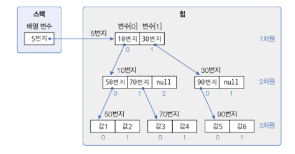
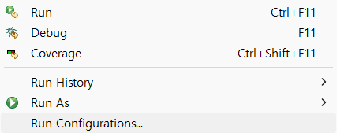
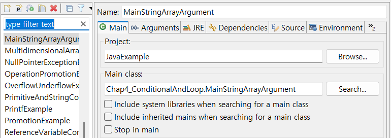
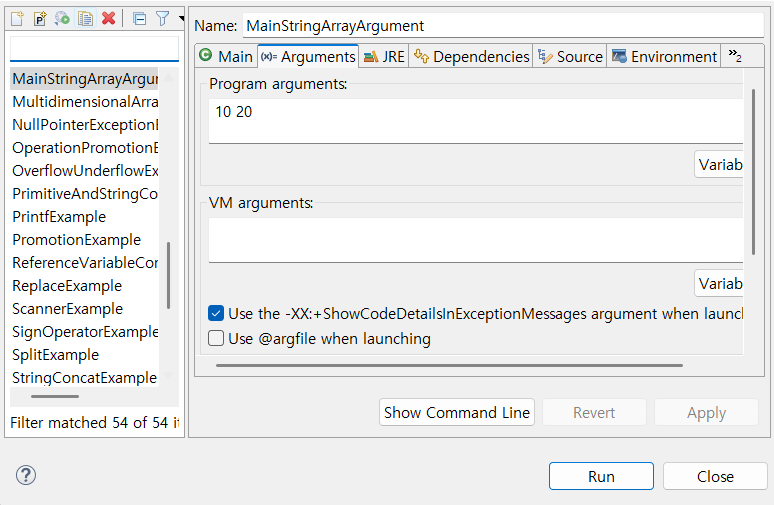

# 자바 개요

## 프로그래밍 언어와 자바

컴퓨터가 이해할 수 있는 기계어는 우리가 일상생활에서 사용하는 언어와는 너무나도 다른 0과 1로 이루어진 이진 코드를 사용한다. 반대로 사람이 사용하는 언어는 컴퓨터 입장에서 보면 이해할 수 없는 문자의 집합이다. 그렇기 때문에 사람과 컴퓨터가 대화하기 위해서는 사람의 언어와 기계어의 다리 역할을 하는 프로그래밍 언어가 필요하다.

프로그래밍 언어는 고급 언어와 저급 언어로 구분된다. 고급 언어란 컴퓨터와 대화할 수 있도록 만든 언어 중에서 사람이 쉽게 이해할 수 있는 언어를 말한다. 고급 언어로 작성된 소스 파일은 컴퓨터가 바로 이해할 수 없기 때문에 컴파일이라는 과정을 통해서 컴퓨터가 이해할 수 있는 0과 1로 이루어진 기계어로 변환한 후 컴퓨터가 사용하게 된다. 반대로 저급 언어란 기계어에 가까운 언어를 말하는데, 대표적으로 어셈블리어가 저급 언어에 속한다.

개발자가 고급 언어로 작성한 파일을 소스 파일이라고 부른다. 고급 언어에는 많은 종류가 있다. 대표적으로 자바, C, C++, C#, 파이썬 등이 있다.

자바는 1995년도에 처음 썬 마이크로시스템즈에서 발표한 후, 가장 성공한 프로그래밍 언어로서 전세계적으로 다양한 분야에서 사용되고 있다. 안드로이드 폰에서 실행하는 애플리케이션뿐만 아니라, 웹 사이트를 개발하는 핵심 언어로 사용되고 있다. 그리고 모든 운영체제에서 실행 가능한 데스크톱 애플리케이션도 개발할 수 있다.

자바는 오라클에서 라이선스를 가지고 있다. 오라클은 자바 개발 도구를 배포하여 자바로 프로그램을 쉽게 개발할 수 있도록 기술적 지원을 하고 있다. 자바는 다른 프로그래밍 언어에 비해 다음과 같은 특징이 있다.

* 모든 운영체제에서 실행 가능

  자바로 작성된 프로그램은 운영체제와 상관없이 모두 실행되기 때문에 윈도우에서 개발된 프로그램을 수정 없이 바로 맥OS 또는 리눅스에서도 실행할 수 있다는 장점이 있다.

* 객체 지향 프로그래밍

  먼저 객체(부품)를 만들고, 이 객체들을 서로 연결해서 더 큰 프로그램을 완성시키는 기법을 객체 지향 프로그래밍(Object Oriented Programming, OOP)이라고 한다. 자바는 OOP를 위한 최적의 언어이다.

* 메모리 자동 정리

  자바는 메모리(RAM)를 자동 관리하므로, 개발자는 메모리 관리의 수고스러움을 덜고 핵심 기능 작성에 집중할 수 있다.

* 무료 라이브러리 풍부

  무료로 다운로드해서 사용할 수 있는 오픈 소스 라이브러리가 풍부하기 때문에 프로그램 개발 기간을 단축시켜준다.

## 운영체제별 JDK 설치

자바 프로그램을 개발하고 실행하기 위해서는 먼저 Java SE의 구현체인 JDK를 설치해야 한다. JDK에는 OpenJDK와 Oracle JDK가 있다.

| 구분                | Open JDK          | Oracle JDK                           |
| ------------------- | ----------------- | ------------------------------------ |
| 라이선스            | GNU GPL version 2 | Oracle Technology Network License    |
| 사용료              | 무료              | 개발 및 학습용 : 무료, 상업용 : 유료 |
| 개발 소스 공개 의무 | 없음              | 없음                                 |

Oracle JDK는 Open JDK보다 응답성과 JVM 성능이 상대적으로 뛰어나다. 하지만 Open JDK의 성능도 지속석으로 향상되고 있으며, 더욱 안정화되었기 때문에 JDK 비용을 고려한다면 Open JDK를 사용하는 것이 유리하다. 

JDK LTS 버전은 장기간 기술 지원을 받을 수 있기 때문에 다른 버전보다는 안정적으로 사용할 수 있다. JDK 8, JDK 11, JDK 17이 LTS 버전이며, 이 버전으로 개발 및 실행하는 것이 좋다. 그래서 Open JDK 17 버전을 사용한다.

## 바이트코드 파일과 자바 가상 머신

JDK를 설치했다면 이제 자바 언어로 작성한 소스 파일을 만들고 컴파일할 수 있다. 자바 소스 파일의 확장명은 .java이다. 텍스트 파일이므로 어떤 텍스트 에디터에서도 작성이 가능하다.

### 바이트코드 파일

소스 파일(.java)을 작성한 후에는 컴파일을 해야 한다. javac(java compiler) 명령어는 소스 파일을 컴파일하는데, 컴파일 결과는 확장명이 .class인 바이트코드 파일로 생성된다. 

윈도우, 맥OS, 리눅스 등 어떤 운영체제라 하더라도 동일한 소스 파일을 javac로 컴파일하면 모두 동일한 바이트코드 파일이 생성된다.

### 자바 가상 머신

바이트코드 파일(~.class)을 특정 운영체제가 이해하는 기계어로 번역하고 실행시키는 명령어는 java이다. java 명령어는 JDK와 함께 설치된 자바 가상 머신을 구동시켜 바이트코드 파일을 완전한 기계어로 번역하고 실행시킨다.

바이트코드 파일은 운영체제와 상관없이 모두 동일한 내용으로 생성되지만, 자바 가상 머신은 운영체제에서 이해하는 기계어로 번역해야 하므로 운영체제별로 다르게 설치된다. 그래서 운영체제별로 설치하는 JDK가 다른 것이다.

## 소스 작성부터 실행까지

1. 사용자 홈에서 temp 디렉터리를 다음 구조로 생성하고, Hello.java 소스 파일을 생성한다.

   ```
   ~/temp
       ├── src
       │   └── ch01
       │       └── sec06
       │           └── Hello.java
       └── bin
   ```

   ※ 패키지란?

   자바는 소스 파일 및 컴파일된 바이트코드 파일을 쉽게 관리하기 위해 패키지를 사용한다. 패키지는 마치 파일 시스템의 디렉터리와 비슷하다. 

2. Hello.java를 텍스트 에디터에서 열고, 다음과 같이 코드를 작성한다.

   ```java
   package ch01 .sec06
       
   public class Hello {
       public static void main(String[] args) { // 바이트코드 파일을 실행하면 이 main() 메소드 블록이 실행된다.
           System.out.println("Hello, Java");
       }
   }
   ```

3. 소스 파일을 javac 명령어로 컴파일한다. 

   ```
   javac -d [바이트코드파일저장위치] [소스경로/*.java]
   ```

   ```
   temp/bin 디렉터리에 바이트코드 파일(ch01/sec06/Hello.class)이 생성
   ```

4. java 명령어로 바이트코드 파일을 기계어로 번역하고 실행한다. 여전히 명령 프롬프트와 터미널의 현재 위치는 사용자 홈의 temp 디렉터리이다. 주의할 점은 .class를 제외한 Hello만 입력해야 한다.

   ```
   java -cp [바이트코드파일위치] [패키지...클래스명]
   ```

   ```
   콘솔에 Hello, Java가 출력
   ```

   javac로 컴파일을 하면 운영체제에 독립적인 바이트코드 파일(*.class)이 생성되기 때문이다.

※ 자동 컴파일된 바이트코드 파일은 어디에?

Hello.java 소스 파일을 작성하고 자동 컴파일된 바이트코드 파일(Hello.class)은 thisisjava 프로젝트 디렉터리 안 bin 디렉터리에 패키지 디렉터리와 함께 저장된다. 

## 연습문제

1. 자바 언어의 특징을 잘못 설명한 것은 무엇입니까?

   1. 안드로이드 애플리케이션뿐만 아니라 웹 사이트를 개발할 때 사용하는 언어이다.
   2. 한 번 작성으로 다양한 운영체제에서 실행할 수 있다.
   3. 객체 지향 프로그래밍 언어이다.
   4. 개발자가 코드로 메모리를 관리해야 한다.

2. Open JDK와 Oracle JDK를 잘못 설명한 것은 무엇입니까?

   1. 둘 다 학습용 및 개발용으로는 무료로 사용 가능하다.
   2. Oracle JDK는 개발 소스 공개 의무가 없지만, Open JDK는 있다.
   3. 둘 다 Java SE의 구현체이다.
   4. JDK 11 LTS 버전의 후속 LTS 버전은 JDK 17이다.

3. 환경 변수에 대해 잘못 설명한 것은 무엇인가?

   1. 프로그램에서 사용할 수 있도록 운영체제가 관리한다.
   2. JAVA_HOME은 JDK가 설치된 디렉토리 경로를 가지고 있다.
   3. PATH는 명령 프롬프트 또는 터미널에서 명령어 파일을 찾을 때 이용된다.
   4. 환경 변수를 수정하면 기존 명령 프롬프트 또는 터미널에서 바로 적용된다.

4. 자바 가상 머신(JVM)에 대해 잘못 설명한 것은 무엇입니까?

   1. JVM은 java.exe 명령어에 의해 구동된다.
   2. JVM은 바이트코드를 기계어로 변환하고 실행시킨다.
   3. JVM은 운영체제에 독립적이다 (운영체제별로 동일한 JVM이 사용된다).
   4. 바이트코드는 어떤 JVM에서도 실행 가능한 독립적 코드이다.

5. 자바 프로그램 개발 과정을 순서대로 적어보시오.

   1. javac.exe로 바이트코드 파일(~.class)을 생성한다.
   2. java.exe로 JVM을 구동시킨다.
   3. 자바 소스 파일(~.java)을 작성한다.
   4. JVM은 main() 메소드를 찾아 메소드 블록을 실행시킨다.

6. 자바 소스 파일을 작성할 때 잘못된 것은 무엇인가?

   1. 자바 소스 파일명과 클래스명은 대소문자가 동일해야 한다.
   2. 클래스 블록과 메소드 블록은 반드시 중괄호 {}로 감싸야 한다.
   3. 실행문 뒤에는 반드시 세미콜론(;)을 붙여야 한다.
   4. 주석은 문자열 안에도 작성할 수 있다.

7. 이클립스의 특징을 올바르게 설명한 것을 모두 선택하시오.

   1. 오픈 소스 통합 개발 환경(IDE)이다.
   2. 소스 파일을 저장하면 자동 컴파일되어 바이트코드 파일이 생성된다.
   3. 워크스페이스(Workspace)는 프로젝트들이 생성되는 기본 디렉터리를 말한다.
   4. Java 17을 지원하는 최소 버전은 Eclipse IDE 2021 - 12 이다.

8. 다음과 같이 출력되도록 Example.java를 패키지 ch01.verify에서 작성하시오.

   ```
   개발자가 되기 위한 필수 개발 언어 Java
   ```

# 변수와 타입

## 변수 선언

컴퓨터 메모리(RAM)는 수많은 번지들로 구성된 데이터 저장 공간이다. 프로그램은 데이터를 메모리에 저장하고 읽는 작업을 빈번히 수행한다. 이때 데이터를 어디에, 어떤 방식으로 저장할지 정해져 있지 않다면 메모리 관리가 무척 어려워진다. 프로그래밍 언어는 이 문제를 해결하기 위해 변수를사용한다.

변수는 하나의 값을 저장할 수 있는 메모리 번지에 붙여진 이름이다. 변수를 통해 프로그램은 메모리 번지에 값을 저장하고 읽을 수 있다.

**변수란? 하나의 값을 저장할 수 있는 메모리 번지에 붙여진 이름**

자바의 변수는 다양한 타입의 값을 저장할 수 없다. 즉, 정수형 변수에는 정수값만 저장할 수 있고, 실수형 변수에는 실수값만 저장할 수 있다.

변수를 사용하려면 변수 선언이 필요한데, 변수 선언은 어떤 타입의 데이터를 저장할 것인지 그리고 변수 이름이 무엇인지를 결정하는 것이다.

변수 이름은 첫 번째 글자가 문자여야 하고, 중간부터는 문자, 숫자, $, ...를 포함할 수 있다. 또한, 첫 문자를 소문자로 시작하되 캐멀 스타일로 작성하는 것이 관례이다.

변수가 선언되었다면 값을 저장할 수 있는데, 이때 대입 연산자인 =를 사용한다. 수학에서 등호(=)는 '같다'라는 의미지만, 자바에서는 우측 값을 좌측 변수에 대입하는 연산자로 사용된다.

변수 선언은 저장되는 값의 타입과 이름만 결정한 것이지, 아직 메모리에 할당된 것은 아니다. 변수에 최초로 값이 대입될 때 메모리에 할당되고, 해당 메모리에 값이 저장된다.

변수에 최초로 값을 대입하는 행위를 변수 초기화라고 하고, 이때의 값을 초기값이라고 한다. 초기값은 다음과 같이 변수를 선언함과 동시에 대입할 수도 있다.

초기화되지 않은 변수는 아직 메모리에 할당되지 않았기 때문에 변수를 통해 메모리 값을 읽을 수 없다. 따라서 다음은 잘못된 코딩이다.

```java
int value; // 변수 선언은 하였으나 초기화되지 않음
int result = value + 10; // 변수 value 값을 읽고 10을 더해서 변수 result에 저장
```

위 코드를 수정하자면 다음과 같다.

```java
int value = 30; // 변수 value가 30으로 초기화됨
int result = value + 10; // 변수 value 값(30)을 읽고 10을 더해서 변수 result에 저장
```

다음 예제는 초기화되지 않은 변수를 연산식에 사용할 경우 컴파일 에러가 발생하는 것을 보여준다.

*VariableInitializationExample.java*

```java
public class VariableInitializationExample {

	public static void main(String[] args) {
		
		// 변수 value 선언
		int value;
		
		// 연산 결과를 변수 result의 초기값으로 대입
		int result = value + 10;
		
		// 변수 result 값을 읽고 콘솔에 출력
		System.out.println(result);
	}

}
```


변수는 출력문이나 연산식에 사용되어 변수값을 활용한다. 다음 예제는 변수를 문자열과 결합 후 출력하거나 연산식에서 활용하는 모습을 보여준다.

*VariableUseExample.java*

```java
public class VariableUseExample {

	public static void main(String[] args) {
		
		int hour = 3;
		int minute = 5;
		System.out.println(hour + " 시간 " + minute + "분");
		
		int totalMinute = (hour*60) + minute;
		System.out.println("총 " + totalMinute + "분");
	}

}
```


변수는 또 다른 변수에 대입되어 메모리 간에 값을 복사할 수 있다. 다음 코드는 변수 x값을 변수 y값으로 복사한다.

```java
int x = 10;
int y = x;
```

다음 예제는 두 변수의 값을 교환하는 방법을 보여준다. 두 변수의 값을 교환하기 위해서 새로운 변수 temp를 선언한 것에 주목한다.

*VariableExchangeExample.java*

```java
public class VariableExchangeExample {

	public static void main(String[] args) {
		
		int x = 3;
		int y = 5;
		System.out.println("x:" + x + ", y" + y);

		int temp = x;
		x = y;
		y = temp;
		System.out.println("x:" + x + ", y" + y);
	}

}
```


## 정수 타입

변수는 선언될 때의 타입에 따라 저장할 수 있는 값의 종류와 허용 범위가 달라진다. 자바는 정수, 실수, 논리값을 저장할 수 있는 기본 타입 8개를 다음과 같이 제공한다.

| 값의 분류        | 기본 타입                    |
| ---------------- | ---------------------------- |
| 정수             | byte, char, short, int, long |
| 실수             | float, double                |
| 논리(true/false) | boolean                      |

정수 타입은 총 5개로, 다음과 같이 메모리 할당 크키와 저장되는 값의 범위를 가지고 있다.

| 타입  | 메모리 크기 | 저장되는 값의 허용 범위 | 저장되는 값의 허용 범위                                |
| ----- | ----------- | ----------------------- | ------------------------------------------------------ |
| byte  | 1byte*      | -2^7 - (2^7-1)          | -128 ~ 127                                             |
| short | 2byte       | -2^15 - (2^15-1)        | -32768 - 32767                                         |
| char  | 2byte       | 0 - (2^16-1)            | 0 - 65535                                              |
| int   | 4byte       | -2^31 - (2^31-1)        | -2,147,483,648 - 2,147,483,643                         |
| long  | 8byte       | -2^63 - (2^63-1)        | -9,233,372,036,854,775,808 - 9,223,372,036,854,775,807 |

각 타입에 저장되는 값의 허용 범위를 모두 외울 필요는 없다. 하지만 메모리 할당 크기는 알아야 한다. 정수 타입을 메모리 사용 크기순으로 나열하면 다음과 같다.

| 종류                       | byte | short | int  | long |
| -------------------------- | ---- | ----- | ---- | ---- |
| 메모리 사용 크기(단위 bit) | 8    | 16    | 32   | 64   |

메모리 크기를 n이라고 할 때 정수 타입은 다음과 같은 동일한 구조의 2진수로 저장된다.


byte, short, int, long은 모두 부호 있는(signed) 정수 타입이므로 최상위 bit는 부호 bit로 사용되고, 나머지 bit는 값의 범위를 결정한다.


값의 범위는 위, 아래 차례대로 0 ~ (2^(n-1) - 1) 과 -2^(n-1) ~ -1이다.

예를 들어 byte 타입은 최상위 bit를 부호 비트로 사용하고 나머지 7bit로 값의 범위를 결정한다.

최상위 bit가 1인 음수의 경우 7개의 bit를 모두 1의 보수(1은 0, 0은 1)로 바꾸고 1을 더한 값에 -를 붙이면 10진수가 된다. 


코드에서 프로그래머가 직접 입력한 고정 값을 리터럴이라고 부르는데, 변수에 대입할 정수 리터럴은 진수에 따라 작성하는 방법이 다르다.

* 2진수 : 0b 또는 0B로 시작하고 0과 1로 작성

  ```java
  int x = 0b1011;
  int y = 0B10100;
  ```

* 8진수 : 0으로 시작하고 0-7 숫자로 작성

  ```java
  int x = 013;
  int y = 0206;
  ```

* 10진수 : 소수점이 없는 0-9 숫자로 작성

  ```java
  int x = 12;
  int y = 365;
  ```

* 16진수 : 0x 또는 0X로 시작하고 0-9 숫자나 A, B, C, D, E, F 또는 a, b, c, d, e, f로 작성

  ```java
  int x = 0xB3;
  int y = 0x2A0F;
  ```

다음 예제는 다양한 정수 리터럴을 int 타입 변수에 대입하고 10진수로 출력한다.

*IntegerLiteralExample.java*

```java
public class IntegerLiteralExample {

	public static void main(String[] args) {
		
		int var1 = 0b1011;
		int var2 = 0206;
		int var3 = 365;
		int var4 = 0xB3;
		
		System.out.println("var1: " + var1);
		System.out.println("var2: " + var2);
		System.out.println("var3: " + var3);
		System.out.println("var4: " + var4);
	}

}
```


다음 예제는 byte 타입 변수에 허용 범위를 초과한 값을 대입했을 경우 컴파일 오류가 발생하는 것을 보여준다.

*ByteExample.java*

```java

public class ByteExample {

	public static void main(String[] args) {

		byte var1 = -128;
		byte var2 = -30;
		byte var3 = 0;
		byte var4 = 30;
		byte var5 = 127;
		byte var6 = 128;
		
		System.out.println(var1);
		System.out.println(var2);
		System.out.println(var3);
		System.out.println(var4);
		System.out.println(var5);

	}

}
```


long 타입은 수치가 큰 데이터를 다루는 프로그램에서 사용된다. 예를 들어 은행이나 과학 분야에서 사용되는 프로그램들이다. 기본적으로 컴파일러는 정수 리터럴을 int 타입 값으로 간주하기 때문에, int 타입의 허용 범위를 초과하는 리터럴은 뒤에 소문자 'l'이나 대문자 'L'을 붙여 long 타입 값을 컴파일러에게 알려줘야 한다.

*LongExample.java*

```java
public class LongExample {
	public static void main(String[] args) {
		long var1 = 10;
		long var2 = 20L;
		long var3 = 100000000000;
		long var4 = 100000000000L;
		
		System.out.println(var1);
		System.out.println(var2);
		System.out.println(var4);
	}
}
```


## 문자 타입

하나의 문자를 작은따옴표로 감싼 것을 문자 리터럴이라고 한다. 문자 리터럴은 유니코드로 변환되어 저장되는데, 유니코드는 세계 각국의 문자를 0-65535 숫자로 매핑한 국제 표준 규약이다. 자바는 이러한 유니코드를 저장할 수 있도록 char 타입을 제공한다.

```java
char var1 = 'A';
char var3 = '가';
```

유니코드가 정수이므로 char 타입도 정수 타입에 속한다. 그렇기 때문에 char 변수에 작은따옴표로 감싼 문자가 아니라 유니코드 숫자를 직접 대입할 수도 있다.

```java
char c = 65;
char c = 0x0041;
```

*CharExample.java*

```java
public class CharExample {

	public static void main(String[] args) {
		
		char c1 = 'A';
		char c2 = 65;
		
		char c3 = '가';
		char c4 = 44032;
		
		System.out.println(c1);
		System.out.println(c2);
		System.out.println(c3);
		System.out.println(c4);

	}

}
```


char 타입의 변수에 어떤 문자도 대입하지 않고 단순히 초기화를 할 목적으로 다음과 같이 작은따옴표 두 개를 연달아 붙인 빈 문자를 대입하면 컴파일 에러가 발생한다. 이 경우에는 공백(유니코드:32) 하나를 포함해서 초기화해야 한다.

```java
char c = '';     // 컴파일 에러
char c = ' ';    // 공백 하나를 포함해서 초기화
```

## 실수 타입

실수 타입에는 float과 double이 있으며 다음과 같이 메모리 할당 크기와 저장되는 값의 범위를 가지고 있다.

| 타입   | 메모리 크기 | 저장되는 값의 허용 범위(양수 기준) | 유효 소수 이하 자리 |
| ------ | ----------- | ---------------------------------- | ------------------- |
| float  | 4byte       | 1.4 x 10^-45 - 3.4 x 10^38         | 7자리               |
| double | 8byte       | 4.9 x 10^-324 - 1.8 x 10^308       | 15자리              |

그림을 보면 double 타입이 큰 실수를 저장할 수도 있고 정밀도 또한 높은 것을 볼 수 있다.

**float 타입**


**double 타입**


자바는 IEEE 754 표준에 근거해서 float 타입과 double 타입의 값을 부동 소수점 방식으로 메모리에 저장한다.

float 타입과 double 타입은 가수와 지수를 저장하기 위해 전체 bit를 다음과 같이 나누어 사용한다.

* float : 부호(1bit) + 지수(8bit) + 가수(23bit) = 32bit = 4byte
* double : 부호(1bit) + 지수(11bit) + 가수(52bit) = 64bit = 8byte

최상위 1bit는 양수 및 음수를 결정짓는 부호 bit로 0이면 양수, 1이면 음수가 된다. 지수는 float 타입은 8bit, double 타입은 11bit로 표현하고 나머지 bit는 모두 기수를 표현하는 데 사용된다. double은 float보다 지수와 가수 부분의 bit 수가 크기 때문에 더 크고 정밀한 실수를 저장할 수 있다. 코드에서 실수 리터럴은 다음과 같이 작성할 수 있다.

* 10진수 리터럴

  ```java
  double x = 0.25;
  double y = -3.14;
  ```

* e 또는 E가 포함된 10의 거듭제곱 리터럴

  ```java
  double x = 5e2;			// 5.0 x 10^2 = 500.0
  double y = 0.12E-2;		// 0.12 x 10^-2 = 0.0012
  ```

컴파일러는 실수 리터럴을 기본적으로 double 타입으로 해석하기 때문에 double 타입 변수에 대입해야 한다. float 타입에 대입하고 싶다면 리터럴 뒤에 소문자 'f'나 대문자 'F'를 붙여 컴파일러가 float 타입임을 알 수 있도록 해야 한다.

```java
double var = 3.14;
double var = 314e-2;
```

```java
float var = 3.14f;
float var = 3E6F;
```

다음 예제는 float과 double 타입의 소수 이하 유효 자릿수를 확인한다. double 타입은 float 타입 보다 약 2배의 유효 자릿수를 가지기 때문에 보다 정확한 데이터 저장이 가능하다. double이라는 이름도 float보다 약 2배의 정밀도를 갖는다는 의미에서 붙여진 것이다. 확인 후에는 10의 거듭 제곱 리터럴을 대입해서 출력해보자.

*FloatDoubleExample.java*

```java
public class FloatDoubleExample {

	public static void main(String[] args) {
		
		// 정밀도 확인
		float var1 = 0.1234567890123456789f;
		double var2 = 0.1234567890123456789;
		System.out.println(var1);
		System.out.println(var2);
		
		// 10의 거듭제곱 리터럴
		double var3 = 3e6;
		float var4 = 3e6F;
		double var5 = 2e-3;
		
		System.out.println(var3);
		System.out.println(var4);
		System.out.println(var5);
	}

}
```


## 논리 타입

참과 거짓을 의미하는 논리 리터럴은 true와 false이다. 논리 리터럴은 boolean 타입 변수에 다음과 같이 대입할 수 있다.

```java
boolean stop = true;
boolean stop = false;
```

boolean 타입 변수는 주로 두 가지 상태값을 저장할 필요가 있을 경우에 사용되며, 상태값에 따라 조건문과 제어문의 실행 흐름을 변경하는 데 사용된다. 연산식 중에서 비교 및 논리 연산의 산출값은 true 또는 false이므로 boolean 타입 변수에 다음과 같이 대입할 수 있다.

```java
int x = 10;
boolean result1 = (x == 20);
boolean result2 = (x != 20);
boolean result3 = (x > 20);
boolean result4 = (0 < x && x < 20);
boolean result5 = (x < 0 || x > 200);
```

다음 예제는 stop 변수값에 따라 if 블록과 else 블록 중 하나를 실행하고, 연산식의 결과를 boolean 변수에 저장해서 출력한다.

*BooleanExample.java*

```java
public class BooleanExample {

	public static void main(String[] args) {
		
		boolean stop = true;
		
		if(stop) {
			System.out.println("stop");
		} else {
			System.out.println("start");
		}
		
		int x = 10;
		boolean result1 = (x == 20);
		boolean result2 = (x != 20);
		
		System.out.println(result1);
		System.out.println(result2);

	}

}
```


## 문자열 타입

작은따옴표로 감싼 한 개의 문자는 char 타입이지만, 큰따옴표로 감싼 여러 갱의 문자들은 유니코드로 반환되지 않는다. 따라서 다음은 잘못 작성된 코드다.

```java
char var1 = "A";		// 컴파일 에러
char var2 = "홍길동";	  // 컴파일 에러
```

큰따옴표로 감싼 문자들을 문자열이라고 부르는데, 문자열을 변수에 저장하고 싶다면 다음과 같이 String 타입을 사용해야 한다.

```java
String var1 = "A";
String var2 = "홍길동";
```

문자열 내부에 역슬레시(`\`)가 붙은 문자를 사용할 수가 있는데, 이것을 이스케이프 문자라고 한다. 이스케이프 문자를 사용하면 특정 문자를 포함할 수 있고, 출력에 영향을 미치기도 한다.

| 이스케이프 문자 | 내용                                 |
| --------------- | ------------------------------------ |
| `\"`            | " 문자 포힘                          |
| `\'`            | ' 문자 포함                          |
| `\\`            | `\` 문자 포함                        |
| `\u16진수`      | 16진수 유니코드에 해당하는 문자 포함 |
| `\t`            | 출력 시 탭만큼 띄움                  |
| `\n`            | 출력 시 줄바꿈(라인피드)             |
| `\r`            | 출력 시 캐리지 리턴                  |

다음 예제는 이스케이프 문자를 사용하는 방법을 보여준다. 문자열에 큰따옴표를 넣기 위해 `\"`를 사용했고, 탭만큼 띄워 출력하기 위해 `\t`를, 다음 행으로 이동하기 위해 `\n`을 사용하였다.

*StringExample.java*

```java
public class StringExample {

	public static void main(String[] args) {
		
		String name = "홍길동";
		String job = "프로그래머";
		System.out.println(name);
		System.out.println(job);
		
		String str = "나는 \"자바\"를 배웁니다.";
		System.out.println(str);
		
		str = "번호\t이름\t직업";
		System.out.println(str);
		
		System.out.println("나는\n");
		System.out.println("자바를\n");
		System.out.println("배웁니다.");

	}

}
```


Java 13부터는 다음과 같은 텍스트 블록 문법을 제공한다.

```java
String str = """
    ...
    """;
```

큰따옴표 3개로 감싸면 이스케이프하거나 라인피드를 할 필요가 없이 작성된 그대로 문자열로 저장된다. 다음 예제에서 str1과 str2는 동일한 문자열이 저장된다.

*TextBlockExample.java*

```java
public class TextBlockExample {

	public static void main(String[] args) {

		String str1 = "" +
				"{\n" +
				"\t\"id\":\"winter\",\n" +
				"\t\"name\":\"눈송이\"\n"  +
				"}";
		
		String str2 = """
				{
					"id":"winter",
					"name":"눈송이"
				}
				""";
		
		System.out.println(str1);
		System.out.println("-----------------------------------------");
		System.out.println(str2);
		System.out.println("-----------------------------------------");
		String str = """
				나는 자바를 \
				학습합니다.
				나는 자바 고수가 될 겁니다.
				""";
		System.out.println(str);
	}
}
```

```
{
	"id":"winter",
	"name":"눈송이"
}
-----------------------------------------
{
	"id":"winter",
	"name":"눈송이"
}

-----------------------------------------
나는 자바를 학습합니다.
나는 자바 고수가 될 겁니다.
```

텍스트 블록에서 줄바꿈은 \n에 해당한다. 만약 줄바꿈을 하지 않고 다음 줄에 이어서 작성하고 싶다면 23라인처럼 맨끝에 `\`를 붙여주면 된다. 이 기능은 Java 14부터 제공된다.

## 2.7 자동 타입 변환

자동 타입 변환(promotion)은 말 그대로 자동으로 타입 변환이 일어난다는 것을 말한다. 자동 타입 변환은 값의 허용 범위가 작은 타입의 허용 범위가 큰 타입으로 대입될 때 발생한다.

기본 타입을 허용 범위 순으로 나열하면 다음과 같다.

```java
byte < short, char < int < long < float < double
```

int 타입이 byte 타입보다 허용 범위가 더 크기 때문에 다음 코드는 자동 타입 변환이 된다.

```java
byte byteValue = 10;
int intValue = byteValue;	// 자동 타입 변환됨
```

byte 타입은 1byte, int 타입은 4byte 메모리 크기를 가지므로 메모리에서 값이 복사되는 모양을 그림으로 표현하면 다음과 같다.


정수 타입이 실수 타입으로 대입될 경우에는 무조건 자동 타입 변환이 된다. 실수 타입은 정수 타입보다 허용 범위가 더 크다.

```java
long longValue = 5000000000L;
float floatValue = longValue;		// 5.0E9f로 저장됨
double doubleValue = longValue;		// 5.0E9로 저장됨
```

char 타입의 경우 int 타입으로 자동 변환되면 유니코드 값이 int 타입에 대입된다.

```java
char charValue = 'A';
int intValue = charValue;	// 65가 저장됨
```

자동 타입 변환에서 예외가 있다. char 타입보다 허용 범위가 작은 byte 타입은 char 타입으로 자동 변환될 수 없다. 왜냐하면 char 타입의 허용 범위는 음수를 포함하지 않는데, byte 타입은 음수를 포함하기 때문이다.

```java
byte byteValue = 65;
char charValue = byteValue;
```

다음은 자동 타입 변환이 생기는 다양한 코드들이다.

*PromotionExample.java*

``` java
public class PromotionExample {

	public static void main(String[] args) {
		
		// 자동 타입 변환
		byte byteValue = 10;
		int intValue = byteValue;
		System.out.println("intValue : " + intValue);
		
		char charValue = '가';
		intValue = charValue;
		System.out.println("가의 유니코드 : " + intValue);
		
		intValue = 50;
		long longValue = intValue;
		System.out.println("longValue : " + longValue);
		
		longValue = 100;
		float floatValue = longValue;
		System.out.println("floatValue : " + floatValue);
		
		floatValue = 100.5F;
		double doubleValue = floatValue;
		System.out.println("doubleValue : " + doubleValue);

	}

}
```

```
intValue : 10
가의 유니코드 : 44032
longValue : 50
floatValue : 100.0
doubleValue : 100.5
```

## 강제 타입 변환

큰 허용 범위 타입은 작은 허용 범위 타입으로 자동 타입 변환될 수 없다. 마치 큰 그릇을 작은 그릇 안에 넣을 수 없는 것과 동일한 이치이다. 하지만 큰 그릇을 작은 그릇 단위로 쪼개어서 한 조각만 작은 그릇에 넣는 것은 가능하다.

큰 허용 범위 타입을 작은 허용 범위 타입으로 쪼개어서 저장하는 것을 강제 타입 변환(casting)이라고 한다. 강제 타입 변환은 캐스팅 연산자로 괄호()를 사용하는데, 괄호 안에 들어가는 타입은 쪼개는 단위이다.

### int >>> byte

int 타입은 byte 타입보다 더 큰 허용 범위를 가진다. 따라서 int 타입은 byte 타입으로 자동 변환되지 않고, (byte) 캐스팅을 해서 byte 타입으로 강제 변환시켜야 한다.

```java
int intValue = 10;
byte byteValue = (byte) intValue;	// 강제 타입 변환
```

int 타입을 byte 타입으로 강제 타입 변환하는 모양을 그림으로 표헌하면 다음과 같다.


10진수 10은 2진수 1010으로 1byte만 있으면 저장할 수 있다. int 타입은 4byte 크기를 가지므로 10은 끝 1byte 안에 저장된다. byte 타입으로 강제 타입 변환하면 앞 3byte는 삭제되고 끝 1byte 값만 byte 타입 변수에 저장된다. 따라서 강제 타입 변환을 하더라도 원래 값 10은 보존된다.

그러나 다음 그림을 보면 2byte 이상이 필요한 int 값은 원래 값이 보존되지 않는다.


강제 타입의 목적은 원래 값이 유지되면서 타입만 바꾸는 것이다. 그렇기 때문에 작은 허용 범위 타입에 저장될 수 있는 값을 가지고 강제 타입 변환을 해야 한다. byte 타입으로 변환한다면 -128 ~ 127인 int 값만 원래 값을 보존할 수 있다.

### long >>> int

long 타입은 int 타입보다 큰 허용 범위를 가진다. 따라서 long 타입은 int 타입으로 자동 변환되지 않고, (int) 캐스팅을 해서 강제 변환시켜야 한다. 예를 들어 300을 갖는 long 타입 변수는 8byte 중에 끝 4byte로 300을 표현할 수 있다. int 타입으로 강제 변환하면 앞 4byte는 버려지고 끝 4byte만 int 타입 변수에 저장되므로 300이 그대로 유지된다.

```java
long longValue = 300;
int intValue = (int) longValue;		// 강제 타입 변환 후에 300이 그대로 유지
```

### int >>> char

int 타입은 char 타입보다 큰 허용 범위를 가진다. 따라서 int 타입은 char 타입으로 자동 변환되지 않고, (char) 캐스팅을 해서 강제 변환시켜야 한다. 주의할 점은 char 타입의 허용 범위인 0-65535 사이의 값만 원래 값을 유지한다.

```java
int intValue = 65;
char charValue = (char) intValue;
System.out.println(charValue);		// 'A'가 출력
```

### 실수 >>> 정수

실수 타입(float, double)은 정수 타입(byte, short, int, long) 보다 항상 큰 허용 범위를 가진다. 따라서 대상 정수 타입으로 캐스팅해서 강제 변환시켜야 한다. 이 경우 소수점 이하 부분은 버려지고, 정수 부분만 저장된다.

```java
double doubleValue = 3.14;
int intValue = (int) doubleValue;		// intValue는 정수 부분인 3만 저장
```

```java
public class CastingExample {

	public static void main(String[] args) {
		
		int var1 = 10;
		byte var2 = (byte) var1;
		System.out.println(var2); 		// 강제 타입 변환 후에 10이 그대로 유지
		
		long var3 = 300;
		int var4 = (int) var3;
		System.out.println(var4); 		// 강제 타입 변환 후에 300이 그대로 유지
		
		int var5 = 65;
		char var6 = (char) var5;
		System.out.println(var6);		// 'A'가 출력
		
		double var7 = 3.14;
		int var8 = (int) var7;
		System.out.println(var8);		// 3이 출력

	}

}
```

```
10
300
A
3
```

## 연산식에서 자동 타입 변환

자바는 실행 성능을 향상시키기 위해 컴파일 단계에서 연산을 수행한다. 정수 리터럴 10과 20을 덧셈 연산해서 결과를 byte 타입 변수 result에 저장하는 코드가 있다고 가정해보자.

```java
byte result = 10 + 20;		// 컴파일 : byte result = 30
```

자바 컴파일러는 컴파일 단계에서 10 + 20을 미리 연산해서 30을 만들고 result 변수에 30을 저장하도록 바이트코드를 생성한다. 따라서 실행 시 덧셈 연산이 없으므로 실행 성능이 좋아진다.

하지만 정수 리터럴이 아니라 변수가 피연산자로 사용되면 실행 시 연산을 수행한다. 정수 타입 변수가 산술 연산식에서 피연산자로 사용되면 int 타입보다 작은 byte, short 타입의 변수는 int 타입으로 자동 타입 변환되어 연산을 수행한다.

```java
byte x = 10;
byte x = 20;
byte result = x + y;	// 컴파일 에러
int result = x + y;
```

위 코드와 같이 byte 변수 x, y가 피연산자로 사용되면 변수값은 int 타입으로 변환되어 연산되고(컴파일 과정에서), 결과도 int 타입으로 생성된다(런타임 과정에서). 따라서 결과값을 byte 변수에 저장할 수 없고, int 변수에 저장해야 한다.

```java
int x = 10;
int y = 20;
int result = x + y;
```

특별한 이유가 없다면 정수 연산에서 변수가 사용될 경우에는 위와 같이 int 타입으로 변수를 선언하는 것이 타입 변환이 발생하지 않기 때문에 실행 성능에 도움이 된다.

정수 연산식에서 모든 변수가 int 타입으로 변환되는 것은 아니다. int 타입보다 허용 범위가 더 큰 long 타입이 피연산자로 사용되면 다른 피연산자는 long 타입으로 변환되어 연산을 수행한다. 따라서 연산 결과는 long 타입 변수에 저장해야 한다.

이번에는 실수 연산을 알아보자. 피연산자가 동일한 실수 타입이라면 해당 타입으로 연산된다. 아래 예시는 피연산자에 모두 f가 붙어있기 때문에 float 타입으로 연산을 수행한다. 따라서 결과도 당연히 float 타입이 된다.

```java
float result = 1.2f + 3.4f;		// 컴파일 : float result = 4.6f
```

하지만 피연산자 중 하나가 double 타입이면 다른 피연산자도 double 타입으로 변환되어 연산되고, 연산 결과 또한 double 타입이 된다.

int 타입과 double 타입을 연산하는 경우에도 int 타입 피연산자가 double 타입으로 자동 변환되고 연산을 수행한다.

```java
int intValue = 10;
double doubleValue = 5.5;
double result = intValue + doubleValue;		// 10.0 + 5.5
```

만약 int 타입으로 연산을 해야 한다면 double 타입을 int 타입으로 강제 변환하고 덧셈 연산을 수행하면 된다.

```java
int intValue = 10;
double doubleValue = 5.5;
int result = intValue + (int) doubleValue;	// 10 + 5
```

수학에서 1을 2로 나누면 0.5가 나온다. 이것을 코드로 옮기면 다음과 같다.

```java
int x = 1;
int y = 2;
double result = x / y;
System.out.println(result);		// 0.5가 출력될까요?
```

위 코드를 실행하면 0.5가 아니라 0.0이 출력된다. 자바에서 정수 연산의 결과는 항상 정수가 되기 때문이다. 따라서 x / y의 연산 결과는 0.5가 아니라 0이 되고, 0을 double 타입 변수 result에 저장하므로, 0.0이 된다. 위 코드의 결과가 0.5가 되기 위해서는 x / y 부분을 정수 연산이 아니라 실수 연산으로 변경해야 한다. x와 y 둘 중 하나 또는 둘 모두를 double 타입으로 변환하는 것이다.

* 방법 1

  ```java
  int x = 1;
  int y = 2;
  double result = (double) x / y;
  System.out.println(result);
  ```

* 방법 2

  ```java
  int x = 1;
  int y = 2;
  double result = x / (double) y;
  System.out.println(result);
  ```

* 방법3

  ```java
  int x = 1;
  int y = 2;
  double result = (double) x / (double) y;
  System.out.println(result);
  ```

만약 (double) (x / y)로 수정하면 0.5가 아니라 0.0을 얻는다. 그 이유는 (x / y)가 먼저 연산이 되어 0이 되고, 이것을 double 타입으로 변환하면 0.0이 되기 때문이다.

*OperationPromotionExample.java*

```java
public class OperationPromotionExample {

	public static void main(String[] args) {
		
		byte result1 = 10 + 20;		// 컴파일 단계에서 연산
		System.out.println("result1 : " + result1);

		byte v1 = 10;
		byte v2 = 20;
		int result2 = v1 + v2;		// int 타입으로 변환 후 연산
		System.out.println("result2 : " + result2);
		
		byte v3 = 10;
		int v4 = 100;
		long v5 = 1000L;
		long result3 = v3 + v4 + v5;	// long 타입으로 변환 후 연산
		System.out.println("result3 : " + result3);
		
		char v6 = 'A';
		char v7 = 1;
		int result4 = v6 + v7;			// int 타입으로 변환 후 연산
		System.out.println("result4 : " + result4);
		System.out.println("result4 : " + (char) result4);
		
		int v8 = 10;
		int result5 = v8 / 4;			// 정수 연산의 결과는 정수
		System.out.println("result5 : " + result5);
		
		int v9 = 10;
		double result6 = v9 / 4.0;		// double 타입으로 변환 후 연산
		System.out.println("result6 : " + result6);
		
		int v10 = 1;
		int v11 = 2;
		double result7 = (double) v10 / v11;	// double 타입으로 변환 후 연산
		System.out.println("result7 : " + result7);
		
	}

}
```

```
result1 : 30
result2 : 30
result3 : 1110
result4 : 66
result4 : B
result5 : 2
result6 : 2.5
result7 : 0.5
```

자바에서 + 연산자는 두 가지 기능을 가지고 있다. 피연산자가 모두 숫자일 경우에는 덧셈 연산을 수행하고, 피연산자 중 하나가 문자열일 경우에는 나머지 피연산자도 문자열로 자동 변환되어 문자열 결합 연산을 수행한다.

```java
int value = 3 + 7; // int value = 10;
String str = "3" + 7;	// String str = "3" + "7"; : String str = "37";
String str = "3" + "7";	// String str = "3" + "7"; : String str = "37";
```

연산식에서 + 연산자가 연이어 나오면 앞에서부터 순차적으로 + 연산을 수행한다. 먼저 수행된 연산이 덧셈 연산이라면 덧셈 결과를 가지고 그다음 + 연산을 수행한다. 만약 먼저 수행된 연산이 결합 연산이라면 이후 + 연산은 모두 결합 연산이 된다.

```java
int value = 1 + 2 + 3; 		// int value = 3 + 3; : int value = 6;
String str = 1 + 2 + 3;		// String str = 3 + "3"; : String str = "33";
String str = 1 + "2" + 3;	// String str = "12" + 3; : String str = "123";
String str = "1" + 2 + 3;	// String str = "12" + 3; : String str = "123";
```

앞에서 순차적으로 + 연산을 수행하지 않고 특정 부분을 우선 연산하고 싶다면 해당 부분을 괄호()로 감싸면 된다. 괄호는 항상 최우선으로 연산을 수행한다.

```java
String str = "1" + (2 + 3); // String str = "1" + 5; : String str = "15";
```

*StringConcatExample.java*

```java
public class StringConcatExample {

	public static void main(String[] args) {
		
		// 숫자 연산
		int result1 = 10 + 2 + 8;
		System.out.println(result1);
		
		// 결합 연산
		String result2 = 10 + 2 + "8";
		System.out.println(result2);
		
		String result3 = 10 + "2" + 8;
		System.out.println(result3);
		
		String result4 = "10" + 2 + 8;
		System.out.println(result4);
		
		String result5 = "10" + (2 + 8);
		System.out.println(result5);

	}

}
```

```
20
128
1028
1028
1010
```

## 문자열을 기본 타입으로 변환

프로그램에서 문자열을 숫자 타입으로 변환하는 경우가 매우 많다. 예를 들어 '12'와 '3.5'를 정수 및 실수 타입으로 변환해서 숫자 연산을 하는 경우이다. 자바에서 문자열을 기본 타입으로 변환하는 방법은 다음과 같다.

| 변환 타입         | 사용 예                                                      |
| ----------------- | ------------------------------------------------------------ |
| String >> byte    | String str = "10";<br />byte value = Byte.parseByte(str);    |
| String >> short   | String str = "200"<br />short value = Short.parseShort(str); |
| String >> int     | String str = "300000";<br />int value = Integer.parseInt(str); |
| String >> long    | String str = "40000000000";<br />long value = Long.parseLong(str); |
| String >> float   | String str = "12.345";<br />float value = Float.parseFloat(str); |
| String >> double  | String str = "12.345";<br />double value = Double.parseDouble(str); |
| String >> boolean | String str = "true";<br />boolean value = Boolean.parseBoolean(str); |

반대로 기본 타입의 값을 문자열로 변경하는 경우도 있는데, 이 경우는 간단히 String.valueOf() 메소드를 이용하면 된다.

```java
String str = String.valueOf(기본타입값);
```

*PrimitiveAndStringConversionExample.java*

```java
package Chap2_VariableAndType;

public class PrimitiveAndStringConversionExample {

	public static void main(String[] args) {
		
		int value1 = Integer.parseInt("10");
		double value2 = Double.parseDouble("3.14");
		boolean value3 = Boolean.parseBoolean("true");
		
		System.out.println(value1);
		System.out.println(value2);
		System.out.println(value3);
		
		String str1 = String.valueOf(10);
		String str2 = String.valueOf(3.14);
		String str3 = String.valueOf(true);
		
		System.out.println(str1);
		System.out.println(str2);
		System.out.println(str3);
	}

}
```

```
10
3.14
true
10
3.14
true
```

## 변수 사용 범위

main() 메소드 블록에는 다른 중괄호 {} 블록들이 작성될 수 있다. 조건문에 해당하는 if, 반복문에 해당하는 for, while 등이 {} 블록을 가질 수 있는데, 이러한 중괄호 {} 블록 내에서 선언된 변수는 해당 중괄호 {} 블록 내에서만 사용이 가능하고 밖에서는 사용할 수 없다.

메소드 블록 전체에서 사용하고 싶다면 메소드 블록 첫머리에 선언하는 것이 좋고, 특정 블록 내부에서만 사용된다면 해당 블록 내에서 선언하는 것이 좋다.

*VariableScopeExample.java*

```java
package Chap2_VariableAndType;

public class VariableScopeExample {

	public static void main(String[] args) {
		
		int v1 = 15;
		if(v1 > 10) {
			int v2 = v1 - 10;
		}
		
		int v3 = v1 + v2 + 5;	// v2 변수를 사용할 수 없기 때문에 컴파일 에러 발생

	}

}
```

```
Exception in thread "main" java.lang.Error: Unresolved compilation problem: 
	v2 cannot be resolved to a variable

	at Chap2_VariableAndType.VariableScopeExample.main(VariableScopeExample.java:12)
```

## 콘솔로 변수값 출력

지금까지 표준 출력 장치인 모니터(명령 프롬프트, 터미널, 콘솔)에 값을 출력하기 위해 System.out.println()을 이용했다. 괄호() 안에 리터럴을 넣으면 리터럴이 그대로 출력되고, 변수를 넣으면 변수에 저장된 값이 출력되었다.

System.out.println(리터럴 또는 변수);

* System.

  시스템으로

* out.

  출력하는데

* println(리터럴 또는 변수);

  괄호 안의 내용을 출력하고 행을 바꿔라

출력 방법에 따라 println() 이외에도 다음과 같이 print(), printf()를 사용할 수 있다.

| 메소드                               | 의미                                         |
| ------------------------------------ | -------------------------------------------- |
| println(내용);                       | 괄호 안의 내용을 출력하고 행을 바꿔라        |
| print(내용);                         | 괄호 안의 내용을 출력하고 행은 바꾸지 말아라 |
| printf("형식문자열", 값1, 값2, ...); | 형식 문자열에 맞추어 뒤의 값을 출력하라      |

printf()의 형식 문자열은 다음과 같은 포맷으로 작성한다.

```java
printf("형식문자열", 값1, 값2, ...)
```

여기서 형식문자열의 포맷을 살펴보면,

```java
% [argument_index$] [flags] [width] [.precision] conversion
```

이다.

각각의 구성을 살펴보면,

* argument_index

  참조할 인수

* flags

  정렬, 공백, 부호 등을 제어하는 옵션이다.

* width

  출력할 최소 폭을 설정한다.

* .precision

  소수점 이하의 자리수를 지정하거나 문자열의 길이를 제한한다.

* conversion

  데이터 유형을 지정한다. 예) d(정수), f(실수), s(문자열) 등

형식 문자열에서 %와 conversion (변환 문자)은 필수로 작성하고 그 외의 항목은 모두 생략할 수 있다. %는 형식 문자열의 시작을 뜻하고, conversion에는 제공되는 값의 타입에 따라 d(정수), f(실수), s(문자열)가 나온다.

```java
System.out.printf("이름 : %s", "김자바");
System.out.printf("나이 : %d", 25);
```

형식 문자열에 포함될 값이 두 개 이상일 경우에는 값의 순번(argument_index$)을 포함시켜야 한다. 예를 들어 1$는 첫 번째 값을, 2$는 두 번째 값을 뜻한다.

```java
System.out.printf("이름 : %1$s, 나이 : %2$d", "김자바", 25);
```

flags는 빈 공간을 채우는 방법인데, 생략되면 왼쪽이 공백으로 채워지고 -가 오면 오른쪽이 공백으로 채워진다. 0은 공백 대신 0으로 채운다. width는 소수점을 포함한 전체 자릿수이며, .precision은 소수 이하 자릿수이다. 자주 사용되는 형식 문자열은 다음과 같다.

| 형식화된 문자열 | 설명                             | 출력 형태                                                    | 출력 형태                                  |
| --------------- | -------------------------------- | ------------------------------------------------------------ | ------------------------------------------ |
| 정수            | %d<br />%6d<br />%-6d<br />%06d  | 정수<br />6자리 정수. 왼쪽 빈자리 공백<br />6자리 정수. 오른쪽 빈자리 공백<br />6자리 정수. 왼쪽 빈자리 0 채움 | 123<br />---123<br />123---<br />000123    |
| 실수            | %10.2f<br />%-10.2f<br />%010.2f | 정수 7자리 + 소수점 + 소수 2자리. 왼쪽 빈자리 공백<br />정수 7자리 + 소수점 + 소수 2자리. 오른쪽 빈자리 공백<br />정수 7자리 + 소수점 + 소수 2자리. 왼쪽 빈자리 0 채움 | ----123.45<br />123.45----<br />0000123.45 |
| 문자열          | %s<br />%6s<br />%-6s            | 문자열<br />6자리 문자열. 왼쪽 빈자리 공백<br />6자리 문자열. 오른쪽 빈자리 공백 | abc<br />---abc<br />abc---                |
| 특수 문자       | \t<br />\n<br />%%               | 탭(tab)<br />줄바꿈<br />%                                   | <br /><br />%                              |

*PrintfExample.java*

```java
package Chap2_VariableAndType;

public class PrintfExample {

	public static void main(String[] args) {
		
		int value = 123;
		System.out.printf("%d\n", value);
		System.out.printf("%6d\n", value);
		System.out.printf("%-6d\n", value);
		System.out.printf("%06d\n", value);
		
		double area = 3.124159 * 10 * 10;
		System.out.printf("반지름이 %d인 원의 넓이 : %10.2f\n", 10, area);
		
		String name = "홍길동";
		String job = "도적";
		System.out.printf("%6d | %-10s | %10s\n", 1, name, job);
		
	}
	
}
```

```
123
   123
123   
000123
반지름이 10인 원의 넓이 :     312.42
     1 | 홍길동        |         도적
```

## 키보드 입력 데이터를 변수에 저장

키보드로부터 입력된 데이터를 읽고 변수에 저장하는 가장 쉬운 방법은 Scanner를 사용하는 것이다. 다음과 같이 Scanner 타입 변수를 선언하고, 대입 연산자 =를 사용해서 new 연산자로 생성한 Scanner 객체를 변수에 대입한다. 

Scanner scanner = new Scanner(System.in);

> 위 코드는 Scanner 객체를 생성해서 생성된 Scanner 객체를 변수에 대입하는 것이다.

그리고 다음과 같이 scanner.nextLine()을 실행하면 키보드로 입력된 내용을 문자열로 읽고 좌측 String 변수에 저장할 수 있다.

String inputData = scanner.nextLine();

> scanner.nextLine()에서 Enter 키를 누르면 입력된 문자열을 읽음 이후 읽은 문자열을 String 변수에 저장

scanner.nextLine()은 Enter 키가 입력되기 전까지 블로킹(대기) 상태가 되며, Enter 키가 입력되면 지금까지 입력된 모든 내용을 문자열로 읽는다.

*ScannerExample.java*

```java
package Chap2_VariableAndType;

import java.util.Scanner;

public class ScannerExample {

	public static void main(String[] args) {
		
		Scanner scanner = new Scanner(System.in);
		
		System.out.println("x 값 입력 : ");
		String strX = scanner.nextLine();
		int x = Integer.parseInt(strX);
		
		System.out.println("y 값 입력 : ");
		String strY = scanner.nextLine();
		int y = Integer.parseInt(strY);
		
		int result = x + y;
		System.out.println("x + y : " + result);
		System.out.println();
		
		while(true) {
			System.out.println("입력 문자열 : ");
			String data = scanner.nextLine();
			if(data.equals("q")) {
				break;
			}
			System.out.println("출력 문자열 : " + data);
			System.out.println();
		}
		
		System.out.println("종료");

	}

}
```

```
x 값 입력 : 
10
y 값 입력 : 
20
x + y : 30

입력 문자열 : 
string
출력 문자열 : string

입력 문자열 : 
string
출력 문자열 : string

입력 문자열 : 
string
출력 문자열 : string

입력 문자열 : 
q
종료
```

자바는 기본 타입(byte, short, int, long, float, double, boolean) 값이 동일한지 비교할 때는 ==를 사용하고, String 타입 값이 동일한지 비교할 때에는 equals()를 사용한다.

* 기본 타입 값 비교

  ```java
  boolean result = (number == 3);
  ```

* 문자열 타입 값 비교

  ```java
  boolean result = string.equals("문자열");
  ```

## 연습문제

1. 변수에 대해 잘못 설명한 것은 무엇입니까? 4

   1. 변수는 하나의 값만 저장할 수 있다.
   2. 변수는 선언 시에 사용한 타입의 값만 저장할 수 있다.
   3. 변수는 변수가 선언된 중괄호 {} 안에서만 사용 가능하다.
   4. 변수는 초기값이 저장되지 않은 상태에서 읽을 수 있다.

2. 변수 이름으로 사용할 수 없는 것을 모두 선택하시오. 3, 6, 7

   1. modelName
   2. class
   3. 6hour
   4. $value
   5. _age
   6. #name
   7. int

3. 다음 표의 빈 칸에 자바의 기본 타입 8개를 적어보세요.

   | 타입\크기 | 1byte   | 2byte       | 4byte | 8byte  |
   | --------- | ------- | ----------- | ----- | ------ |
   | 정수 타입 | byte    | char, short | int   | long   |
   | 실수 타입 |         |             | float | double |
   | 논리 타입 | boolean |             |       |        |

4. 다음 코드에서 타입, 변수 이름, 리터럴에 해당하는 것을 적어보세요.

   ```java
   int age;
   age = 10;
   double price = 3.14;
   ```

   * 타입 : int, double
   * 변수 이름 : age, price
   * 리터럴 : 10, 3.14

5. 다음 자동 타입 변환에서 컴파일 에러가 발생하는 것을 선택하세요. 3

   ```java
   byte byteValue = 10;
   char charValue = 'A';
   ```

   1. int intValue = byteValue;
   2. int intValue = charValue;
   3. short shortValue = charValue;
   4. double doubleValue = byteValue;

6. 다음 강제 타입 변환에서 컴파일 에러가 발생하는 것을 선택하세요. 4

   ```java
   int intValue = 10;
   char charValue = 'A';
   double doubleValue = 5.7;
   String strValue = "A";
   ```

   1. double var = (double) intValue;
   2. byte var = (byte) intValue;
   3. int var = (int) doubleValue;
   4. char var = (char) strValue;

7. 변수를 잘못 초기화한 것은 무엇입니까? 3

   1. int var1 = 10;

   2. long var2 = 1000000000000L;

   3. char var3 = ''; // 작은따옴표 두 개가 붙어 있음

   4. float var4 = 10;

   5. String var5 = "abc\ndef";

   6. String var6 = """

      abc

      def

      """;

8. 콘솔에 값을 입출력하는 방법에 대해 잘못 설명한 것을 선택하세요. 3

   1. System.out.print(변수)는 변수값을 출력시키고 행을 바꾸지 않는다.
   2. System.out.println(변수)는 변수값을 출력시키고 행을 바꾼다.
   3. System.out.printf("형식", 변수)는 주어진 형식대로 변수값을 바꾼다.
   4. Scanner의 nextLine() 메소드는 콘솔에 입력된 내용을 문자열로 읽는다.

9. 연산식의 타입 변환 중에서 컴파일 에러가 발생하는 것을 선택하세요. 1

   ```java
   byte byteValue = 10;
   float floatValue = 2.5F;
   double doubleValue = 2.5;
   ```

   1. byte result = byteValue + byteValue;
   2. int result = 5 + byteValue;
   3. float result = 5 + floatValue;
   4. double result = doubleValue;

10. 문자열을 기본 타입으로 변환하는 코드로 틀린 것을 고르시오. 2

    ```java
    String str = "5";
    ```

    1. byte var1 = Byte.parseByte(str);
    2. int var2 = Int.parseInt(str);
    3. float var3 = Float.parseFloat(str);
    4. double var4 = Double.parseDouble(str);

11. 다음 코드에서 컴파일 에러가 발생하는 라인을 모두 적어보세요.

    ```java
    int v1 = 1;
    System.out.println("v1 : " + v1);
    if(true) {
        int v2 = 2;
        if(true) {
            int v3 = 2;
            System.out.println("v1 : " + v1);
            System.out.println("v2 : " + v2);
            System.out.println("v3 : " + v3);
        }
        System.out.println("v1 : " + v1);
        System.out.println("v2 : " + v2);
        System.out.println("v3 : " + v3);	// 컴파일 에러
    }
    System.out.println("v1 : " + v1);
    System.out.println("v2 : " + v2);	// 컴파일 에러
    ```

# 연산자

## 부호/증감 연산자

### 부호 연산자

부호 연산자는 변수의 부호를 유지하거나 변경한다.

| 연산식     | 설명                 |
| ---------- | -------------------- |
| + 피연산자 | 피연산자의 부호 유지 |
| - 피연산자 | 피연산자의 부호 변경 |

`+` 연산자는 잘 사용되지 않고, `-` 연산자는 변수값의 부호를 변경할 때 사용된다. 주의할 점은 부호 변경 후의 타입이다. 다음 코드는 컴파일 에러가 발생한다.

```java
byte b = 100;
byte result = -b;	// 컴파일 에러
```

정수 타입(byte, short, int) 연산의 결과는 int 타입이다. 부호를 변경하는 것도 연산이므로 다음과 같이 int 타입 변수에 대입해야 한다.

```java
byte b = 100;
int result = -b;
```

*SignOperatorExample.java*

```java
package Chap3_Operator;

public class SignOperatorExample {

	public static void main(String[] args) {
		
		int x = -100;
		x = -x;
		System.out.println(x);
		
		byte b = 100;
		int y = -b;
		System.out.println(y);

	}

}
```

```
100
-100
```

### 증감 연산자

증감 연산자(++, --)는 변수의 값을 1 증가시키거나 1 감소시키는 연산자이다.

| 연산식      | 설명                                             |
| ----------- | ------------------------------------------------ |
| ++ 피연산자 | 피연산자의 값을 1 증가시킴                       |
| -- 피연산자 | 피연산자의 값을 1 감소시킴                       |
| 피연산자 ++ | 다른 연산을 수행 후에 피연산자의 값을 1 증가시킴 |
| 피연산자 -- | 다른 연산을 수행 후에 피연산자의 값을 1 감소시킴 |

변수 단독으로 증감 연산자가 사용될 경우에는 변수의 앞뒤 어디에든 붙어도 결과는 동일하다.

하지만 여러 개의 연산자가 포함되어 있는 연산식에서는 증감 연산자의 위치에 따라 결과가 달라진다. 

* 전위 증감 연산자 

  증감 연산자가 변수 앞에 있으면 변수 사용 전 연산한다. 즉, 메모리에 저장된 값을 변경 후, 그 새로운 값을 사용한다.

* 후위 증감 연산자

  증감 연산자가 변수 뒤에 있으면 변수 사용 후 연산한다. 즉, 메모리에 저장된 값을 사용 후, 메모리에 저장한다.

cf) : 여기서 변수를 사용한다는 것은 메모리에 변수를 저장한다는 것 역시 포함된다.

```java
int x = 1;
int y = 1;
int result1 = ++x + 10;		// x를 1증가	// int result1 = 2 + 10;
int result2 = y++ + 10;		// int result2 = 1 + 10;	// y를 1 증가
```

위 코드에서 result1과 result2에는 각각 12와 11이 저장된다. 그리고 최종 x와 y의 값은 2가 된다.

*IncreaseDecreaseOperatorExample.java*

```java
package Chap3_Operator;

public class IncreaseDecreaseOperatorExample {

	public static void main(String[] args) {
		
		int x = 10;
		int y = 10;
		int z;
		
		x++;
		++x;
		System.out.println("x = " + x); 
		
		System.out.println("---------------------");
		
		y--;
		--y;
		System.out.println("y = " + y); 
		
		System.out.println("---------------------");
		
		z = x++;
		System.out.println("z = " + z); 
		System.out.println("x = " + x);
		
		System.out.println("---------------------");
		
		z = ++x;
		System.out.println("z = " + z);
		System.out.println("x = " + x);
		
		System.out.println("---------------------");
		
		z = ++x + y++;
		System.out.println("z = " + z);
		System.out.println("x = " + x);
		System.out.println("y = " + y);

	}

}
```

```
x = 12
---------------------
y = 8
---------------------
z = 12
x = 13
---------------------
z = 14
x = 14
---------------------
z = 23
x = 15
y = 9
```

## 산술 연산자

산술 연산자는 +, -, *, /, %로 총 5개이다.

| 연산식              | 설명                                       |
| ------------------- | ------------------------------------------ |
| 피연산자 + 피연산자 | 덧셈 연산                                  |
| 피연산자 - 피연산자 | 뺄셈 연산                                  |
| 피연산자 * 피연산자 | 곱셈 연산                                  |
| 피연산자 / 피연산자 | 나눗셈 연산(피연산자의 타입에 따라 다르다) |
| 피연산자 % 피연산자 | 나눗셈의 나머지를 산출하는 연산            |

산술 연산의 특징은 다음과 같다.

* 피연산자가 정수 타입(byte, short, char, int)이면 연산 결과는 int 타입이다.
* 피연산자가 정수 타입이고 그 중 하나가 long 타입이면 연산의 결과는 long 타입이다.
* 피연산자 중 하나가 실수 타입이면 연산의 결과는 실수 타입이다.

*ArithmeticOperatorExample.java*

```java
package Chap3_Operator;

public class ArithmeticOperatorExample {

	public static void main(String[] args) {
		
		byte v1 = 10;
		byte v2 = 4;
		int v3 = 5;
		long v4 = 10L;
		
		int result1 = v1 + v2;	// 모든 피연산자는 int 타입으로 자동 변환 후 연산
		System.out.println(result1);
		
		long result2 = v1 + v2 - v4;	// 모든 피연산자는 long 타입으로 자동 변환 후 연산
		System.out.println(result2);
		
		double result3 = (double) v1 / v2;	// double 타입으로 강제 변환 후 연산
		System.out.println(result3);
		
		int result4 = v1 % v2;
		System.out.println(result4);

	}

}
```

```
14
4
2.5
2
```

위 코드에서

```java
double result3 = (double) v1 / v2;	// double 타입으로 강제 변환 후 연산
```

를 보면 v1만 강제 타입 변환이 되고 v2는 자동 타입 변환된다. 데이터 타입이 다른 피연산자가 연산에 참여할 때 자바는 더 큰 범위를 지원하는 데이터 타입으로 작은 타입을 자동으로 변환한다. 이를 타입 승격이라고 한다.

메모리와 JVM 관점에서 보면, v1과 v2는 메서드 내부의 스택 영역에 저장된다. 이때, v1과 v2는 각각 byte 형으로 저장된다. 이후 JVM은 (double) v1 구문의 타입 변환을 수행한다. 그다음 JVM은 v2를 자동으로 타입을 double로 변환한다. 이 작업은 JVM이 값을 계산하기 위하여 연산 중 임시메모리를 생성하여 처리한다. 변환된 v2의 double 값은 스택의 연산 영역(Operand Stack)에 저장된다.

## 오버플로우와 언더플로우

오버플로우란 타입이 허용하는 최대값을 벗어나는 것을 말한다. 반대로 언더플로우는 타입이 허용하는 최소값을 벗어나는 것을 말한다. 정수 타입 연산에서 오버플로우 또는 언더플로우가 발생하면 값이 잘리고 순환된 값이 메모리에 저장된다. 잘려진 값은 저장되지 않고 버려진다. 다만, 오버플로우 여부를 기록하기 위해 상태 레지스터에 플래그가 설정된다. 

순환된 값이 메모리에 저장되는 예를 보면 byte 타입일 경우 최대값을 127에서 1을 더하면 128이 되어 오버플로우가 발생하여 연산 결과는 최소값인 -128이 된다. 그리고 다시 1을 더하면 -127이 된다.

```java
byte value = 127;
value++;	// value 값에 1을 더함
System.out.println(value);	// -128
```

마찬가지로 -128에서 1을 빼면 -129가 되어 언더플로우가 발생하는데, 연산 결과는 최대값인 127이 된다. 그리고 다시 1을 빼면 126이 된다.

```java
byte value = -128;
value--;	// value 값에 1을 뺌
System.out.println(value);	// 127
```

*OverflowUnderflowExample.java*

```java
package Chap3_Operator;

public class OverflowUnderflowExample {

	public static void main(String[] args) {

		byte var1 = 125;
		for(int i=0; i<5; i++) {
			var1++;
			System.out.println(var1);
		}
		
		System.out.println("-------------------------");
		
		byte var2 = -125;
		for(int i=0; i<5; i++) {
			var2--;
			System.out.println(var2);
		}

	}

}
```

```
126
127
-128
-127
-126
-------------------------
-126
-127
-128
127
126
```

## 나눗셈 연산 후 NaN과 Infinity 처리

나눗셈 또는 나머지 연산에서 우측 피연산자가 0일 경우에 예외(ArithmeticException)가 발생한다. 무한대의 값을 정수로 표현할 수 없기 때문이다. 

```java
int x = 5;
int y = 0;
int result = 5 / 0;		// 예외 발생
```

하지만 좌측 피연산자가 실수이거나 우측 피연산자가 0.0 또는 0.0f이면 예외가 발생하지 않고 연산의 결과는 Infinity(무한대) 또는 NaN(Not a Number)이 된다.

Infinity 또는 NaN 상태에서 계속해서 연산을 수행하면 안된다. 어떤 연산을 하더라도 결과는 계속해서 Infinity와 NaN이 된다.

따라서 /와 % 연산의 결과가 Infinity 또는 NaN인지 먼저 확인하고 다음 연산을 수행하는 것이 좋다. 확인하기 위해서는 Double.isInfinite()와 Double.isNaN()를 사용한다. 이렇게 하면 변수값이 Infinity 또는 NaN일 경우 true를, 그렇지 않다면 false를 산출한다.

```java
boolean result = Double.isInfinity(변수);
boolean result = Double.isNaN(변수);
```

## 비교 연산자

비교 연산자는 동등 또는 크기를 평가해서 boolean 타입인 true/false를 반환한다. 비교 연산자는 흐름 제어문인 조건문, 반복믄에서 실행 흐름을 제어할 때 주로 사용된다.

| 구문      | 연산식                 | 설명             |
| --------- | ---------------------- | ---------------- |
| 동등 비교 | 피연산자1 == 피연산자2 | 값이 같은지 검사 |
|           | 피연산자1 != 피연산자2 | 값이 다른지 검사 |
| 크기 비교 | 피연산자1 > 피연산자2  |                  |
|           | 피연산자1 >= 피연산자2 |                  |
|           | 피연산자1 < 피연산자2  |                  |
|           | 피연산자1 <= 피연산자2 |                  |

문자열을 비교할 때에는 동등 연산자 대신 equals()와 !equals()를 사용한다. 이유는 자바에서 문자열은 리터럴이 아닌 참조타입의 자료형이기 때문이다.

## 논리 연산자

논리 연산자는 논리곱, 논리합, 배타적 논리합 그리고 논리 부정 연산을 수행한다. 논리 연산은 흐름 제어문인 조건문, 반복문 등에서 주로 이용된다.

| 구분               | 연산식                  | 결과  | 설명                                                         |
| ------------------ | ----------------------- | ----- | ------------------------------------------------------------ |
| AND(논리곱)        | true && 또는 & true     | true  | 피연산자 모두가 true일 경우에만 연산 결과가 true             |
|                    | true && 또는 & false    | false |                                                              |
|                    | false && 또는 & true    | true  |                                                              |
|                    | false && 또는 & false   | false |                                                              |
| OR(논리합)         | true \|\| 또는 \| true  | true  | 피연산자 중 하나만 true이면 연산 결과는 true                 |
|                    | true \|\| 또는 \| false | true  |                                                              |
|                    | false \|\| 또는 true    | true  |                                                              |
|                    | false \|\| 또는 false   | false |                                                              |
| XOR(배타적 논리합) | true ^ true             | false | 피연산자가 하나는 true이고 다른 하나가 false일 경우에만 연산 결과가 true |
|                    | true ^ false            | true  |                                                              |
|                    | false ^ true            | true  |                                                              |
|                    | false ^ false           | false |                                                              |
| NOT(논리 부정)     | ! true                  | false | 피연산자의 논리값을 바꿈                                     |
|                    | ! false                 | true  |                                                              |

&&와 &는 산출 결과는 같지만 연산 과정이 조금 다르다. &&는 앞의 피연산자가 false라면 뒤의 피연산자를 평가하지 않고 바로 false를 산출한다. 그러나 &는 두 피연산자 모두를 평가해서 산출 결과를 낸다. 따라서 &보다는 &&가 더 효율적으로 동작한다. ||와 |도 마찬가지이다. 

*LogicalOperatorExample.java*

```java
package Chap3_Operator;

public class LogicalOperatorExample {

	public static void main(String[] args) {

//		int charCode = 'A';
//		int charCode = 'a';
		int charCode = '5';
		
		if((65 <= charCode) & (charCode <= 90)) {
			System.out.println("대문자이군요.");
		}
		
		if((97 <= charCode) && (charCode <= 127)) {
			System.out.println("소문자이군요.");
		}
		
		if((48 <= charCode) & (charCode <= 57)) {
			System.out.println("0~9 숫자이군요.");
		}
		
//		----------------------------------------------
		
//		int value = 6;
		int value = 7;
		
		if((value%2==0) | (value%3==0)) {
			System.out.println("2 또는 3의 배수이군요.");
		}
		
		boolean result = (value%2==0) || (value%3==0);
		if(!result) {
			System.out.println("2 또는 3의 배수가 아니군요.");
		}

	}

}
```

```
0~9 숫자이군요.
2 또는 3의 배수가 아니군요.
```

## 비트 논리 연산자

비트 논리 연산자는 bit 단위로 논리 연산을 수행한다. 0과 1이 피연산자가 되므로 2진수 0과 1로 저장되는 정수 타입만 피연산자가 될 수 있고, 부동 소수점 방식으로 저장되는 실수 타입은 피연산자가 될 수 없다.

다음은 비트 논리 연산자의 종류를 보여준다. 피연산자가 1, 0이라는 것과, 산출 결과가 1, 0이라는 점에 주목하자. 1은 true, 0은 false라고 생각한다면 앞의 논리 연산자와 차이가 없다.

| 구분               | 연산식 | 결과 | 설명                                                       |
| ------------------ | ------ | ---- | ---------------------------------------------------------- |
| AND(논리곱)        | 1 & 1  | 1    | 두 비트 모두 1일 경우에만 연산 결과가 1                    |
|                    | 1 & 0  | 0    |                                                            |
|                    | 0 & 1  | 0    |                                                            |
|                    | 0 & 0  | 0    |                                                            |
| OR(논리합)         | 1 \| 1 | 1    | 두 비트 중 하나만 1이면 연산 결과는 1                      |
|                    | 1 \| 0 | 1    |                                                            |
|                    | 0 \| 1 | 1    |                                                            |
|                    | 0 \| 0 | 0    |                                                            |
| XOR(배타적 논리합) | 1 ^ 1  | 0    | 두 비트 중 하나는 1이고 다른 하나가 0일 경우 연산 결과는 1 |
|                    | 1 ^ 0  | 1    |                                                            |
|                    | 0 ^ 1  | 1    |                                                            |
|                    | 0 ^ 0  | 0    |                                                            |
| NOT(논리 부정)     | ~ 1    | 0    | 보수                                                       |
|                    | ~ 0    | 1    |                                                            |

비트 논리 연산이 왜 필요한지 예를 하나 들어보자. 소형 임베디드 장치의 C 프로그램에서 외부 서버의 자바 프로그램으로 데이터를 전달한다고 가정하자. C 언어에는 unit8_t 타입이 있는데, 이 타입은 1byte 크기를 가지면서 0-255 값의 범위를 가진다.

C 프로그램이 unit8_t 타입 136(10001000)을 2진수로 보내면, 자바는 2진수를 -120(10001000)으로 읽게 된다. 그 이유는 자바는 최상위 비트가 1이면 음수로 인식하기 때문이다.

-120을 C 프로그램이 보낸 136으로 복원하고 싶다면 -120과 255를 비트 논리곱(&) 연산을 수행하면 된다.

```java
byte receiveData = -120;
int unsignedInt = receiveData & 255; // 136
```

receiveData는 int 타입으로 변환되고, 다음과 같이 연산이 수행된다.

​    `11111111`   `11111111`   `11111111`   `10001000` (-120)

& `00000000`   `00000000`   `00000000`   `11111111` (255)

`-----------------------------------------`

   `00000000`   `00000000`   `00000000`   `10001000` (136)

위와 같이 255와 비트 논리곱 연산을 수행하는 방법도 있지만, 자바는 개발자의 편의성을 위해 Byte.toUnsignedInt() 코드를 제공한다.

```java
byte receiveData = -120;
int unsignedInt = Byte.toUnsignedInt(receiveData);	// 136
```

*BitLogicExample.java*

```java
package Chap3_Operator;

public class BitLogicExample {

	public static void main(String[] args) {
		
		System.out.println("45 & 25 = " + (45 & 25));
		System.out.println("45 | 25 = " + (45 | 25));
		System.out.println("45 ^ 25 = " + (45 ^ 25));
		System.out.println("~45 = " + (~45));
		
		System.out.println("------------------------------");
		
		byte receiveData = -120;
		
		// 방법1 : 비트 논리곱 연산으로 Unsigned 정수 얻기
		int unsignedInt1 = receiveData & 255;
		System.out.println(unsignedInt1);
		
		// 방법2 : 자바 API를 이용해서 Unsigned 정수 얻기
		int unsignedInt2 = Byte.toUnsignedInt(receiveData);
		System.out.println(unsignedInt2);
		
		int test = 136;
		byte btest = (byte) test;
		System.out.println(btest);

	}

}
```

```
45 & 25 = 9
45 | 25 = 61
45 ^ 25 = 52
~45 = -46
------------------------------
136
136
-120
```

## 비트 이동 연산자

비트 연산자에는 논리 연산자 외에도 이동 연산자가 있다. 비트 이동 연산자는 비트를 좌측 또는 우측으로 밀어서 이동시키는 연산을 수행한다.

| 구분        | 연산식  | 설명                                                         |
| ----------- | ------- | ------------------------------------------------------------ |
| 이동(shift) | a << b  | 정수 a의 각 비트를 b만큼 왼쪽으로 이동<br />오른쪽 빈자리는 0으로 채움<br />a x 2^b와 동일한 결과가 됨 |
|             | a >> b  | 정수 a의 각 비트를 b만큼 오른쪽으로 이동<br />왼쪽 빈자리는 최상위 부호 비트와 같은 값으로 채움<br />a / 2^b와 동일한 결과가 됨 |
|             | a >>> b | 정수 a의 각 비트를 b만큼 오른쪽으로 이동<br />왼쪽 빈자리는 0으로 채움 |

좌측 이동 연산자(<<)를 사용하여 정수 1을 3비트만큼 왼쪽으로 이동시켜보자.

```java
int result = 1 << 3;
```

`00000000`   `00000000`   `00000000`   `00000001`

`<<3`

`00000000`   `00000000`   `00000000`   `00001` `000`

빠져나온 `000`는 버림

4byte(32bit) 전체를 왼쪽으로 3비트 이동하면 맨 왼쪽 3비트는 밀려서 버려지고, 맨 오른쪽에 새로 생기는 3비트는 0으로 채워진다. 따라서 result 변수에는 8이 저장된다. 좌측 이동 연산자(<<)는 다음과 같이 2의 거듭제곱을 곱한 결과와 동일한다.

```
1 << 3 = 1 x 2^3 = 8
```

이번에는 우측 이동 연산자(>>)를 사용하여 정수 -8을 3비트만큼 오른쪽으로 이동시켜보자.

`1` `1111111`   `11111111`   `11111111`   `11111000`

`>>3`

`111` `11111`   `11111111`   `11111111`   `11111111`

빠져나온 `000`은 버림

4byte(32bit) 전체를 오른쪽으로 3비트 이동할 때 맨 오른쪽 3비트는 밀려서 버려지고, 맨 왼쪽에 새로 생기는 3비트는 최상위 보호 비트와 동일한 값으로 채워진다. 4byte가 모두 1이면 정수 -1이므로 변수 result에는 -1이 저장된다. 우측 이동 연산자(`>>>`)는 다음과 같이 2의 거듭제곱을 나눈 결과와 동일하다.

```
-8 >> 3 = -8 / 2^3 = -1
```

*BitShiftExample1.java*

```java
package Chap3_Operator;

public class BitShiftExample {

	public static void main(String[] args) {
		
		int num1 = 1;
		int result1 = num1 << 3;
		int result2 = num1 * (int) Math.pow(2, 3);
		System.out.println(result1);
		System.out.println(result2);
		
		int num2 = -8;
		int result3 = num2 >> 3;
		int result4 = num2 / (int) Math.pow(2, 3);
		System.out.println(result3);
		System.out.println(result4);

	}

}
```

```
8
8
-1
-1
```

이번에는 우측 이동 연산자(>>>)를 사용하여 정수 -8을 3비트만큼 오른쪽으로 이동시킨다.

```java
int result = -8 >>> 3;
```

`11111111`    `11111111`    `11111111`    `11111000`

`>>>3`

`000` `11111`    `11111111`    `11111111`    `11111111`

32비트 전체를 오른쪽으로 3비트 이동할 때 맨 오른쪽 3비트는 밀려서 버려지고, 맨 왼쪽에 새로 생기는 3비트는 무조건 0으로 채워진다. 이렇게 변환된 2진수를 10진수로 변환하면 536870911 값을 얻는다.

*BitShiftExample2.java*

```java
package Chap3_Operator;

public class BitShiftExample2 {

	public static void main(String[] args) {
		
		int value = 772; // [00000000][00000000][00000011][00000100]
		
		// 우측으로 3byte(24bit) 이동하고 끝 1바이트만 읽음 [00000000]
		byte byte1 = (byte) (value >>> 24);
		int int1 = byte1 & 255;
		System.out.println("첫번째 바이트 부호 없는 값 : " + int1);
		
		// 우측으로 2byte(16bit) 이동하고 끝 1바이트만 읽음 [00000000]
		byte byte2 = (byte) (value >>> 16);
		int int2 = Byte.toUnsignedInt(byte2);
		System.out.println("두번째 바이트 부호 없는 값 : " + byte2);
		
		// 우측으로 1byte(8bit) 이동하고 끝 1바이트만 읽음 [00000011]
		byte byte3 = (byte) (value >>> 8);
		int int3 = byte3 & 255;
		System.out.println("세번째 바이트 부호 없는 값 : " + int3);
		
		// 끝 1바이트만 읽음 : [00000100]
		byte byte4 = (byte) value;
		int int4 = Byte.toUnsignedInt(byte4);
		System.out.println("네 번째 바이트 부호 없는 값 : " + int4);

	}

}
```

```
첫번째 바이트 부호 없는 값 : 0
두번째 바이트 부호 없는 값 : 0
세번째 바이트 부호 없는 값 : 3
네 번째 바이트 부호 없는 값 : 4
```

## 대입 연산자

대입 연산자는 우측 피연산자의 값을 좌측 피연산자인 변수에 대입한다. 우측 피연산자에 리터럴 및 변수, 그리고 다른 연산식이 올 수 있다. 대입 연산자의 종류에는 단순히 값을 대입하는 단순 대입 연산자가 있고, 정해진 연산을 수행한 후 결과를 대입하는 복합 대입 연산자가 있다.

| 구분                        | 연산식             | 설명                                                 |
| --------------------------- | ------------------ | ---------------------------------------------------- |
| 단순 대입 연산자            | 변수 = 피연산자    | 우측 피연산자의 값을 변수에 저장                     |
| 복합 대입 연산자(이하 동일) | 변수 += 피연산자   | 연산 기호에 따라 연산 후 다시 변수에 저장(이하 동문) |
|                             | 변수 -= 피연산자   |                                                      |
|                             | 변수 *= 피연산자   |                                                      |
|                             | 변수 /= 피연산자   |                                                      |
|                             | 변수 %= 피연산자   |                                                      |
|                             | 변수 &= 피연산자   |                                                      |
|                             | 변수 \|= 피연산자  |                                                      |
|                             | 변수 ^= 피연산자   |                                                      |
|                             | 변수 <<= 피연산자  |                                                      |
|                             | 변수 >>= 피연산자  |                                                      |
|                             | 변수 >>>= 피연산자 |                                                      |

## 삼항(조건) 연산자

삼항 연산자(피연산자 ? 피연산자 : 피연산자)는 총 3개의 피연산자를 가진다. ? 앞의 피연산자는 boolean 변수 또는 조건식이 오므로 조건 연산자라고도 한다. 이 값이 true이면 `:` 앞의 피연산자가 선택되고, false이면 `:` 뒤의 피연산자가 선택된다.

피연산자2와 3에는 주로 값이 오지만, 경우에 따라서는 다른 연산식이 올 수도 있다.

*ConditionalOperationExample.java*

```java
package Chap3_Operator;

public class ConditionalOperationExample {

	public static void main(String[] args) {
		
		int score = 85;
		char grade = (score > 90) ? 'A' : ((score > 80) ? 'B' : 'C');
		System.out.println(score + "점은 " + grade + "등급입니다.");

	}

}
```

```
85점은 B등급입니다.
```

## 연산의 방향과 우선순위

다음은 연산자의 연산 방향과 우선순위를 정리한 표이다.

| 연산자                                                 | 연산 방향 | 우선순위 |
| ------------------------------------------------------ | --------- | -------- |
| 증감(`++`, `--`), 부호(`+`, `-`), 비트(`~`), 논리(`!`) | ←         | 높음     |
| 산술(`*`, `/`, `%`)                                    | →         |          |
| 산술(`+`, `-`)                                         |           |          |
| 쉬프트(`<<`, `>>`, `>>>`)                              |           |          |
| 비교(`<`, `>`, `<=`, `>=`, instanceof)                 |           |          |
| 비교(`==`, `!=`)                                       |           |          |
| 논리(`&`)                                              |           |          |
| 논리(`^`)                                              |           |          |
| 논리(`|`)                                              |           |          |
| 논리(`&&`)                                             |           |          |
| 논리(`||`)                                             |           |          |
| 조건(`?:`)                                             |           |          |
| 대입(`=`, `+=`, `-=`, `*=`, ...)                       | ←         | 낮음     |

먼저 처리할 연산은 괄호()로 묶는다. 괄호는 최우선 순위를 가지기 때문이다.

# 조건문과 반복문

## 코드 실행 흐름 제어

## if 문

## switch 문

case에 어떤 자료형이든 넣을 수 있다(list, hashmap 등). 또한 여러 값을 하나의 case에 넣을 수도 있다.

## for 문

### 향상된 for 문(foreach) 문

```java
for (데이터타입 변수이름 : 배열이나 컬렉션) {
    // 반복할 코드
}
```

*배열 순회*

```java
int[] numbers = {1, 2, 3, 4, 5};

for (int number : numbers) {
    System.out.println(number); // 배열 요소를 하나씩 출력
}
```

*컬렉션 순회*

```java
import java.util.ArrayList;
import java.util.List;

List<String> names = new ArrayList<>();
names.add("Alice");
names.add("Bob");
names.add("Charlie");

for (String name : names) {
    System.out.println(name); // 리스트의 각 이름을 출력
}
```

## HashMap 순회

*키-값 쌍 순회*

```java
import java.util.HashMap;
import java.util.Map;

public class Main {
    public static void main(String[] args) {
        HashMap<String, Integer> map = new HashMap<>();
        map.put("Apple", 3);
        map.put("Banana", 5);
        map.put("Cherry", 7);

        // Entry Set을 사용하여 순회
        for (Map.Entry<String, Integer> entry : map.entrySet()) {
            System.out.println("Key: " + entry.getKey() + ", Value: " + entry.getValue());
        }
    }
}
```

*키만 순회*

```java
for (String key : map.keySet()) {
    System.out.println("Key: " + key);
}
```

*값만 순회*

```java
for (Integer value : map.values()) {
    System.out.println("Value: " + value);
}
```

## Iterator를 사용한 순회

Iterator는 자바를 포함한 많은 프로그래밍 언어에서 컬렉션(Collection)의 요소들을 순차적으로 접근할 수 있는 도구이다. 쉽게 말해, 순회(iteration)를 수행하기 위한 객체이다. 이터레이터는 특히 요소의 순서에 접근하거나 탐색이 필요한 경우 유용하게 사용된다.

### Iterator의 특징

* 통일된 방식

​	배열, 리스트, 셋(Set), 맵(Map)과 같은 다양한 컬렉션을 순회할 수 있도록 설계됨.

* 단방향 이동

​	이터레이터는 컬렉션의 요소를 한 방향(앞으로)으로만 이동하며, 뒤로 돌아갈 수 없다.

* 동적 관리

​	컬렉션 요소를 순회하는 도중 요소를 제거하는 등 변경 작업을 수행할 수 있다.


### Iterator를 사용하는 이유

가독성: 컬렉션의 내부 구조를 몰라도 순회할 수 있는 간결한 방식.

안전성: 순회 중에도 컬렉션 요소를 변경할 수 있으며, 직접 인덱스를 다루지 않아 오류 가능성을 줄임.

범용성: 다양한 데이터 구조를 일관된 방식으로 처리 가능.

### Iterator의 주요 메소드

`hasNext()`: 다음 요소가 있는지 확인하고 **true** 또는 **false**를 반환한다.

`next()`: 다음 요소를 반환하며, 커서를 다음 위치로 이동한다.

`remove()`: 현재 요소를 삭제한다(선택적 메서드).

### 동작 원리

`map.entrySet().iterator()`를 호출하여 HashMap의 Entry Set을 기반으로 Iterator를 생성.

`iterator.hasNext()`를 통해 다음 요소가 있는지 확인.

`iterator.next()`를 호출하여 현재 요소를 가져온다.

```java
import java.util.ArrayList;
import java.util.Iterator;

public class Main {
    public static void main(String[] args) {
        ArrayList<String> list = new ArrayList<>();
        list.add("Apple");
        list.add("Banana");
        list.add("Cherry");

        // Iterator 생성
        Iterator<String> iterator = list.iterator();

        // 순회
        while (iterator.hasNext()) {
            String element = iterator.next();
            System.out.println(element);

            // 필요하면 요소 삭제
            if (element.equals("Banana")) {
                iterator.remove();
            }
        }

        System.out.println("After removal: " + list); // ["Apple", "Cherry"]
    }
}
```

```java
import java.util.HashMap;
import java.util.Iterator;
import java.util.Map;

public class Main {
    public static void main(String[] args) {
        HashMap<String, Integer> map = new HashMap<>();
        map.put("Apple", 3);
        map.put("Banana", 5);
        map.put("Cherry", 7);

        // Iterator를 사용하여 순회
        Iterator<Map.Entry<String, Integer>> iterator = map.entrySet().iterator();

        while (iterator.hasNext()) {
            Map.Entry<String, Integer> entry = iterator.next();
            System.out.println("Key: " + entry.getKey() + ", Value: " + entry.getValue());
        }
    }
}
```

## while 문

*KeyControlExample.java*

```java
package Chap4_ConditionalAndLoop;

import java.util.Scanner;

public class KeyControlExample {

	public static void main(String[] args) {
		
		Scanner scanner = new Scanner(System.in);
		boolean run = true;
		int speed = 0;
		
		while(run) {
			System.out.println("------------------------------");
			System.out.println("1. 증속 | 2. 감속 | 3. 중지");
			System.out.println("------------------------------");
			System.out.println("선택 : ");
			
			String strNum = scanner.nextLine();
			
			if(strNum.equals("1")) {
				speed++;
				System.out.println("현재 속도 = " + speed);
			} else if(strNum.equals("2")) {
				speed--;
				System.out.println("현재 속도 = " + speed);
			} else if(strNum.equals("3")) {
				run = false;
			}
		}
		
		System.out.println("시스템 종료");

	}

}

```

```
------------------------------
1. 증속 | 2. 감속 | 3. 중지
------------------------------
선택 : 
1
현재 속도 = 1
------------------------------
1. 증속 | 2. 감속 | 3. 중지
------------------------------
선택 : 
3
시스템 종료

```

### do-while 문

*DoWhileExample.java*

```java
package Chap4_ConditionalAndLoop;

import java.util.Scanner;

public class DoWhileExample {

	public static void main(String[] args) {
		
		System.out.println("메세지 입력");
		System.out.println("q를 누르면 종료");
		
		Scanner scanner = new Scanner(System.in);
		String inputString;
		
		do {
			System.out.println(">");
			inputString = scanner.nextLine();
			System.out.println(inputString);
		} while ( ! inputString.equals("q"));
		
		System.out.println();
		System.out.println("프로그램 종료");

	}

}
```

```
메세지 입력
q를 누르면 종료
>
안녕
안녕
>
방가
방가
>
q
q

프로그램 종료
```

## break 문

### 라벨

`Outter:`는 라벨(label)로, 자바에서 특정 반복문에 이름을 부여할 때 사용된다. 이 이름을 통해 해당 반복문을 쉽게 참조하고, 특정 조건에서 반복문 전체를 빠져나갈 수 있다. 자바에서 라벨은 보통 `break`나 `continue`와 함께 사용되며, 코드의 흐름을 제어하는 데 도움을 준다.

#### 라벨의 역할

위 코드에서 `Outter:`는 외부 반복문을 가리킨다. 내부 반복문에서 `break Outter;`를 호출하면, 내부 반복문뿐만 아니라 외부 반복문까지 종료된다. 즉, 라벨은 어느 반복문을 종료하거나 건너뛸지를 지정하는 역할을 한다.

#### 사용 사례

라벨은 복잡한 중첩 반복문에서 특정 조건에 따라 반복문을 빠져나가야 할 때 유용하다. 하지만 코드 가독성을 위해 지나치게 남용하지 않는 것이 좋다. 대체로 라벨 대신 메서드 분리와 같은 다른 접근법을 권장한다.

*BreakOutterExample.java*

```java
package Chap4_ConditionalAndLoop;

public class BreakOutterExample {

	public static void main(String[] args) throws Exception {
		
		Outter: for(char upper='A'; upper<='Z'; upper++) {
			for(char lower='a'; lower<='z'; lower++) {
				System.out.println(upper + "-" + lower);
				if(lower=='g') {
					break Outter;
				}
			}
		}
		
		System.out.println("프로그램 실행 종료");

	}

}
```

```
A-a
A-b
A-c
A-d
A-e
A-f
A-g
프로그램 실행 종료
```

## continue 문

*ContinueExample.java*

```java
package Chap4_ConditionalAndLoop;

public class ContinueExample {

	public static void main(String[] args) throws Exception {
		
		for(int i=1; i<=10; i++) {
			if(i%2 != 0) {
				continue;
			}
			
			System.out.println(i + " ");
			
		}

	}

}
```

```
2 
4 
6 
8 
10 
```

# 참조 타입

## 데이터 타입 분류

자바의 데이터 타입은 크게 기본 타입과 참조 타입으로 분류된다. 참조 타입이란 객체의 번지를 참조하는 타입으로 배열, 열거, 클래스, 인터페이스 타입이 있다.

기본 타입으로 선언된 변수와 참조 타입으로 선언된 변수의 차이점은 저장되는 값이다. 기본 타입으로 선언된 변수는 값 자체를 저장하고 있지만, 참조 타입으로 선언된 변수는 객체가 생성된 메모리 번지를 저장한다.

cf) : 참조 타입은 포인터인가?

참조 타입은 포인터와 다르다. 포인터는 메모리 주소를 직접 다루는 변수를 의미하며, 주로 C나 C++ 같은 언어에서 사용된다. 이에 비해 참조 타입은 주소를 직접 다루기보다는, 객체의 위치를 간접적으로 참조하는 역할을 한다.

예를 들어, Java와 같은 언어에서 참조 타입은 객체의 메모리 위치를 저장하지만, 개발자가 메모리 주소를 직접 조작할 수는 없도록 추상화되어 있다. 이는 메모리 관리와 보안성을 높이는 데 도움을 준다.

따라서 : 

* 포인터는 메모리 주소를 직접 조작하는 반면,
* 참조 타입은 메모리 주소를 추상화하고 객체에 간접적으로 접근할 수 있게 한다.

변수들은 모두 스택이라는 메모리 영역에 생성된다. 기본 타입 변수는 직접 값을 저장하고 있지만, 참조 타입 변수는 힙 메모리 영역의 String 객체 번지를 저장하고 이 번지를 통해 String 객체를 참조한다.

## 메모리 사용 영역

자바에서 사용하는 메모리 영역에 대해 알아본다. java 명령어로 JVM이 구동되면 JVM은 운영체제에서 할당받은 메모리 영역(Runtime Data Area)을 다음과 같이 구분해서 사용한다. 

### 메소드 영역

메소드 영역은 바이트코드 파일을 읽은 내용이 저장되는 영역으로 클래스별로 상수, 정적 필드, 메소드 코드, 생성자 코드 등이 저장된다. 주요 특징은 다음과 같다.

* 클래스 파일이 로드되면 클래스별 데이터, 정적 변수(static variable), 상수와 메서드 코드가 이곳에 저장된다.
* 클래스의 구조에 대한 정보와, 정적 초기화 블록 등이 포함된다.
* JVM의 종료 시까지 해당 데이터가 유지된다.

### 힙 영역

힙 영역은 객체가 생성되고 저장되는 영역이다. 객체의 번지는 메소드 영역과 스택 영역의 상수와 변수에서 참조할 수 있다.

* 모든 객체와 배열이 생성되며, GC가 관리한다.
* 메소드 영역과 스택 영역에서 참조할 수 있는 객체 데이터가 포함된다.
* new 키워드를 사용해 객체를 생성하면, 이 객체가 힙에 저장된다.

### 스택 영역

스택 영역은 메소드를 호출할 때마다 생성되는 프레임이 저장되는 영역이다. 메소드 호출이 끝나면 프레임은 자동 제거된다. 프레임 내부에는 로컬 변수 스택이 있다. 여기에서 기본 타입 변수와 참조 타입 변수가 생성되고 제거된다.

* 메소드 호출에 대한 정보(스택 프레임)가 저장된다.
* 로컬 변수(기본 타입과 참조 타입)와 메소드의 매개변수가 저장된다.
* 자동으로 생성 및 제거되므로 개발자가 직접 관리하지 않는다.

## 참조 타입 변수의 ==, != 연산

==, != 연산자는 변수의 값이 같은지, 아닌지를 조사한다. 참조 타입 변수의 값은 객체의 번지이므로 참조 타입 변수의 ==, != 연산자는 번지를 비교하는 것이 된다. 번지가 같다면 동일한 객체를 참조하는 것이고, 다르다면 다른 객체를 참조하는 것이다.

*ReferenceVariableCompareExample.java*

```java
package Chap4_ConditionalAndLoop;

public class ReferenceVariableCompareExample {

	public static void main(String[] args) {
		
		int[] arr1;
		int[] arr2;
		int[] arr3;
		
		arr1 = new int[] {1,2,3};
		arr2 = new int[] {1,2,3};
		arr3 = arr2;
		
		System.out.println(arr1 == arr2);
		System.out.println(arr2 == arr3);

	}

}
```

```
false
true
```

## null과 NullPointerException

참조 타입 변수는 아직 번지를 저장하고 있지 않다는 뜻으로 null 값을 가질 수 있다. null도 초기값으로 사용할 수 있기 때문에 null로 초기화된 참조 변수는 스택 영역에 생성된다.

```java
String refVar1 = "자바";
String refVar2 = null;
```

참조 타입 변수가 null 값을 가지는지 확인하려면 다음과 같이 ==, != 연산을 수행할 수 있다.

```java
refVar1 == null;	// 결과 : false
refVar2 != null;	// 결과 : true
```

```java
refVar2 == null		// 결과 : true
refVar2 != null		// 결과 : false
```

자바는 프로그램 실행 도중에 발생하는 오류를 예외라고 부른다. 참조 변수를 사용하면서 가장 많이 발생하는 예외 중 하나는 NullPointerException이다. 변수가 null인 상태에서 객체의 데이터나 메소드를 사용하려 할 때 이 예외가 발생한다. 다음 코드를 보자.

```java
int[] intArray = null;
intArray[0] = 10;		// NullPointerException
```

배열 변수 intArray에 null을 대입한 상태에서 배열 객체의 0 인덱스 항목에 10을 대입하는 코드(intArray[0] = 10)를 실행하면 NullPointerException이 발생한다. 이유는 intArray가 참조하는 배열 객체가 없으므로 10을 저장할 수 없기 때문이다. 다음 코드도 보자.

```java
String str = null;
System.out.println("총 문자 수 : " + str.length());		// NullPointerException
```

str 변수에 null을 대입한 상태에서 문자열 길이를 얻기 위해 length() 메소드를 호출하면 NullPointerException이 발생한다. 이유는 str 변수가 참조하는 String 객체가 없으므로 문자열의 길이를 구할 수 없기 때문이다. 

따라서 str 변수가 null인지 확인하는 코드를 추가하면 NullPointerException을 피할 수 있다.

```java
if (str != null) {
    System.out.println("총 문자 수 : " + str.length());
} else {
    System.out.println("str 변수는 null입니다.");
}
```

*NullPointerExceptionExample.java*

```java
package Chap4_ConditionalAndLoop;

public class NullPointerExceptionExample {

	public static void main(String[] args) {
		
		int[] intArray = null;
		// intArray[0] = 10;	// NullPointerException
		
		String str = null;
		System.out.println(str.length());	// NullPointerException

	}

}
```

```
Exception in thread "main" java.lang.NullPointerException: Cannot invoke "String.length()" because "str" is null
	at Chap4_ConditionalAndLoop.NullPointerExceptionExample.main(NullPointerExceptionExample.java:11)
```

앞으로 NullPointerException이 발생하면 예외가 발생된 곳에서 null인 상태의 참조 변수가 사용되고 있음을 알아야 한다. 이것을 해결하려면 참조 변수가 객체를 정확히 참조하도록 번지를 대입해야 한다.

경우에 따라서는 참조 타입 변수에 일부러 null을 대입하기도 한다. 프로그램에서 객체를 사용하려면 해당 객체를 참조하는 변수를 이용해야 하는데, 변수에 null을 대입하면 번지를 잃게 되므로 더이상 객체를 사용할 수 없게 된다.

```java
String hobby = "여행";
hobby = null;
```

어떤 변수에서도 객체를 참조하지 않으면 해당 객체는 프로그램에서 사용할 수 없는 객체가 된다. 즉, 힙 메모리에는 있지만, 위치 정보를 모르기 때문에 사용할 수 없게 된다. 자바는 이러한 객체를 쓰레기로 취급하고, GC를 실행시켜 자동으로 제거한다.

사실 자바는 코드를 이용해서 객체를 직접 제거하는 방법을 제공하지 않는다. 객체를 제거하는 유일한 방법은 객체의 모든 참조를 없애는 것이다.

다음 코드에서 "여행"에 해당하는 String 객체는 쓰레기가 된다. hobby 변수에 "영화"가 대입되면서 다른 String 객체의 번지가 대입되어 이전 번지를 잃어버리기 때문이다.

```java
String hobby = "여행";
hobby = "영화";
```

*GarbageObjectExample.java*

```java
package Chap4_ConditionalAndLoop;

public class GarbageObjectExample {

	public static void main(String[] args) {
		
		String hobby = "여행";
		hobby = null;		// "여행"에 해당하는 String 객체를 쓰레기로 만듦
		
		String kind1 = "자동차";
		String kind2 = kind1;	// kind1 변수에 저장되어 있는 번지를 kind2 변수에 대입
		kind1 = null;	// "자동차"에 해당하는 String 객체는 쓰레기가 아님
		System.out.println("kind2 : " + kind2);

	}

}
```

```
kind2 : 자동차
```

10라인에서 kind1 변수에 null을 대입한다고 해서 "자동차"에 해당하는 String 객체가 쓰레기가 되지는 않는다. 그 이유는 kind2 변수가 여전히 참조하고 있기 때문이다.

## 문자열(String) 타입

자바의 문자열은 String 객체로 생성된다. 다음은 두 개의 String 변수 name과 hobby를 선언하고 문자열 리터럴을 대입한 것이다. name 변수와 hobby 변수에 문자열 리터럴이 대입되면 문자열은 String 객체로 생성되고, 객체의 번지가 각각 대입된다.

```java
String name;				// String 타입 변수 name 선언 
name = "홍길동";			  // name 변수에 문자열 대입
String hobby = "여행";	   // String 타입 변수 hobby를 선언하고 문자열 대입
```

### String 자료형이 참조형인 이유

1. 불변성

   Java의 String 객체는 불변 객체로 설계되었다. 즉, 생성된 문자열은 변경할 수 없다. 이런 특성을 유지하려면 값 자체를 저장하는 기본 타입(primitive type)이 아니라, 객체를 생성하여 참조하는 구조가 필요하다. 이를 통해 동일한 문자열을 여러 참조에서 공유할 수 있어 메모리를 효율적으로 사용한다.

2. 추상화의 기능

   문자열은 단순히 텍스트 데이터를 저장하는 데 그치지 않고, 다양한 기능을 제공한다. 예를 들어, 문자열 비교, 변환, 검색 등의 메서드가 포함되어 있다. 이러한 추가 기능은 객체로 구현하는 것이 훨씬 유연하며, 객체 지향 프로그래밍의 원칙을 따른다.

3. 문자열 조작 성능

   자바는 문자열을 효율적으로 관리하기 위해 문자열 상수 풀(String Constant Pool)을 사용한다. 동일한 문자열 리터럴이 재사용되며, 이는 참조 타입을 기반으로 하는 구조에서 가능해진다. 기본 타입이라면 이런 최적화가 어려울 수 있다.

4. 객체 기반 설계 철학

   Java는 객체 지향 언어로 설계되었기 때문에 문자열처럼 복잡한 데이터를 객체로 다루는 것이 자연스러운 선택이다. 기본 타입은 단순 데이터를 처리하는 데 적합하지만, 문자열처럼 다양한 기능과 특성을 포함하는 경우에는 객체로 구현하는 것이 더 적합하다.

### 문자열 비교

자바는 문자열 리터럴이 동일하다면 String 객체를 공유하도록 설계되어 있다. 다음과 같이 name1과 name2 변수에 "홍길도"을 대입할 경우, name1과 name2 변수에는 동일한 String 객체의 번지가 저장된다.

```java
String name1 = "홍길동"
String name2 = "홍길동";
```

String 변수에 문자열 리터럴을 대입하는 것이 일반적이지만, new 연산자로 직접 String 객체를 생성하고 대입할 수도 있다. new 연산자는 새로운 객체를 만드는 연산자로 객체 생성 연산자라고 한다.

```java
String name1 = new String("홍길동");
String name2 = new String("홍길동");
```

이 경우 name1과 name2 변수는 서로 다른 String 객체의 번지를 가지게 된다.

그렇기 때문에 문자열 리터럴로 생성하느냐 new 연산자로 생성하느냐에 따라 비교 연산자의 결과가 달라질 수 있다.

```java
String name1 = "홍길동";
String name2 = "홍길동";
String name3 = new String("홍길동");
```

name1과 name2는 동일한 문자열 리터럴로 생성된 객체를 참조하기 때문에 name1 == name2의 결과는 true가 나오지만, name3은 new 연산자로 String 객체를 별도로 저장했기 때문에 name1 == name3의 결과는 false가 나온다.

```java
name1 == name2 		// 결과 : true
name1 == name3		// 결과 : false
```

동일한 String 객체든 다른 String 객체든 상관없이 내부 문자열만을 비교할 경우에는 String 객체의 equals() 메소드를 사용한다.

*EqualsExample.java*

```java
package Chap4_ConditionalAndLoop;

public class EqualsExample {

	public static void main(String[] args) {
		
		String strVar1 = "홍길동";
		String strVar2 = "홍길동";
		
		if(strVar1 == strVar2) {
			System.out.println("참조가 동일");
		} else {
			System.out.println("참조가 다름");
		}
		
		if(strVar1.equals(strVar2)) {
			System.out.println("문자열 동일");
		}
		
		String strVar3 = new String("홍길동");
		String strVar4 = new String("홍길동");
		
		if(strVar3 == strVar4) {
			System.out.println("참조가 같음");
		} else {
			System.out.println("참조가 다름");
		}
		
		if(strVar3.equals(strVar4)) {
			System.out.println("문자열 동일");
		}

	}

}
```

```
참조가 동일
문자열 동일
참조가 다름
문자열 동일
```

String 변수에 빈 문자열을 대입할 수도 있다. 빈 문자열도 String 객체로 생성되기 때문에 변수가 빈 문자열을 참조하는지 조사하려면 위와 동일하게 equals() 메소드를 사용해야 한다.

### 문자 추출

문자열에서 특정 위치의 문자를 얻고 싶다면 charAt() 메소드를 이용할 수 있다. charAt() 메소드는 매개값으로 주어진 인덱스의 문자를 리턴한다. 여기서 인덱스란 0에서부터 -1까지의 번호를 말한다.

```java
String subject = "자바 프로그래밍";
char charValue = subject.charAt(3);
```

"자바 프로그래밍"이라는 문자열은 다음과 같이 인덱스를 매길 수 있다. 따라서 charAt(3)은 3번 인덱스 위치에 있는 문자, 즉 '프'가 해당된다.

`자` `바` `   ` `프` `로` `그` `래` `밍`

 0   1   2   3   4    5    6    7

다음 예제는 주민등록번호에서 성별에 해당하는 7번째 문자를 읽고 남자 또는 여자인지를 출력한다.

*CharAtExample.java*

```java
package Chap4_ConditionalAndLoop;

public class CharAtExample {

	public static void main(String[] args) {
		
		String ssn = "9506241230123";
		char sex = ssn.charAt(6);
		switch(sex) {
			case '1':
			case '3':
				System.out.println("남자");
				break;
			case '2':
			case '4':
				System.out.println("여자");
				break;
		}

	}

}
```

```
남자
```

### 문자열 길이

문자열에서 문자의 개수를 얻고 싶다면 length() 메소드를 사용한다.

*LengthExample.java*

```java
package Chap4_ConditionalAndLoop;

public class LengthExample {

	public static void main(String[] args) {
		
		String ssn = "9506241230123";
		int length = ssn.length();
		if(length == 13) {
			System.out.println("자릿수 맞다");
		} else {
			System.out.println("자릿수 틀리다.");
		}

	}

}
```

```
자릿수 맞다
```

### 문자열 대체

문자열에서 특정 문자열을 다른 문자열로 대체하고 싶다면 replace() 메소드를 사용한다. replace() 메소드는 기존 문자열은 그대로 두고, 대체한 새로운 문자열을 리턴한다. 

```java
String oldStr = "자바 프로그래밍";
String newStr = oldStr.replace("자바", "JAVA");
```

String 객체의 문자열은 변경이 불가한 특성을 갖기 때문에 replace() 메소드가 리턴하는 문자열은 원래 문자열의 수정본이 아니라 완전히 새로운 문자열이다. 따라서 newStr 변수는 새로 생성된 "JAVA 프로그래밍" 문자열을 참조한다.

*ReplaceExample.java*

```java
package Chap4_ConditionalAndLoop;

public class ReplaceExample {

	public static void main(String[] args) {
		
		String oldStr = "자바 문자열은 불변이다. 자바 문자열은 String이다.";
		String newStr = oldStr.replace("자바", "JAVA");
		
		System.out.println(oldStr);
		System.out.println(newStr);

	}

}
```

```
자바 문자열은 불변이다. 자바 문자열은 String이다.
JAVA 문자열은 불변이다. JAVA 문자열은 String이다.
```

### 문자열 잘라내기

문자열에서 특정 위치의 문자열을 잘라내어 가져오고 싶다면 substring() 메소드를 사용한다.

| 메소드                                  | 설명                                    |
| --------------------------------------- | --------------------------------------- |
| substring(int beginIndex)               | beginIndex에서 끝까지 잘라내기          |
| substring(int beginIndex, int endIndex) | beginIndex에서 endIndex 앞까지 잘라내기 |

*SubStringExample.java*

```java
package Chap4_ConditionalAndLoop;

public class SubStringExample {

	public static void main(String[] args) {
		
		String ssn = "880815-1234567";
		
		String firstNum = ssn.substring(0, 6);
		System.out.println(firstNum);
		
		String secondNum = ssn.substring(7);
		System.out.println(secondNum);

	}

}
```

```
880815
1234567
```

### 문자열 찾기

문자열에서 특정 문자열의 위치를 찾고자 할 때에는 indexOf() 메소드를 사용한다. indexOf() 메소드는 주어진 문자열이 시작되는 인덱스를 리턴한다.

만약 주어진 문자열이 포함되어 있지 않으면 indexOf() 메소드는 -1을 리턴한다. 주어진 문자열이 포함되어 있는지 여부에 따라 실행 코드를 달리하고 싶다면 if 조건식을 사용해서 다음과 같이 코드를 작성할 수 있다.

```java
int index = subject.indexOf("프로그래밍");
if(index == -1) {
    // 포함X
} else {
    // 포함O
}
```

주어진 문자열이 단순히 포함되어 있는지만 조사하고 싶다면 contains() 메소드를 사용하면 편리하다. 원하는 문자열이 포함되어 있으면 contains() 메소드는 true를 리턴하고, 그렇지 않으면 false를 리턴한다.

```java
boolean result = subject.contains("프로그래밍")
```

*IndexOfContainsExample.java*

```java
package Chap4_ConditionalAndLoop;

public class IndexOfContainsExample {

	public static void main(String[] args) {
		
		String subject = "자바 프로그래밍";
		
		int location = subject.indexOf("프로그래밍");
		System.out.println(location);
		String substring = subject.substring(location);
		System.out.println(substring);
		
		location = subject.indexOf("자바");
		if(location != -1) {
			System.out.println("자바와 관련된 책");
		} else {
			System.out.println("자바와 관련없는 책");
		}
		
		boolean result = subject.contains("자바");
		if(result) {
			System.out.println("자바와 관련된 책");
		} else {
			System.out.println("자바와 관련없는 책");
		}

	}

}
```

```
3
프로그래밍
자바와 관련된 책
자바와 관련된 책
```

### 문자열 분리

문자열이 구분자를 사용하여 여러 개의 문자열로 구성되어 있을 경우, 이를 따로 분리해서 얻고 싶다면 split() 메소드를 사용한다.

```java
String board = "번호,제목,내용,설명";
String[] arr = board.split(",");
```

board는 쉼표로 구분된 문자열을 가지고 잇다. split() 메소드를 호출할 때 쉼표를 제공하면 분리된 문자열로 구성된 배열(array)을 얻을 수 있다.

*SplitExample.java*

```java
package Chap4_ConditionalAndLoop;

public class SplitExample {

	public static void main(String[] args) {
		
		String board = "1,자바 학습,참조 타입 String을 학습합니다.,홍길동";
		
		//문자열 분리
		String[] tokens = board.split(",");
		
		//인덱스별로 읽기
		System.out.println("번호 : " + tokens[0]);
		System.out.println("제목 : " + tokens[1]);
		System.out.println("내용 : " + tokens[2]);
		System.out.println("성명 : " + tokens[3]);
		System.out.println();
		
		//for 문을 이용한 읽기
		for(int i=0; i<tokens.length; i++) {
			System.out.println(tokens[i]);
		}
		
	}

}
```

```
번호 : 1
제목 : 자바 학습
내용 : 참조 타입 String을 학습합니다.
성명 : 홍길동

1
자바 학습
참조 타입 String을 학습합니다.
홍길동
```

## 배열(Array) 타입

### 배열 변수 선언

### 값 목록으로 배열 생성

*ArrayCreateByValueListExample1.java*

```java
package Chap4_ConditionalAndLoop;

public class ArrayCreateByValueListExample1 {

	public static void main(String[] args) {
		
		// 배열 변수 선언과 배열 생성
		String[] season = { "Spring", "Summer", "Fall", "Winter" };
		
		// 배열의 항목값 읽기
		System.out.println(season[0]);
		System.out.println(season[1]);
		System.out.println(season[2]);
		System.out.println(season[3]);

	}

}
```

```
Spring
Summer
Fall
Winter
```

### new 연산자로 배열 생성

값의 목록은 없지만 향후 값들을 저장할 목적으로 배열을 미리 생성할 수도 있다. new 연산자를 다음과 같이 사용하면 배열 객체를 생성시킨다. 길이는 배열이 저장할 수 있는 항목 수를 말한다.

```java
타입[] 변수 = new 타입[길이];
```

new 연산자는 해당 길이의 배열을 생성하고 배열의 번지를 리턴하기 때문에 배열 변수에 대입할 수 있다. 이미 배열 변수가 선언된 후에도 다음과 같이 대입이 가능하다.

### 배열 길이

## 다차원 배열

배열 항목에는 또 다른 배열이 대입될 수 있는데, 이러한 배열을 다차원 배열이라고 부른다. 다음은 2차원 배열과 3차원 배열의 모양을 보여준다.



배열 변수는 5번지의 1차원 배열을 참조하고, 변수[0]은 다시 10번지 배열을 참조하고, 변수[1]은 30번지 배열을 참조한다. 위 그림처럼 다차원 배열은 1차원 배열을 서로 연결한 것이라고 볼 수 있다. 다차원 배열에서 각 차원의 항목에 접근하는 방법은 다음과 같다.

```java
변수[1차원인덱스][2차원인덱스]...[N차원인덱스]
```

위 그림에서 값1, 값3, 값6을 읽는 방법은 다음과 같다.

```java
변수[0][0][0]		// 값1
변수[0][1][0]		// 값3
변수[1][0][1]		// 값6
```

### 값 목록으로 다차원 배열 생성

값 목록으로 다차원 배열을 생성하려면 배열을 생성하려면 배열 변수 선언 시 타입 뒤에 대괄호 []를 차원의 수만큼 붙이고, 값 목록도 마찬가지로 차원의 수만큼 중괄호를 중첩시킨다. 다음은 값 목록으로 2차원 배열을 생성하고 변수에 대입하는 방법을 보여준다.

```java
타입[][] 변수 = {
    {값1, 값2, ...},	// 1차원 배열의 0인덱스
    {값3, 값4, ...},	// 1차원 배열의 1인덱스
    ...
};
```

### new 연산자로 다차원 배열 생성

*MultidimensionalArrayByNewExample.java*

```java
package Chap4_ConditionalAndLoop;

public class MultidimensionalArrayByNewExample {

	public static void main(String[] args) {
		
		// 각 반의 학생 수가 3명으로 동일할 경우 점수 저장을 위한 2차원 배열 생성
		int[][] mathScores = new int[2][3];
		// 배열 항목 초기값 출력
		for(int i=0; i<mathScores.length; i++) {
			for(int k=0; k<mathScores[i].length; k++) {
				System.out.println("mathScores[" + i + "][" + k +"]: " +
				mathScores[i][k]);
			}
		}
		System.out.println();
		
		// 배열 항목 값 변경
		mathScores[0][0] = 80;
		mathScores[0][1] = 83;
		mathScores[0][2] = 85;
		mathScores[1][0] = 86;
		mathScores[1][1] = 90;
		mathScores[1][2] = 92;
		
		// 전체 학생의 수학 평균 구하기
		int totalStudent = 0;
		int totalMathSum = 0;
		for(int i=0; i<mathScores.length; i++) { // 반의 수만큼 반복
			totalStudent += mathScores[i].length;	// 반의 학생 수 합산
			for(int k=0; k<mathScores[i].length; k++) { // 해당 반의 학생 수만큼 반복
				totalMathSum += mathScores[i][k];	// 학생 점수 합산
			}
		}
		
		// 각 반의 학생 수가 다를 경우 점수 저장을 위한 2차원 배열 생성
		int[][] englishScores = new int[2][];
		englishScores[0] = new int[2];
		englishScores[1] = new int[3];
		// 배열 항목 초기값 출력
		for(int i=0; i<englishScores.length; i++) {
			for(int k=0; k<englishScores[i].length; k++) {
				System.out.println("englishScores[" + i + "][" + k + "]:" +
				englishScores[i][k]);
			}
		}
		System.out.println();

	}

}
```

```
englishScores[0][0]:0
englishScores[0][1]:0
englishScores[1][0]:0
englishScores[1][1]:0
englishScores[1][2]:0
```

## 객체를 참조하는 배열

기본 타입 배열은 각 항목에 값을 직접 저장하지만, 참조 타입 배열은 각 항목에 객체의 번지를 저장한다. 

*ArrayReferenceObjectExample.java*

```java
package Chap4_ConditionalAndLoop;

public class ArrayReferenceObjectExample {

	public static void main(String[] args) {
		
		String[] strArray = new String[3];
		strArray[0] = "Java";
		strArray[1] = "Java";	// 0번째 항목과 동일한 String 객체 참조
		strArray[2] = new String("Java");	// 다른 String 객체 생성
		
		System.out.println(strArray[0] == strArray[1]);
		System.out.println(strArray[0] == strArray[2]);
		System.out.println(strArray[0].equals(strArray[2]));
		
	}

}
```

```
true
false
true
```

## 배열 복사

배열은 한 번 생성하면 길이를 변경할 수 없다. 더 많은 저장 공간이 필요하다면 더 큰 길이의 배열을 새로 만들고 이전 배열로부터 항목들을 복사해야 한다. 채워지지 않은 배열 항목에는 0, false, null이 들어간다. 

* 숫자 타입 배열

  * 정수형

    초기값은 0이다.

  * 실수형

    초기값은 0.0이다.

* 논리 타입 배열

  초기값은 false이다.

* 참조 타입 배열

  초기값은 null이다.

## 배열 항목 반복을 위한 향상된 for 문

자바는 배열 및 컬렉션을 좀 더 쉽게 처리할 목적으로 다음과 같은 for문을 제공한다. 카운터 변수와 증감식을 사용하지 않고, 항목의 개수만큼 반복한 후 자동으로 for문을 빠져나간다.

```java
for ( 타입 변수 : 배열 ) {
    실행문;
}
```

for 문이 실행되면 배열에서 가져올 항목이 잇을 경우 변수에 항목을 저장하고, 실행문을 실행한다. 다음 항목이 없으면 for 문을 종료한다.

*AdvancedForExample.java*

```java
package Chap4_ConditionalAndLoop;

public class AdvancedForExample {

	public static void main(String[] args) {

		// 배열 변수 선언과 배열 생성
		int[] scores = { 95, 71, 84, 93, 87 };
		// 배열 항목 전체 값 구하기
		int sum = 0;
		for(int score : scores) {
			sum += score;
		}
		System.out.println("총합 : " + sum);
		
		double avg = (double) sum / scores.length;
		System.out.println("평균 : " + avg);

	}

}
```

```
총합 : 430
평균 : 86.0
```

## main() 메소드의 String[] 매개변수 용도

자바 프로그램을 실행하기 위해 지금까지 main() 메소드를 작성했는데, 여기에서 문자열 배열 형태인 String[] args 매개변수가 왜 필요한지 알아보자.

윈도우의 명령 프롬프트나 맥OS의 터미널에서 프로그램을 실행할 때는 요구하는 값이 있을 수 있다. 예를 들어 두 수를 입력받고 덧셈을 수행하는 Sum 프로그램은 실행할 때 다음과 같이 두 수를 요구할 수 있다.

```java
java Sum 10 20
```

공백으로 구분된 10과 20은 문자열로 취급되며 String[] 배열의 항목 값으로 구성된다. 그리고 main() 메소드 호출 시 매개값으로 전달된다.

main() 메소드 중괄호 내에서 문자열 "10"과 "20"은 다음과 같이 얻을 수 있다.

```java
String x = args[0];
String y = args[1];
```

*MainStringArrayArgument.java*

```java
package Chap4_ConditionalAndLoop;

public class MainStringArrayArgument {

	public static void main(String[] args) {

		if(args.length != 2) {
			System.out.println("입력값 부족");
			System.exit(0);
		}
		
		String strNum1 = args[0];
		String strNum2 = args[1];
		
		int num1 = Integer.parseInt(strNum1);
		int num2 = Integer.parseInt(strNum2);
		
		int result = num1 + num2;
		System.out.println(num1 + " + " + num2 + " = " + result);

	}

}
```

```
입력값 부족
```







```
10 + 20 = 30
```

cf) : 명령 프롬프트나 터미널에서 입력값 주기

## 열거(Enum) 타입

데이터 중에는 몇 가지로 한정된 값을 갖는 경우가 있다. 이와 같이 한정된 값을 갖는 타입을 열거(enumeration type)이라고 한다.

열거 타입을 사용하기 위해서는 먼저 열거 타입 이름으로 소스 파일(.java)을 생성하고 한정된 값을 코드로 정의해야 한다. 열거 타입 이름은 캐멀 케이스로 지어주는 것이 관례이다.

요일을 저장할 수 있는 열거 타입인 Week를 이클립스에서 생성한다(New - Enum).

*Week.java*

```java
package Chap5_ReferenceType;

public enum Week {
	
	Monday,
	TUESDAY,
	WEDNESDAY,
	THURSDAY,
	FRIDAY,
	SATUERDAY,
	SUNDAY

}
```

열거 타입도 하나의 데이터 타입이므로 변수를 선언하고 사용해야 한다. 열거 타입 Week로 변수를 선언하면 다음과 같다.

```java
Week today;
Week reservationDay;
```

```java
Week today = Week.SUNDAY;
```

컴퓨터의 날짜 및 요일, 시간을 얻을 때는 Calendar를 이용한다.

```java
Calendar now = Calendar.getInstance();		// Calender 객체 얻기
int year = now.get(Calendar.YEAR);			// 연
int month = now.get(Calendar.MONTH) + 1;	// 월(1~12)
int week = now.get(Calendar.DAY_OF_MONTH);	// 일
int day = now.get(Calendar.DAY_OF_WEEK);	// 요일(1~7)
int hour = now.get(Calendar.HOUR);			// 시간
int minute = now.get(Calendar.MINUTE);		// 분
int second = now.get(Calendar.SECOND);		// 초
```

*WeekExample.java*

```java
package Chap5_ReferenceType;

import java.util.Calendar;

public class WeekExample {

	public static void main(String[] args) {
		
		// Week 열거 타입 변수 선언
		Week today = null;
		
		// Calendar 얻기
		Calendar cal = Calendar.getInstance();
		
		// 오늘의 요일 얻기(1~7)
		int week = cal.get(Calendar.DAY_OF_WEEK);
		
		// 숫자를 열거 상수로 변환해서 변수에 대입
		switch(week) {
			case 1: today = Week.SUNDAY;	break;
			case 2: today = Week.MONDAY;	break;
			case 3: today = Week.TUESDAY;	break;
			case 4: today = Week.WEDNESDAY;	break;
			case 5: today = Week.THURSDAY;	break;
			case 6: today = Week.FRIDAY;	break;
			case 7: today = Week.SATURDAY;	break;
		}
		
		// 열거 타입 변수를 사용
		if(today == Week.SUNDAY) {
			System.out.println("일욜");
		} else {
			System.out.println("일욜아님");
		}

	}

}
```

```
일욜
```

# 클래스

## 객체 지향 프로그래밍

객체지향 프로그래밍(Object-Oriented Programming, OOP)은 프로그래밍 패러다임 중 하나로, 데이터를 객체(object)라는 단위로 나누고, 이 객체들 간의 상호작용을 통해 프로그램을 구성하는 방식이다. 객체는 데이터(속성)와 그 데이터를 다루는 메소드(함수)를 묶어 하나의 독립적인 단위로 취급한다.

### 객체란?

객체(Object)는 객체지향 프로그래밍(OOP)의 핵심 단위로, 현실 세계의 사물이나 개념을 소프트웨어에서 모델링한 것이다. 객체는 데이터를 포함하는 속성(Attributes)과 동작을 수행하는 메소드(Methods)로 구성된다.

* 속성
  * 객체의 상태를 나타내는 변수
* 메소드
  * 객체가 수행할 수 있는 동작이나 기능
* 클래스와의 관계
  * 객체는 클래스라는 템플릿에서 생성된 인스턴스이다.
  * 클래스는 객체의 속성과 메서드를 정의하며, 객체는 클래스에서 만들어진 구체적인 예제이다.

### 객체의 역할

객체(Object)는 객체지향 프로그래밍(OOP)의 핵심 단위로, 현실 세계의 사물이나 개념을 소프트웨어에서 모델링한 것이다. 객체는 데이터를 포함하는 속성(Attributes)과 동작을 수행하는 메소드(Methods)로 구성된다.

### 객체의 상호작용

현실 세계에서 일어나는 모든 현상은 객체와 객체 간의 상호작용으로 이루어져 있다.

객체 지향 프로그램에서도 객체들은 다른 객체와 서로 상호작용하면서 동작한다. 객체들 사이의 상호작용 수단은 메소드이다. 객체가 다른 객체의 기능을 이용할 때 이 메소드를 호출한다.

메소드 호출을 통해 객체들은 데이터를 서로 주고받는다. 메소드 이름과 함께 전달하고자 하는 데이터를 괄호() 안에 기술하는데, 이러한 데이터를 매개값이라고 한다. 매개값은 메소드가 실행할 때 필요한 값이다. 리턴값은 메소드의 실행 결과이며, 호출한 곳으로 돌려주는 값이다.

### 객체 간의 관계

객체는 단독으로 존재할 수 있지만 대부분 다른 객체와 관계를 맺고 있다. 관계의 종류에는 집합, 사용, 상속이 있다.

#### 집합 관계

완성품과 부품의 관계를 말한다. 예를 들어 자동차는 엔진, 타이어, 핸들 등으로 구성되므로 자동차와 부품들은 집합 관계라고 볼 수 있다.

#### 사용 관계

다른 객체들의 필드를 읽고 변경하거나 메소드를 호출하는 관계를 말한다. 예를 들어 사람이 자동차에게 달린다, 멈춘다 등의 메소드를 호출하면 사람과 자동차는 사용 관계라고 볼 수 있다.

#### 상속 관계

부모와 자식 관계를 말한다. 자동차가 기계의 특징(필드, 메소드)을 물려받는다면 기계(부모)와 자동차(자식)는 상속 관계에 있다고 볼 수 있다.

### 객체 지향 프로그래밍의 특징

#### 캡슐화

캡슐화(Encapsulation)란 객체의 데이터(필드), 동작(메소드)을 하나로 묶고 실제 구현 내용을 외부에 감추는 것을 말한다. 외부 객체는 객체 내부의 구조를 알지 못하며 객체가 호출해서 제공하는 필드와 메소드만 이용할 수 있다.

필드와 메소드를 캡슐화하여 보호하는 이유는 외부의 잘못된 사용으로 인해 객체가 손상되지 않도록 하는 데 있다. 자바는 캡슐화된 멤버를 노출시킬 것인지 숨길 것인지를 결정하기 위해 접근 제한자(Access Modifier)를 사용한다.

#### 상속

객체 지향 프로그래밍에서는 부모 역할의 상위 객체와 자식 역할의 하위 객체가 있다. 부모 객체는 자기가 가지고 있는 필드와 메소드를 자식 객체에게 물려주어 자식 객체가 사용할 수 있도록 한다. 이것이 상속이다. 상속을 하는 이유는 다음과 같다.

* 코드의 재사용성을 높여준다.
* 유지 보수 시간을 최소화시켜 준다.

#### 다형성

다형성이란 사용 방법은 동일하지만 실행 결과가 다양하게 나오는 성질을 말한다. 자동차 부품을 교환하면 성능이 다르게 나오듯이 프로그램을 구성하는 객체(부품)를 바꾸면 프로그램의 실행 성능이 다르게 나올 수 있다.

다형성을 구현하기 위해서는 자동 타입 변환과 재정의 기술이 필요하다. 이 기술들은 상속과 인터페이스 구현을 통해 얻어진다.

## 객체와 클래스

## 클래스 선언

## 객체 생성과 클래스 변수

```java
클래스 변수 = new 생성자();		// 생성자 : 클래스와 동일한 이름, 객체 초기화 및 설정
Class class = new Class();
```

## 클래스의 구성 멤버

#### 필드

객체의 데이터를 저장하는 역할을 한다. 선언 상태는 변수 선언과 비슷하나 쓰임새는 다르다.

#### 생성자

new 연산자로 객체를 생성할 때 객체의 초기화 역할을 담당한다. 선언 형태는 메소드와 비슷하지만, 리턴 타입이 없고 이름은 클래스 이름과 동일하다.

#### 메소드

객체가 수행할 동작이다. 메소드는 객체와 객체간의 상호 작용을 위해 호출된다. 

## 필드 선언과 사용

#### 필드 선언

초기값을 제공하지 않을 경우 필드는 객체 생성 시 자동으로 기본값으로 초기화된다. 다음은 필드 타입별 기본값을 보여준다.

* 기본 타입
  * 정수 타입
    * byte : 0
    * char : \u0000 (빈공백)
    * short : 0
    * int : 0
    * long : 0L
  * 실수 타입
    * float : 0.0F
    * double : 0.0
  * 논리 타입
    * boolean : false
* 참조 타입
  * 배열 : null
  * 클래스(String 포함) : null
  * 인터페이스 : null

#### 필드 사용

## 생성자 선언과 호출

new 연산자는 객체를 생성한 후 연이어 생성자(Constructor)를 호출해서 객체를 초기화하는 역할을 한다. 객체 초기화란 필드 초기화를 하거나 메소드를 호출해서 객체를 사용할 준비를 하는 것을 말한다.

```java
Class class = new Class();
```

생성자가 성공적으로 실행이 끝나면 new 연산자는 객체의 주소를 리턴한다. 리턴된 주소는 클래스 변수에 대입되어 객체의 필드나 메소드에 접근할 때 이용된다.

#### 기본 생성자

모든 클래스는 생성자가 존재하며, 하나 이상을 가질 수 있다. 클래스에 생성자 선언이 없으면 컴파일러는 다음과 같은 기본 생성자를 바이트코드 파일에 자동으로 추가시킨다.

```java
[public] 클래스() {}
```

클래스가 public class로 선언되면 기본 생성자도 public이 붙지만, 클래스가 public 없이 class로만 선언되면 기본 생성자에도 public이 붙지 않는다. 예를 들어 Car 클래스를 설계할 때 생성자를 생략하면 기본 생성자가 다음과 같이 생성된다.

**소스 파일(Car.java)**

```java
public class Car {
    
}
```

**바이트코드 파일(Car.class)**

```java
public class Car {
	public Car() { }	// 자동 추가
}
```

그렇기 때문에 다음과 같이 new 연산자 뒤에 기본 생성자를 호출할 수 있다.

```java
Car myCar = new Car();
```

그러나 개발자가 명시적으로 선언한 생성자가 있다면 컴파일러는 기본 생성자를 추가하지 않는다. 개발자가 생성자를 선언하는 이유는 객체를 다양하게 초기화하기 위해서이다.

#### 생성자 선언

#### 필드 초기화

#### 생성자 오버로딩

매개값으로 객체의 필드를 다양하게 초기화하려면 생성자 오버로딩(Overloading)이 필오하다. 생성자 오버로딩이란 매개변수를 달리하는 생성자를 여러 개 선언하는 것을 말한다. 

```java
public class Car {
    Car() { ... }
    Car(String model) { ... }
    Car(String model, String color) { ... }
    Car(String model, String color, int maxSpeed) { ... }
}
```

매개변수의 타입과 개수 그리고 선언된 순서가 똑같을 경우 매개변수 이름만 바꾸는 것은 생성자 오버로딩이 아니다. 바로 다음과 같인 경우이다.

```java
Car(String model, String color) { ... }
Car(String color, String model) { ... }
```

생성자가 오버로딩되어 있을 경우, new 연산자로 생성자를 호출할 때 제공되는 매개값의 타입과 변수에 따라 실행될 생성자가 결정된다.

```java
Car car1 = new Car();
Car car2 = new Car("그랜저");
Car car3 = new Car("그랜저", "회색");
Car car4 = new Car("그랜저", "흰색", 300);
```

*Car.java*

```java
package Chap6_Class;

public class Car {

	String company = "현대자동차";
	String model;
	String color;
	int maxSpeed;
	
	Car() {}
	
	Car(String model) {
		this.model = model;
	}
	
	Car(String model, String color) {
		this.model = model;
		this.color = color;
	}
	
	Car(String model, String color, int maxSpeed) {
		this.model = model;
		this.color = color;
		this.maxSpeed = maxSpeed;
	}

}
```

*CarExample.java*

```java
package Chap6_Class;

public class CarExample {

	public static void main(String[] args) {
		
		Car car1 = new Car();
		System.out.println(car1.company);
		System.out.println();
		
		Car car2 = new Car("자가용");
		System.out.println(car2.company);
		System.out.println(car2.model);
		System.out.println();
		
		Car car3 = new Car("자가용", "빨강");
		System.out.println(car3.company);
		System.out.println(car3.model);
		System.out.println(car3.color);
		
		Car car4 = new Car("택시", "검정", 200);
		System.out.println(car4.company);
		System.out.println(car4.model);
		System.out.println(car4.color);
		System.out.println(car4.maxSpeed);

	}

}
```

```
현대자동차

현대자동차
자가용

현대자동차
자가용
빨강

현대자동차
택시
검정
200
```

#### 다른 생성자 호출

## 메소드 선언과 호출

### 메소드 선언

#### 리턴 타입

#### 메소드 선언

#### 매개변수

#### 실행 블록

### 메소드 호출

### 가변길이 매개변수

메소드를 호출할 때에는 매개변수의 개수에 맞게 매개값을 제공해야 한다. 만약 메소드가 가변길이 매개변수를 가지고 있다면 매개변수의 개수와 상관없이 매개값을 줄 수 있다. 가변길이 매개변수는 다음과 같이 선언한다.

```java
int sum(int ... values) {
    
}
```

가변길이 매개변수는 메소드 호출 시 매개값을 쉼표로 구분해서 개수와 상관없이 제공할 수 있다.

```java
int result = sum(1,2,3);
int result = sum(1,2,3,4,5);
```

매개값들은 자동으로 배열 항목으로 변환되어 배열 객체로서 메소드에서 사용된다. 그렇기에 메소드 호출 시 직접 배열을 매개값으로 제공해도 된다.

```java
int[] values = {1,2,3};
int result = sum(values);
```

```java
int result = sum(new int[] {1,2,3});
```

*Computer.java*

```java
public class Computer {
    int sum(int ... values) {
        int total = 0;
        for (int value : values) {
            total += value;
        }
        return total;
    }   
}
```

*ComputerExample.java*

```java
package Chap6_Class;

class ComputerExample {

	public static void main(String[] args) {
		
		// Computer 객체 생성
		Computer myCom = new Computer();
		
		// sum() 메소드 호출 시 매개값 1,2,3을 제공하고
		// 합산 결과를 리턴 받아 result1 변수에 대입
		int result1 = myCom.sum(1,2,3);
		System.out.println(result1);
		
		// sum() 메소드 호출 시 매개값 1,2,3,4,5를 제공하고
		// 합산 결과를 리턴 받아 result2 변수에 대입
		int result2 = myCom.sum(1,2,3,4,5);
		System.out.println(result2);
		
		// sum() 메소드 호출 시 배열을 제공하고
		// 합산 결과를 리턴 받아 result3 변수에 대입
		int[] values = { 1,2,3,4,5 };
		int result3 = myCom.sum(values);
		System.out.println(result3);
		
		// sum() 메소드 호출 시 배열을 제공하고
		// 합산 결과를 리턴 받아 result4 변수에 대입
		int result4 = myCom.sum(new int[] { 1,2,3,4,5 });
		System.out.println(result4);

	}

}
```

```
6
15
15
15
```

### return 문

return 문은 메소드의 실행을 강제 종료하고 호출한 곳으로 돌아간다라는 의미이다. 메소드 선언에 리턴 타입이 있을 경우에는 return 문 뒤에 리턴값을 추가로 지정해야 한다.

```java
return [리턴값];
```

### 메소드 오버로딩

메소드 오버로딩은 메소드 이름은 같되 매개변수의 타입, 개수, 순서가 다른 메소드를 여러 개 선언하는 것을 말한다.

```java
class 클래스 {
    리턴타입 메소드이름 (타입 변수, ... ) { ... }
    
    // 무관	동일		타입, 개수, 순서가 달라야 함
    리턴타입 메소드이름 (타입 변수, ... ) { ... }
}
```

메소드 오버로딩의 목적은 다양한 매개값을 처리하기 위해서이다. 

## 인스턴스 멤버

필드와 메소드는 선언 방법에 따라 인스턴스 멤버와 정적 멤버로 분류할 수 있다. 멤버로 선언되면 객체 생성 후 사용할 수 있고, 정적 멤버로 선언되면 객체 생성 없이도 사용할 수 있다.

| 구분                    | 설명                                                         |
| ----------------------- | ------------------------------------------------------------ |
| 인스턴스(instance) 멤버 | 객체에 소속된 멤버<br />(객체를 생성해야만 사용할 수 있는 멤버) |
| 정적(static) 멤버       | 클래스에 고정된 멤버<br />(객체 없이도 사용할 수 있는 멤버)  |

### 인스턴스 멤버 선언 및 사용

인스턴스 멤버란 객체에 소속된 멤버를 말한다. 따라서 객체가 있어야만 사용할 수 있는 멤버다.

### this 키워드

객체 내부에서는 인스턴스 멤버에 접근하기 위해 this를 사용할 수 있다.

## 정적 멤버

자바는 클래스 로더를 이용해서 클래스를 메소드 영역에 저장하고 사용한다. 정적 멤버란 메소드 영역의 클래스에 고정적으로 위치하는 멤버를 말한다. 그렇기 때문에 정적 멤버는 객체를 생성할 필요 없이 클래스를 통해 바로 사용이 가능하다.

### 정적 멤버 선언

필드와 메소드는 모두 정적 멤버가 될 수 있다. 정적 필드와 정적 메소드로 선언하려면 다음과 같이 static 키워드를 추가하면 된다.

```java
public class 클래스 {
    // 정적 필드 선언
    static 타입 필드 [=초기값];
    
    // 정적 메소드
    static 리턴타입 메소드( 매개변수, ... ) { ... }
}
```

객체마다 가지고 있을 필요성이 없는 공용적인 필드는 정적 필드로 선언하는 것이 좋다. 예를 들어 Calculator 클래스에서 원의 넓이나 둘레를 구할 때 필요한 파이는 Calculator 객체마다 가지고 있을 필요가 없기 때문에 정적 필드로 선언하는 것이 좋다.

```java
public class Calculator {
    String color;						// 계산기별로 색깔이 다를 수 있다.
    static double pi = 3.141592;		// 계산기에서 사용하는 파이 값은 동일하다.
}
```

### 정적 멤버 사용

클래스가 메모리로 로딩되면 정적 멤버를 바로 사용할 수 있는데, 클래스 이름과 함께 도트(.) 연산자로 접근하면 된다. 

### 정적 블록

정적 필드는 다음과 같이 필드 선언과 동시에 초기값을 주는 것이 일반적이다.

```java
static double pi = 3.141592;
```

하지만 복잡한 초기화 작업이 필요하다면 정적 블록을 이용해야 한다. 다음은 정적 블록의 형태를 보여준다.

```java
static {
    ...
}
```

정적 블록은 클래스가 메모리로 로딩될 때 자동으로 실행된다. 정적 블록이 클래스 내부에 여러 개가 선언되어 있을 경우에는 선언된 순서대로 실행된다.

cf) : 생성자에서 초기화를 하지 않는 정적 필드

정적 필드는 객체 생성 없이도 사용할 수 있기 때문에 생성자에서 초기화 작업을 하지 않는다. 생성자는 객체 생성 후 실행되기 때문이다.

### 인스턴스 멤버 사용 불가

*Television.java*

```java
package Chap6_Class;

public class Television {
	
	static String company = "My Company";
	static String model = "LCD";
	static String info;
	
	static {
		info = company + "-" + model;
	}

}
```

*TelevisionExample.java*

```java
package Chap6_Class;

public class TelevisionExample {

	public static void main(String[] args) {
		
		System.out.println(Television.info);

	}

}
```

```
My Company-LCD
```

### 인스턴스 멤버 사용 불가

정적 메소드와 정적 블록은 객체가 없어도 실행된다는 특징 때문에 내부에 인스턴스 필드나 인스턴스 메소드를 사용할 수 없다. 또한 객체 자신의 참조인 this도 사용할 수 없다.

```java
public class ClassName {
    
    // 인스턴스 필드와 메소드 선언
    int field;
    void method1() { ... }
    
    // 정적 필드와 메소드 선언
    static int field2;
    static void method2() { ... }
    
    // 정적 블록 선언
    field1 = 10;	// 컴파일 에러
    method1();		// 컴파일 에러
    field2 = 10;
    method2();
    
    // 정적 메소드 선언
    static void method3() {
        this.field1 = 10;	// 컴파일 에러
        this.method();		// 컴파일 에러
        field2 = 10;
        method2();
    }
    
}
```

## final 필드와 상수

인스턴스 필드와 정적 필드는 언제든지 값을 변경할 수 있다. 그러나 경우에 따라서는 값을 변경하는 것을 막고 읽기만 허용해야 할 때가 있다. 이때 final 필드와 상수를 선언해서 사용한다.

### final 필드 선언

final은 '최종적'이란 뜻을 가지고 있다. final 필드는 초기값이 저장되면 이것이 최종적인 값이 되어서 프로그램 실행 도중에 수정할 수 없게 된다. final 필드는 다음과 같이 선언한다.

```java
final 타입 필드 [=초기값];
```

final 필드에 초기값을 줄 수 있는 방법은 다음 두 가지 밖에 없다.

```java
1. 필드 선언 시에 초기값 대입
2. 생성자에서 초기값 대입
```

고정된 값이라면 필드 선언 시에 주는 것이 제일 간단하다. 하지만 복잡한 초기화 코드가 필요하거나 객체 생성 시에 외부에서 전달된 값으로 초기화한다면 생성자에서 해야 한다. 이 두 방법을 사용하지 않고 final 필드를 그대로 남겨두면 컴파일 에러가 발생한다.

다음 예제에서 Korean 클래스를 보면 국가(nation)과 주민등록번호(ssn) 필드를 final 필드로 선언했다. nation은 고정값이므로 선언 시에 초기값을 대입했고, ssn은 Korean 객체가 생성될 때 부여되므로 생성자 매개값으로 주민등록번호를 받아 초기값으로 대입했다.

*Korean.java*

```java
package Chap6_Class;

public class Korean {
	
	// 인스턴스 final 필드 선언
	final String nation = "대한민국";
	final String ssn;
	
	// 인스턴스 필드 선언
	String name;
	
	// 생성자 선언
	public Korean(String ssn, String name) {
		this.ssn = ssn;
		this.name = name;
	}

}
```

*KoreanExample.java*

```java
package Chap6_Class;

public class KoreanExample {

	public static void main(String[] args) {
		
		// 객체 생성 시 주민등록번호와 이름 전달
		Korean k1 = new Korean("123456-1234567", "김자바");
		
		// 필드값 읽기
		System.out.println(k1.nation);
		System.out.println(k1.ssn);
		System.out.println(k1.name);
		
		// Final 필드는 값을 변경할 수 없음
//		k1.nation = "USA";
//		k1.ssn = "123456-7890123";
		
		// 비 final 필드는 값 변경 가능
		k1.name = "김자바";

	}

}
```

```
대한민국
123456-1234567
김자바
```

### 상수 선언

우리 주변에는 불변의 값이 있다. 불변의 값은 수학에서 사용되는 원주율 파이나 지구의 무게 및 둘레 등이 해당된다. 이런 불변의 값을 저장하는 필드를 자바에서는 상수(constant)라고 한다.

상수는 객체마다 저장할 필요가 없고, 여러 개의 값을 가져도 안되기 때문에 static이면서 final인 특성을 가져야 한다. 따라서 상수는 다음과 같이 선언한다.

```java
static final 타입 상수 [=초기값];
```

초기값은 선언 시에 주는 것이 일반적이지만, 복잡한 초기화가 필요한 경우에는 정적 블록에서 초기화할 수도 있다.

```java
static final 타입 상수;
static {
    상수 = 초기값;
}
```

상수 이름은 모두 대문자로 작성하는 것이 관례이다. 만약 서로 다른 단어가 혼합된 이름이라면 언더바(_)로 단어들을 연결한다.

```java
static final double PI = 3.141592;
static final double EARTH_SURFACE_AREA = 5.147185403641517E8;
```

또한 상수는 정적 필드이므로 클래스로 접근해서 읽을 수 있다.

```java
클래스명.상수
```

*Earth.java*

```java
package Chap6_Class;

public class Earth {
	
	// 상수 선언 및 초기화
	static final double EARTH_RADIUS = 6400;
	
	// 상수 선언
	static final double EARTH_SURFACE_AREA;
	
	// 정적 블록에서 상수 초기화
	static {
		EARTH_SURFACE_AREA = 4 * Math.PI * EARTH_RADIUS * EARTH_RADIUS;
	}
	
}
```

*EarthExample.java*

```java
package Chap6_Class;

public class EarthExample {

	public static void main(String[] args) {
		
		// 상수 읽기
		System.out.println(Earth.EARTH_RADIUS);
		System.out.println(Earth.EARTH_SURFACE_AREA);

	}

}
```

```
6400.0
5.147185403641517E8
```

## 패키지

지금까지 예제 클래스를 패키지 안에 생성해서 관리했다. 자바의 패키지는 단순히 디렉터리만을 의미하지는 않는다. 패키지는 클래스의 일부분이며, 클래스를 식별하는 용도로 사용된다.

패키지는 주로 개발 회사의 도메인 이름의 역순으로 만든다. 예를 들어 mycompany.com 회사의 패키지는 com.mycompany로, yourcompany.com 회사의 패키지는 com.yourcompany로 만든다. 이렇게 하면 두 회사에서 개발한 Car 클래스가 있을 경우 다음과 같이 관리할 수 있다.


패키지는 상위 패키지와 하위 패키지를 도트(.)로 구분한다. 도트는 물리적으로 하위 디렉터리임을 뜻한다. 예를 들어 com.mycompany 패키지의 com은 상위 디렉터리, mycompany는 하위 디렉터리이다.

패키지는 클래스를 식별하는 용도로 사용되기 때문에 클래스의 전체 이름에 포함된다. 예를 들어 Car 클래스가 com.mycompany 패키지에 속해 있다면 Car 클래스의 전체 이름은 com.mycompany.Car가 된다. 이것은 com.yourcompany.Car와 다른 클래스임을 뜻한다.

패키지에 속한 바이트코드 파일(~.class)은 따로 떼어내어 다른 디렉터리로 이동할 수 없다. 예를 들어 Car 클래스가 com.mycompany 패키지에 소속되어 있다면 다른 디렉터리에 Car.class를 옮겨 저장할 경우 Car 클래스를 사용할 수 없게 된다.

### 패키지 선언

패키지 디렉터리는 클래스를 컴파일하는 과정에서 자동으로 생성된다. 컴파일러는 클래스의 패키지 선언을 보고 디렉터리를 자동 생성시킨다. 패키지 선언은 package 키워드와 함께 패키지 이름을 기술한 것으로, 항상 소스 파일 최상단에 위치해야 한다.

```java
package 상위패키지.하위패키지;

public class 클래스명 { ... }
```

패키지 이름은 모두 소문자로 작성하는 것이 관례이다. 그리고 패키지 이름이 서로 중복되지 않도록 회사 도메인 이름의 역순으로 작성하고, 마지막에는 프로젝트 이름을 붙여주는 것이 일반적이다.

```java
com.samsung.projectname
com.lg.projectname
com.apache.projectname
```

소스 파일(~.java)이 저장되면 이클립스는 자동으로 컴파일해서 <thisisjava_second_edition>/bin 디렉터리에 패키지 디렉터리와 함께 바이트코드 파일(~.class)을 생성한다.

만약 패키지 선언이 없다면 이클립스는 클래스를 (default package)에 포함시킨다. (default package)란 패키지가 없다는 뜻이다. 그러나 어떤 프로젝트든 패키지 없이 클래스를 만드는 경우는 드물다.

### import 문

같은 패키지에 있는 클래스는 아무런 조건 없이 사용할 수 있지만, 다른 패키지에 있는 클래스를 사용하려면 import 문을 이용해서 어떤 패키지의 클래스를 사용하는지 명시해야 한다.

## 접근 제한자

경우에 따라서는 객체의 필드를 외부에서 변경하거나 메소드를 호출할 수 없도록 막아야 할 필요가 있다. 중요한 필드와 메소드가 외부로 노출되지 않도록 해 객체의 무결성(결점이 없는 성질)을 유지하기 위해서이다.

| 접근 제한자 | 제한 대상                    | 제한 범위                                                    |
| ----------- | ---------------------------- | ------------------------------------------------------------ |
| public      | 클래스, 필드, 생성자, 메소드 | 없음                                                         |
| protected   | 필드, 생성자, 메소드         | 같은 패키지이거나, 자식 객체만 사용 가능(7장 상속에서 자세히 설명) |
| (default)   | 클래스, 필드, 생성자, 메소드 | 같은 패키지                                                  |
| private     | 필드, 생성자, 메소드         | 객체 내부                                                    |

### 클래스의 접근 제한

```java
[public] class 클래스 { ... }
```

### 생성자의 접근 제한

```java
public class ClassName {
    [public | private] ClassName(...) { ... }
}
```

### 필드와 메소드의 접근 제한

```java
// 필드 선언
[public | private] 타입 필드;

// 메소드 선언
[public | private] 리턴타입 메소드(...) { ... }
```

## Getter와 Setter

객체의 무결성을 위하여 쓴다.

```java
private 타입 fieldName;

// Getter
public 타입 getFieldName() {
    return fieldName;
}

// Setter
public void setFieldName(타입 fieldName) {
    this.fieldName = fieldName;
}
```

## 싱글톤 패턴

싱글톤 패턴은 단 한 개의 객체만 생성해서 사용하기 위한 것이다.생성자를 private 접근 제한해서 외부에서 new 연산자로 생성자를 호출할 수 없도록 막는 것이다.

```java
private 클래스() {}
```

# 상속

## 상속 개념

상속(inheritance)은 부모 클래스의 필드와 메소드를 자식 클래스에게 물려주는 것을 말한다.

상속은 이미 잘 개발된 클래스를 재사용해서 새로운 클래스를 만들기 때문에 중복되는 코드를 줄여 개발 시간을 단축시킨다.

## 클래스 상속

현실에서 상속은 부모가 자식을 선택해서 물려주지만, 프로그램에서는 자식이 부모를 선택해서 물려받는다. 자식 클래스를 선언할 때 어떤 부모로부터 상속받을 것인지를 결정하고, 부모 클래스를 다음과 같이 extends 뒤에 기술한다.

```java
public class 자식클래스 extends 부모클래스 {
    
}
```

다른 언어와 달리 자바는 다중 상속을 허용하지 않는다. 즉 여러 개의 부모 클래스를 상속할 수 없다. 따라서 extends 뒤에는 단 하나의 부모 클래스만이 와야 한다.

*Phone.java*

```java
```

*SmartPhone.java*

```java
```

*SmartPhoneExample.java*

```java
```

```
```

## 부모 생성자 호출

현실에서 부모 없는 자식이 있을 수 없듯이 자바에서도 자식 객체를 생성하면 부모 객체가 먼저 생성된 다음 자식 객체가 생성된다. 다음 코드는 SmartPhone 객체만 생성되는 것처럼 보이지만, 사실은 부모인 Phone 객체가 먼저 생성되고 그 다음에 자식인 SmartPhone 객체가 생성된 것이다.

```java
자식클래스 변수 = new 자식클래스();
```

이것을 메모리로 표현하면 다음과 같다.


모든 객체는 생성자를 호출해야만 생성된다. 부모 객체도 예외는 아니다. 그렇다면 부모 객체의 생성자는 어디서 호출된 것일까? 이것에 대한 비밀은 자식 생성자에 숨어 있다. 부모 생성자는 자식 생성자의 맨 첫 줄에 숨겨져 있는 super()에 의해 호출된다.

cf) : super() 키워드와 new 키워드의 차이

* super()는 메서드가 아니라 부모로 부터 상속 받을 생성자 호출을 위한 키워드이다. super() 키워드는 자식 객체가 부모 객체의 생성자를 호출하여 부모의 필드와 메서드를 초기화 할 수 있다. 즉, 부모 객체를 '물려받아서' 자식 클래스가 상속을 유지하는 것이다.
* new 키워드는 상속이 아닌 완전히 새로운 객체를 생성하는 것이다. 즉, 상속이 아닌 별도의 객체를 생성하는 것이다.

```java
// 자식 생성자 선언
public 자식클래스(...) {
    super();
    ...
}
```

super()는 컴파일 과정에서 자동 추가되는데, 이것은 부모의 기본 생성자를 호출한다. 만약 부모 클래스에 기본 생성자가 없다면 자식 생성자 선언에서 컴파일 에러가 발생한다. 

부모 클래스에 기본 생성자가 없고 매개변수를 갖는 생성자만 있다면 개발자는 다음과 같이 super(매개값, ...) 코드를 직접 넣어야 한다. 이 코드는 매개값의 타입과 개수가 일치하는 부모 생성자를 호출한다.

```java
// 자식 생성자 선언
public 자식클래스(...) {
    super(매개값, ...);
    ...
}
```

*Phone.java*

```java
```

